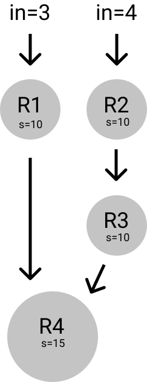

Operation models are used in the analysis of complex water resources systems. These systems may involve thousands of decision variables and constraints that require optimization techniques in order to solve. Recently, with the help of computer processing, operation models have provided solutions and decision variables at a rate like never before.

There are four available methods for optimization of reservoir operations based on mathematical programming techniques, however, there is no general algorithm. The four methods are classified as follows:

- Linear Programming (LP),
- Dynamic Programming (DP),
- Nonlinear Programming (NLP), and
- Simulation

The typical constraints that these models consider include the continuity equation, storage, release, and many more arise from specific equipment or legal limitations. Purposes for a typical reservoir system include water supply for irrigation, industrial use, domestic use, hydropower, and many more. Expansion is not included in the review, because it is assumed that reservoir capacities and configuration are pre-determined.

## Linear Programming

Linear programming is among the most common and widely used methods for water resources management. Linear programming solves a problem in which all variables are linearly related. Over the years, this method has been developed to accommodate the increasing complexity of water resources systems. In 1962, Dorfman demonstrated three different versions of linear programming and introduced critical period analysis and stochastic inflow. In 1967, Meier and Beightler introduced a branch compression technique that was improved upon in the coming years. In 1974, Becker and Yeh combined linear programming and dynamic programming for optimization of real-time reservoir operations.

Though many leaps were made in the development of linear programming models, they remain predominantly deterministic. Stochastic linear programming offers a methodology for considering particular parameters (such as inflows) as non-deterministic. Two stage stochastic programs (stochastic programs with recourse) first solve for a decision variable and then re-solve for a new decision variable following the observation of the random event. This method is computationally expensive as it requires modeling of all possible realizations of the random variable. While chance-constrained linear programming models reflect the probability conditions on constraints and may help estimate the loss function, the technique may be limited. Hogan et al. have warned that chance constrained programming does not produce the same results as stochastic programming with recourse.

Linear decision rules (LDR) relate decision parameters in chance-constrained linear programming to reservoir design and operation. The decision rules helped find release at the start time period and also helped eliminate mathematical challenges. Limitations of decision rules are as follows, it is not completely stochastic in streamflow and it offers an additional constraint. These limitations have consequently generated overly conservative results.

## Dynamic Programming

Dynamic programming is used in optimizing a multistage decision process. The stochastic and nonlinear features common to water resources systems lend themselves to dynamic programming formulation. While dimensionality poses a challenge, incremental dynamic programming may be formulated in order to reduce the exponential growth of state transitions. Successive approximations may also be introduced in order to further decompose the original multiple-state variable dynamic program into one state variable problems. While stochastic dynamic programming models were found useful, they had no direct control over the probability of failure. Reliability-constrained dynamic programming was formulated in order to solve this problem by introducing a penalty function. Application of reliability constrained dynamic programming is limited to short-term planning. Another limitation of dynamic programming in multiple reservoir systems is its computational cost. Iterative procedures called differential dynamic programming may be used to alleviate this issue.

## Nonlinear Programming

Nonlinear programming offers general mathematical formulation and can be a good foundation for other methods, however, the process is limited in speed and storage requirements. Nonlinear programming has various subprogram capabilities for iterative solving of large-scale systems including quadratic, geometric, and separable programming. Simulation modeling utilizes computers in solving mathematical or algebraic formulas for approximating system behaviors. The model predicts a response based on inputs or decision rules. This allows for the analysis of a system prior to construction. Some notable simulation models include the HEC-3 and HEC-5 developed by the Hydraulic Engineering Center. More recently, optimization schemes have been introduced into simulation models and consequently blurred the line between simulation and optimization. Real time reservoir operation is a technique based on forecasted information. This method is seldom favored by reservoir operators because they find the model uncomfortable to use, the research is not practical use oriented, and user-research interactions are impeded.

## Problem Setup

A four reservoir, twelve time period optimization problem solved using linear programming.

The benefits associated with release time for each reservoir is listed below. Note that reservoir 4 is truly a combination of two smaller reservoirs.

| Time Period (t) | g1(t) | g2(t) | g3(t) | g4(t) | g5(t) | g4+5(t) |
|-----------------|-------|-------|-------|-------|-------|---------|
|               1 |   1.1 |   1.4 |   1.0 |   1.0 |   1.6 |     2.6 |
|               2 |   1.0 |   1.1 |   1.0 |   1.2 |   1.7 |     2.9 |
|               3 |   1.0 |   1.0 |   1.2 |   1.8 |   1.8 |     3.6 |
|               4 |   1.2 |   1.0 |   1.8 |   2.5 |   1.9 |     4.4 |
|               5 |   1.8 |   1.2 |   2.5 |   2.2 |   2.2 |     4.4 |
|               6 |   2.5 |   1.8 |   2.2 |   2.0 |   2.0 |     4.0 |
|               7 |   2.2 |   2.5 |   2.0 |   1.8 |   2.0 |     3.8 |
|               8 |   2.0 |   2.2 |   1.8 |   2.2 |   1.9 |     4.1 |
|               9 |   1.8 |   2.0 |   2.2 |   1.8 |   1.8 |     3.6 |
|              10 |   2.2 |   1.8 |   1.8 |   1.4 |   1.7 |     3.1 |
|              11 |   1.8 |   2.2 |   1.4 |   1.1 |   1.6 |     2.7 |
|              12 |   1.4 |   1.8 |   1.1 |   1.0 |   1.5 |     2.5 |

The storage capacities and constraints are as follows:

| Reservoir Number | Smax | Smin | s(1) | s(13) |
|------------------|------|------|------|-------|
|                1 |   10 |    0 |    4 |     4 |
|                2 |   10 |    0 |    4 |     4 |
|                3 |   10 |    0 |    4 |     4 |
|                4 |   15 |    0 |    5 |     5 |

### Continuity Equation

The continuity equation states that the storage at some time (`I`) must be equal to the storage at the previous time step, plus inflow, minus release for all reservoirs (`J`).

STORAGE(I+1,J) = STORAGE(I,J) + INFLOW(I+1,J) - RELEASE(I,J)

### Inflow

In this example, reservoirs 1 and 2 are upstream of 3 and 4, with 2 flowing into 3, and 1 and 3 flowing into 4. The inflow to each reservoir can then be expressed as follows:

INFLOW(I,1) = 3
INFLOW(I,2) = 4
INFLOW(I,3) = RELEASE(I-1,2)
INFLOW(I,4) = RELEASE(I-1,1) + RELEASE(I-1,3)



### Objective Function

The objective is to maximize benefit, which depends on the decision variable, release. Thus, the objective function is:

MAX = SUM(BENEFIT(I,J) * RELEASE(I,J))

### Storage Constraints

Each reservoir has the following storage constraints based on capacity and emergency allocation:

STORAGE(I,J) >= 0
STORAGE(1,J) = 4
STORAGE(1,4) = 5
STORAGE(I,1) <= 10)
STORAGE(I,2) <= 10)
STORAGE(I,3) <= 10)
STORAGE(I,4) <= 15)

### Decision Variable

Since benefit is pre-determined, and inflow and storage depend on release. The decision variable must be:

RELEASE

## Lingo Code

```shell
MODEL:
  ! A 4 RESERVOIR 12 TIME PERIOD OPTIMIZATION PROBLEM;

  SETS:
    RESERVOIRS/ 1 2 3 4/;
    TIME/ 1 2 3 4 5 6 7 8 9 10 11 12/;
    LINK( TIME, RESERVOIRS)/
    1 1, 2 1, 3 1, 4 1, 5 1, 6 1, 7 1, 8 1, 9 1, 10 1, 11 1, 12 1,
    1 2, 2 2, 3 2, 4 2, 5 2, 6 2, 7 2, 8 2, 9 2, 10 2, 11 2, 12 2,
    1 3, 2 3, 3 3, 4 3, 5 3, 6 3, 7 3, 8 3, 9 3, 10 3, 11 3, 12 3,
    1 4, 2 4, 3 4, 4 4, 5 4, 6 4, 7 4, 8 4, 9 4, 10 4, 11 4, 12 4/:
    BENEFIT, RELEASE, STORAGE, INFLOW;
  ENDSETS

  DATA:
    BENEFIT =
    1.1, 1, 1, 1.2, 1.8, 2.5, 2.2, 2, 1.8, 2.2, 1.8, 1.4,   ! g1;
    1.4, 1.1, 1, 1, 1.2, 1.8, 2.5, 2.2, 2, 1.8, 2.2, 1.8,   ! g2;
    1, 1, 1.2, 1.8, 2.5, 2.2, 2, 1.8, 2.2, 1.8, 1.4, 1.1,   ! g3;
    2.6, 2.9, 3.6, 4.4, 4.4, 4, 3.8, 4.1, 3.6, 3.1, 2.7, 2.5; ! g4+g5;
  ENDDATA

  ! Objective Function;
  MAX = @SUM( LINK( I, J):
  BENEFIT( I, J) * RELEASE( I, J));

  ! Continuity Equation;
  @FOR( LINK( I, J):
  STORAGE(@WRAP( I+1, 12), J) =
  STORAGE( I, J) + INFLOW( @WRAP( I+1, 12), J) - RELEASE( I, J));

  ! Inflow Constraints;
  @FOR( LINK( I, J):
  INFLOW( I, 1) = 3;
  INFLOW( I, 2) = 4;
  INFLOW( I, 3) = RELEASE(@WRAP( I-1, 12), 2);
  INFLOW( I, 4) = RELEASE(@WRAP( I-1, 12), 1) + RELEASE(@WRAP( I-1, 12), 3););

  ! Storage Constraints;
  @FOR( LINK( I, J) | ( I #GT# 1 #AND# J #LE# 3): STORAGE( I, J) <= 10);
  @FOR( LINK( I, J) | ( I #GT# 1 #AND# j #EQ# 4): STORAGE( I, J) <= 15);
  @FOR( LINK( I, J) | ( I #GT# 1): STORAGE( I, J) >=0);
  @FOR( LINK( I, J) | ( J #LE# 3): STORAGE( 1, J) = 4);
  @FOR( LINK( I, J): STORAGE( 1, 4) = 5;);

END
```

## Output

```shell
Model Class: LP
Objective value: 612.2
Infeasibilities: 0
Total solver iterations: 57
Elapsed runtime seconds: 0.35
Total variables: 116
Nonlinear variables: 0
Integer variables: 0
Total constraints: 385
Nonlinear constraints: 0
Total nonzeros: 536
Nonlinear nonzeros: 0
```

### Inflow vs Time

| Time Period | Reservoir 1 | Reservoir 2 | Reservoir 3 | Reservoir 4 |
|-------------|-------------|-------------|-------------|-------------|
|           1 |           3 |           4 |           0 |           0 |
|           2 |           3 |           4 |           6 |           3 |
|           3 |           3 |           4 |           0 |           0 |
|           4 |           3 |           4 |           0 |           0 |
|           5 |           3 |           4 |           4 |           7 |
|           6 |           3 |           4 |           8 |          21 |
|           7 |           3 |           4 |           0 |          13 |
|           8 |           3 |           4 |          14 |          15 |
|           9 |           3 |           4 |           4 |           9 |
|          10 |           3 |           4 |           4 |           7 |
|          11 |           3 |           4 |           4 |           7 |
|          12 |           3 |           4 |           4 |           2 |

### Release Policy vs Time

| Time Period | Reservoir 1 | Reservoir 2 | Reservoir 3 | Reservoir 4 |
|-------------|-------------|-------------|-------------|-------------|
|           1 |           3 |           6 |           0 |           0 |
|           2 |           0 |           0 |           0 |           0 |
|           3 |           0 |           0 |           0 |           0 |
|           4 |           3 |           4 |           4 |           0 |
|           5 |           3 |           8 |          18 |          36 |
|           6 |          13 |           0 |           0 |          13 |
|           7 |           3 |          14 |          12 |           0 |
|           8 |           3 |           4 |           6 |          24 |
|           9 |           3 |           4 |           4 |           7 |
|          10 |           3 |           4 |           4 |           4 |
|          11 |           2 |           4 |           0 |           0 |
|          12 |           0 |           0 |           0 |           0 |

### Storage vs Time

| Time Period | Reservoir 1 | Reservoir 2 | Reservoir 3 | Reservoir 4 |
|-------------|-------------|-------------|-------------|-------------|
|           1 |           4 |           4 |           4 |           5 |
|           2 |           4 |           2 |          10 |           8 |
|           3 |           7 |           6 |          10 |           8 |
|           4 |          10 |          10 |          10 |           8 |
|           5 |          10 |          10 |          10 |          15 |
|           6 |          10 |           6 |           0 |           0 |
|           7 |           0 |          10 |           0 |           0 |
|           8 |           0 |           0 |           2 |          15 |
|           9 |           0 |           0 |           0 |           0 |
|          10 |           0 |           0 |           0 |           0 |
|          11 |           0 |           0 |           0 |           3 |
|          12 |           1 |           0 |           4 |           5 |

### Benefit vs Time

| Time Period | Reservoir 1 | Reservoir 2 | Reservoir 3 | Reservoir 4 | Total |
|-------------|-------------|-------------|-------------|-------------|-------|
|           1 |         1.1 |         1.4 |           1 |         2.6 |   6.1 |
|           2 |           1 |         1.1 |           1 |         2.9 |     6 |
|           3 |           1 |           1 |         1.2 |         3.6 |   6.8 |
|           4 |         1.2 |           1 |         1.8 |         4.4 |   8.4 |
|           5 |         1.8 |         1.2 |         2.5 |         4.4 |   9.9 |
|           6 |         2.5 |         1.8 |         2.2 |           4 |  10.5 |
|           7 |         2.2 |         2.5 |           2 |         3.8 |  10.5 |
|           8 |           2 |         2.2 |         1.8 |         4.1 |  10.1 |
|           9 |         1.8 |           2 |         2.2 |         3.6 |   9.6 |
|          10 |         2.2 |         1.8 |         1.8 |         3.1 |   8.9 |
|          11 |         1.8 |         2.2 |         1.4 |         2.7 |   8.1 |
|          12 |         1.4 |         1.8 |         1.1 |         2.5 |   6.8 |
