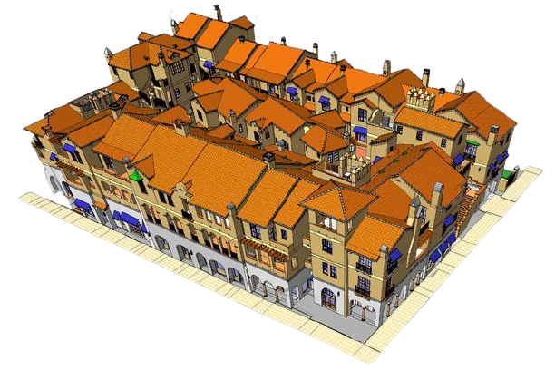

I was a design engineer responsible for drafting structural details, transforming architectural plans, performing beam loading analysis, and beam selection for the Mixed Use development. The Paseo Chapala project includes 27 residential units, 10,000 square feet of commercial and retail space, and 25,000 square feet of parking in the heart of downtown Santa Barbara. The project utilized Type V construction over a 14" thick elevated concrete deck supported by concrete columns with masonry walls and light gauge steel framing for the upper floors.

