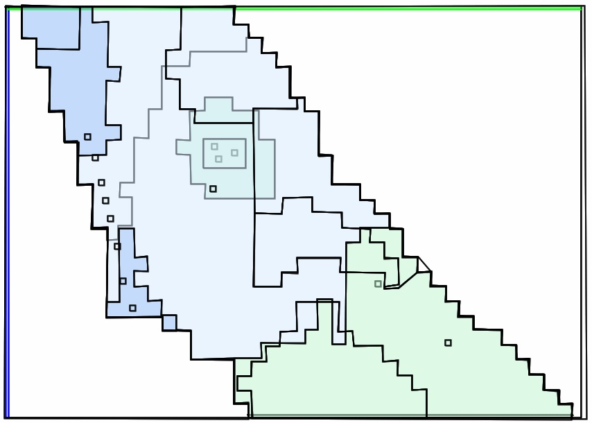
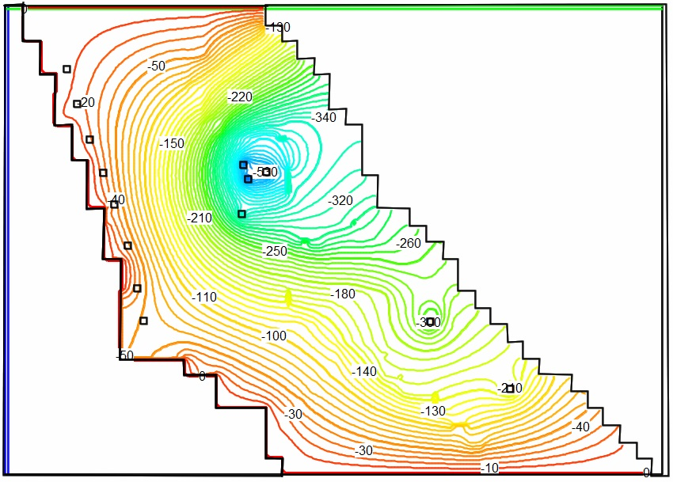
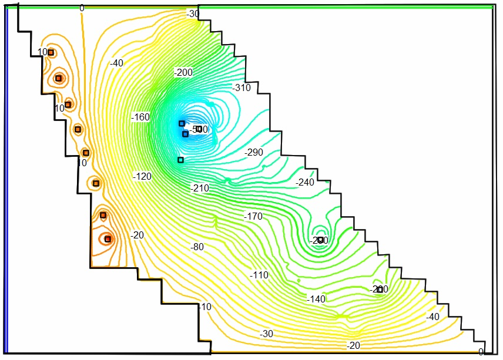
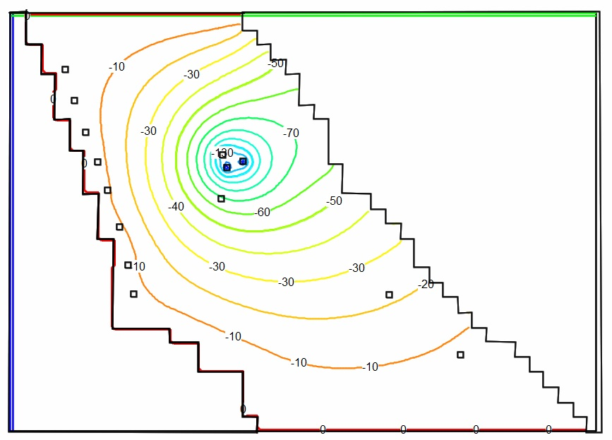
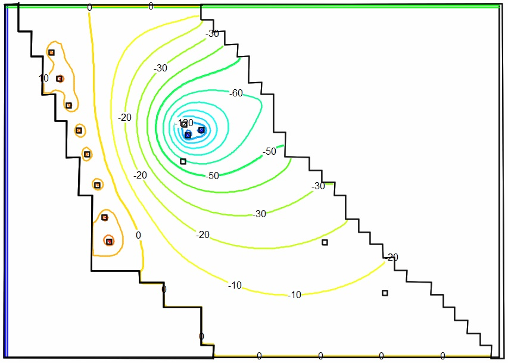
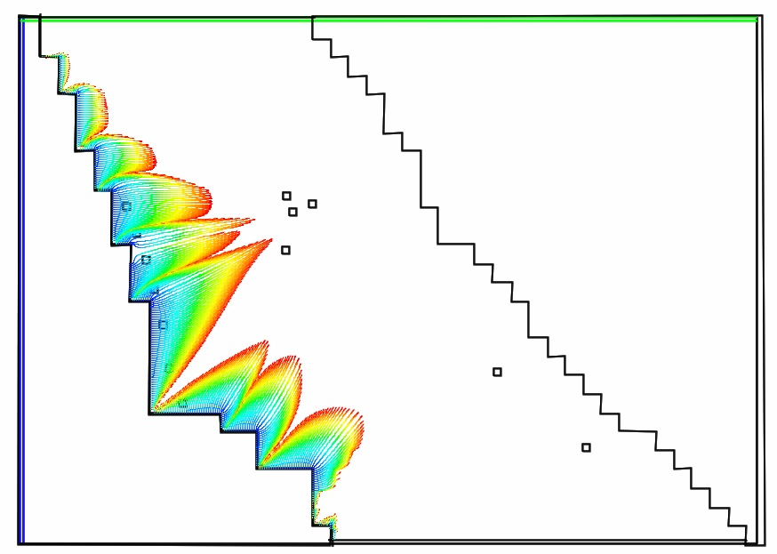
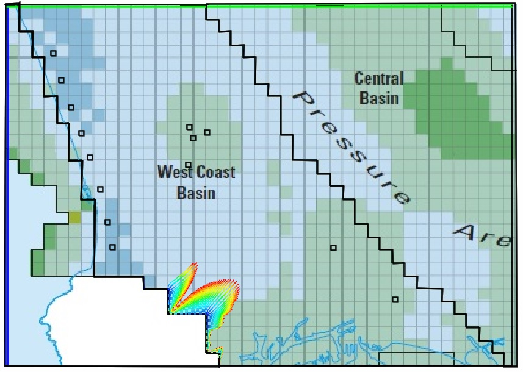
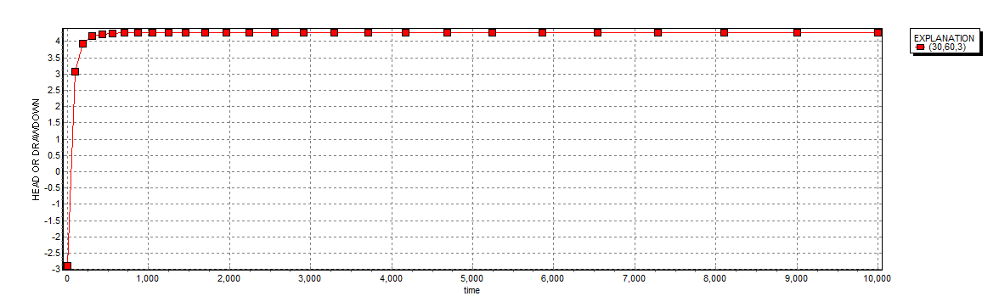
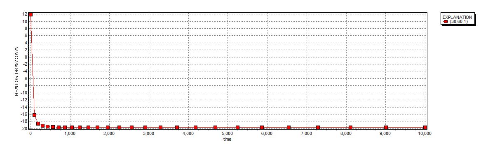
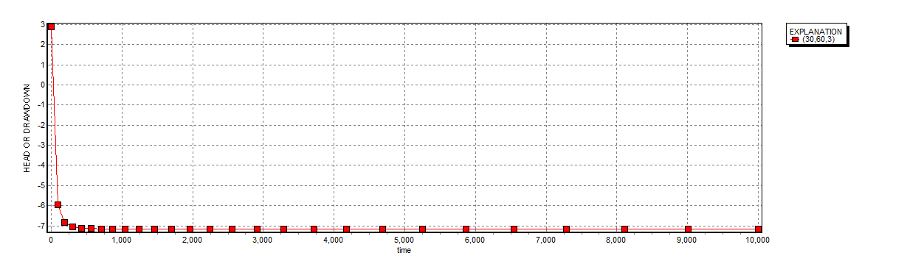

## Abstract

Seawater intrusion is primarily caused by over pumping groundwater in coastal regions. Hydraulic barriers have been found to be an effective means of mitigating seawater intrusion and protecting freshwater pumping wells in the coastal plain. A model was developed to simulate the West Coast Barrier project and to assess impacts of continued pumping at average rates that meet a particular demand in the West Coast Basin. The model includes pumping wells appropriately located in the model domain and a hydraulic barrier simulated using a series of injection wells near the ocean boundary. The model contains two aquifer systems, Lakewood and Upper San Pedro, which are separated by an aquitard. Model results indicate the point in time when the system reaches steady-state, and that implementing an injection well barrier can aid in reducing seawater intrusion caused by over pumping.

# Introduction

Groundwater over development in the West Coast Basin of Los Angeles County in the beginning of the 20th century created significant water-level declines and induced seawater intrusion (Reichard, E. G. and Johnson, T. A., 2005). One of the mitigation techniques explored includes construction of hydraulic or simple barriers. A hydraulic barrier is created using a group of injection wells placed near the coastline. The wells inject freshwater into the aquifers to raise the freshwater head and create a seaward hydraulic gradient that prevents the seawater from moving inland (Bray, B. and Yeh, W. W-G., 2008). The model assesses one of three major seawater intrusion barriers currently in operation in Los Angeles County, the West Coast Basin, the Dominguez Gap, and the Alamitos gap. These barriers serve to protect a 20.3 million acre-foot groundwater reservoir that supplies nearly 40% of the potable water demand of the 4 million residents of Los Angeles (Bray, B. and Yeh, W. W-G., 2008).

In order to correctly implement this technique, a groundwater flow simulation model must first be developed. Extensive hydraulic, geologic, and chemical data collection programs have been undertaken that have aided in the creation of such models.

# Model Development

A MODFLOW model of the West Coast Basin and the West Coast Barrier was constructed in the program ModelMuse. The steps taken to produce this model are outlined below.

## Initial Model Box & Boundary Conditions

Dimensions for the model were selected to roughly match the West Coast Basin in Los Angeles. The model grid size was set to be 20 miles wide in the East-West direction and 14 miles long in the North-South direction. A cell size of 500 feet by 500 feet was selected in order to maximize accuracy while reducing the computational cost of the model. The western boundary along the Pacific Ocean was set as a fault and a constant head boundary was then added alongside the fault. The southern boundary condition was set to constant head of 0 because the Dominguez Gap Barrier Project is assumed to be functional at this location. The section following Palos Verdes is also set to a fault, as the geologic conditions prevent groundwater flow. The northern boundary condition was set to a constant head of 0. This value was estimated from Figure 36 in Reichard, E. G., et al. (2003).

## Layer Formation

In order to simplify the model, only the Lakewood and Upper San Pedro aquifer systems were assessed, with an aquitard separating these systems. The aquitard was designed to be of ten foot depth and its hydraulic conductivity was set 0.0001 ft/day to ensure minimal to no flow.

The depth of these systems varies spatially roughly based on real world depths found through data collection. Each aquifer system has two to four zones defining areas of differing minimum elevation and hydraulic conductivity. The West Coast Basin model region’s geohydrologic characterization for the model was based information found in a study by Reichard, E. G., et al. (2003) called “Geohydrology, geochemistry, and groundwater-water simulation-optimization of the Central and West Coast basins, Los Angeles County, California”. The global model value for specific storage was also approximated from a report by Reichard, E. G., et al. The ModelMuse zonation for these layers can be seen in Figure 1 of Appendix A.

## Well Fields

The synthetic well field includes a collection of six pumping wells. Three pumping wells were placed in the Lakewood layer and three in the Upper San Pedro layer. The pumping and injection well locations were chosen to roughly represent real-world placements. The extraction of each wells is set to 1,000,000 𝑓𝑡3/𝑑 with a total combined extraction of 6,000,000 𝑓𝑡3/𝑑. The pumping rate was chosen in order to Induce a drawdown of at least 1 foot in several locations in both layers. The high pumping rates also serve to improve the particle path simulation conducted by increasing the flow inward from the ocean boundary.

A total of eight injection wells were placed along the location of the West Coast Barrier Project. Each well has an injection rate of 600,000 𝑓𝑡3/𝑑 for a total combined rate of 4,800,000 𝑓𝑡3/𝑑 and a difference in pumping and injection is 1,200,000 𝑓𝑡3/𝑑. The injection rate was arrived at through iteration with the target rate being one that created a positive head west of the well field without exceeding the pumping rate.

## Simulation Timeframe

Two stress periods were used in simulating the model. The first was set from -1 to 0 days so that the initial steady state of the model is stressed. This means that the pumping wells are active during this stress period with no barrier injection wells active. The second stress period was set from 0 to 10,000 days in order to give the model a sufficiently long period of time for the flow field to reach an approximate steady state with the barrier project in place. A time step of 50 days and a 1.1 time multiplier were used in order to maximize computational efficiency, while maintaining accuracy.

## Particle Tracking

Particle tracking was applied to simulate advective transport of water from the coastline, and the seawater injection barriers. This was done using a MODPATH array of particles initiated along the ocean boundary beginning at the start of the transient stress period. The MODPATH results were generated once with injection wells in operation, and once without the injection wells for comparison purposes.

# Analysis of Results

The model results clearly indicate that in both Layer 1 and Layer 2 of the model an inland hydraulic gradient is present before injection, and that a seward hydraulic gradient is present after steady-state is reached. These results demonstrate that the barrier project is successful. A head value contour map at the ocean boundary both before and after the barrier is activated can be found in Appendix B and Appendix C.

The particle tracking results also indicate that seawater flow within the San Pedro aquifer system occurs inland prior to the barrier activation and that virtually no seawater intrusion occurs at steady-state. A plot of the flow paths originating at the ocean boundary at various time steps throughout the simulation using MODPATH can be found in Appendix D.

The MODFLOW model output was read using the GWCHART program, and a plot of head versus time for a model cell of row value 30 and column value 60 can be seen Figure 8 of Appendix E. From this plot of head versus time, it can be deduced that the required time to reach a steady state condition (no change in head with respect to time) is roughly 300 days. It is assumed that the whole model reaches steady state at the same time as the single cell selected for the analysis. This is because the model domain is sufficiently large.

# Conclusions

Groundwater over development in coastal regions can cause water-level declines that are not sustainable, and a solution to this problem must be developed. As this report indicates, the use of hydraulic barriers is a viable technique for mitigating such hazards. The MODFLOW model constructed shows that the implementation of injection wells does achieve the goal of reducing seawater intrusion in the West Coast Basin. Less fresh water is injected than pumped so the barrier appears to be feasible. While results from the model simulation are promising, it is important to note that many simplifications and assumptions were made, including only modeling a single basin, only modeling three layers, and averaging of elevation levels and hydraulic gradient across these layers.

# References

Bray, B., Tsai, F. T-C., Sim, Y. and Yeh, W. W-G., “Model Development and Calibration of a Saltwater Intrusion Model in Southern California,” Journal of American Water Resources Association, 43(5):1329-1343, October 2007.

Bray, B. and Yeh, W. W-G., “Improving Seawater Barrier Operation with Simulation Optimization in Southern California,” Journal of Water Resources Planning and Management, ASCE, 134(2): 171-180, March 2008.

Emch, P.G. and Yeh, W.W-G., "Management Model for Conjunctive Use of Coastal Surface Water and Groundwater," Journal of Water Resources Planning and Management, ASCE, 124(3): 129-139, May/June, 1998. 3

Reichard, E. G. and Johnson, T. A. “Assessment of Regional Management Strategies for Controlling Seawater Intrusion.” Journal of Water Resources Planning and Management, ASCE, 131(4), 280-291, 2005.

Reichard, E. G., et al. (2003). “Geohydrology, geochemistry, and groundwater-water simulation-optimization of the Central and West Coast basins, Los Angeles County, California” U.S. Geological Survey Water-Resources Investigations Rep. 03-4065, Sacramento <https://pubs.usgs.gov/wri/wrir034065/wrir034065.html>.

# Appendix A

# Appendix B

# Appendix C

# Appendix D

# Appendix E

