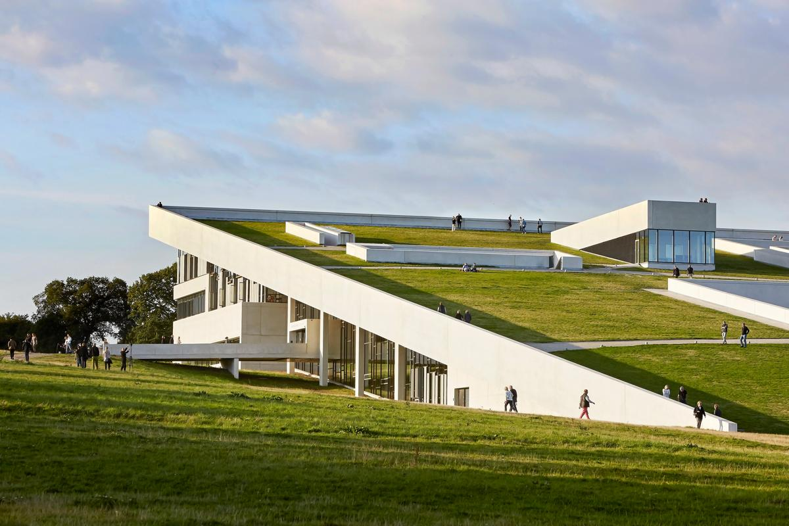
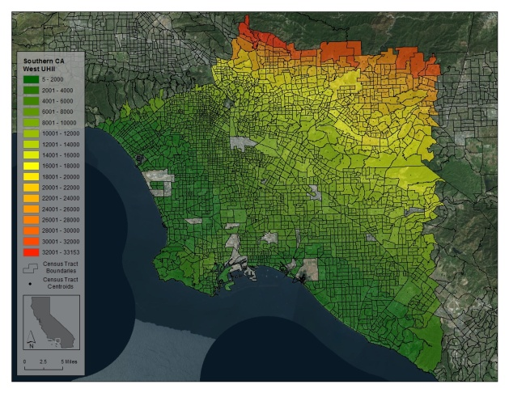
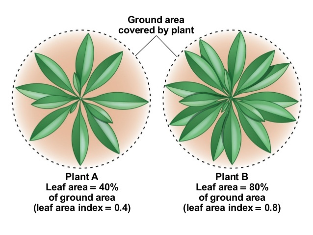

# GREEN ROOF ENERGY BUDGET

## INTRODUCTION

Cities suffer from - and contribute to - the urban heat island effect. This phenomenon occurs when thermal energy is absorbed at unnaturally high rates in the urban environment. Much of the urban heat island effect may be attributed to rooftops of buildings. Mitigation techniques may help balance the thermal budget of cities by increasing thermal losses and decreasing the corresponding gains. These mitigation techniques aim to increase the albedo of the urban landscape by expanding green space and using natural heat sinks to dissipate excess heat (Santamouris, 2012).

Green (eco, living, or vegetated) roofs present a promising mitigation technique by utilizing roofs that are partially or fully covered with vegetation. Green roofs can lower surface temperatures and decrease the corresponding sensible heat flux to the atmosphere. The two main types of green roofs are extensive roofs, which are lightweight and are covered by a thin layer of vegetation, and intensive roofs which are heavier and can support shrubs or even small trees. Green roofs provide a multitude of additional environmental advantages including stormwater runoff management, decreased energy consumption, better air quality, noise reduction, and wildlife habitat.

## PERFORMANCE FACTORS

Studies performed to identify the energy conservation potential of green roofs found that performance depends on the local climate, design and building characteristics. These factors can be categorized as follows:

#### CLIMATOLOGICAL VARIABLES

Climate plays a very important role in the mitigation potential of green roofs. Climatological performance factors consist of solar radiation intensity, ambient temperature and humidity, wind speed and precipitation.

##### Solar Radiation Intensity

Solar radiation intensity determines the heat storage and surface temperature of the green roofs. The spectral characteristics are especially important in intensive green roofs, where the canopy color, moisture content and structure affect the transmittance, reflectance and absorptance (Santamouris, 2012).

##### Ambient Temperature

The ambient temperature helps to determine the amount of sensible heat released by the green roofs, as convective heat flow is a direct function of their temperature difference. When ambient temperature is low in winter the sensible heat flux is at a minimum and inversely reaches a maximum during the summer period (Jim & He, 2010).

##### Ambient Humidity

The atmospheric humidity controls the vapor pressure gradient between the roof and atmosphere. High relative humidity reduces the evapotranspiration latent heat flux (Jim & Peng, 2012).

##### Wind Speed

Wind speed affects heat transfer between the roof surface and the atmosphere and thus determines the sensible heat flux (with higher wind speeds increasing the flux) (Santamouris, 2012). Wind speed is highly correlated with surface temperature in green roofs (Jim & Peng, 2012).

##### Precipitation

The precipitation amount and rate directly affects the moisture content of the soil in green roofs and thus determines the amount of the latent heat flux (Jim and He, 2010).

#### OPTICAL VARIABLES

The optical variables to be considered in green roof performance are the albedo, emissivity and the absorptivity and shielding of plants.

##### Albedo

The albedo to solar radiation is a key variable in the thermal budget of roofs. High albedos decrease the accumulation of heat in the roof and decrease its surface temperature. This corresponds to a  lower sensible heat flux in the roof system (Santamouris, 2012).

##### Emissivity

The emissivity of the roofs defines their ability to dissipate heat through emission of infrared radiation. Higher emissivity values correspond to lower surface temperatures. Typical value of emissivity for a green roof ranges from 0.9 to 0.95 (Santamouris, 2012).

##### Absorptivity

The higher the water leaf content the higher the absorptance of the visible radiation.  The average absorbed solar radiation by greenery is roughly 23% (Lazzarin et al. 2005).

##### Shielding

The shielding effects of green foliage on green roofs determine the amount of heat absorbed by the roof structure. The type and characteristics of the plants define the shading levels and the transfer of radiation through the layers. Intensive green roofs with shrubs or trees present a high shield effectiveness compared to extensive green roofs containing grasses (Jim & He, 2010). High vegetation density is required to produce a significant cooling effect.

#### THERMAL VARIABLES

The thermal capacity of the roofs as well as their thermal transmittance (U value) are key thermal parameters defining their performance.

##### Thermal Capacity

The thermal capacity of green roofs affects the sensible heat flux and peak surface temperatures. Daytime heat storage in the green roofs ranges between 350 and 400 W/m2 while night time values are typically around negative 60 W/m2 (Jim & He, 2010).

##### Thermal Transmittance

The thickness and the thermal characteristics of the vegetative roof largely define its thermal transmittance (U value) and the corresponding transfer of heat to the building, which may be reduced by 50% compared to a conventional concrete roof (Santamouris, 2012).

##### Thermal Flux

Normal black or white roofs both typically have negative flux at night, while the green roofs do not. This is because green roofs maintain a higher temperature due to thermal mass, which prevents the roof from cooling below ambient temperatures at night. The reduced view of the sky due to vegetation also plays a role in moderating thermal flux at night.

#### HYDROLOGICAL VARIABLES

In particular all parameters defining latent heat phenomena in green roofs.

##### Latent Heat

The latent heat is transferred by diffusion of vapor in pores in the soil layer of the green roof. The transfer of heat depends mainly on water content and temperature, while the transfer of water vapor depends on vapor pressure at the soil surface, canopy, and ambient air (Santamouris, 2012). Therefore, frequency and rate  of watering determines the latent heat release and regulates the thermal balance of the roof.

##### Evapotranspiration

The vapor pressure at the leaf surface and canopy (and the internal resistance to the vapor transfer) control the energy flux related to evaporation. The leaf area index (LAI) is another key parameter defining evaporation losses (see figure below). For example, evapotranspiration losses (during peak periods) range from 250, 370 and 550 W/m2 for leaf area indexes of 2, 4, and 7, respectively.

## 

## MODELING

EnergyPlus, a program for modeling annual building energy consumption, was used in many of the above mentioned findings. A typical EnergyPlus simulation uses 6 time steps per hour to represent building operation subject to the weather of a typical meteorological year. Energyplus also includes a module for simulating the energy balance of a vegetated roof with a simulated irrigation system that is triggered if the soil moisture content falls below a specified threshold. The model accounts for longwave and shortwave radiative exchange within the plant canopy, plant canopy effects on convective heat transfer, evapotranspiration from the soil and plants, heat conduction, and storage in the soil layer (Santamouris, 2012).

The EnergyPlus model output is somewhat limited and had to be customized to accommodate the specific studies. For example, soil surface temperature, soil sensible heat flux and plant canopy sensible heat flux are not normally available for output.

#### CHALLENGES AND LIMITATIONS

The growing urban heat island crisis requires the development and application of mitigation technologies. While green roofs offer a viable option, it is evident that further research and development is necessary.

The studies reviewed have generally explored urban climate impacts using coarse resolution mesoscale models that do not accurately represent the morphology of the city or the thermal characteristics of insulated roofing. Most studies are also limited in scope to considering summertime conditions only. One study that used the Weather Research and Forecasting Model (ARW) coupled with an urban canopy model was used in one study, simulated the impact of green roofs in an indirect way by neglecting latent phenomena and using an equivalent albedo (0.80) like in the case of a cool roof.

Many of the modeling methods used in the past allow for a useful comparison between roofing elements, but do not attempt to predict their impact on urban air temperatures. While urban air temperature impact is beyond the scope of most studies, it is the natural next step in the assessment of green roof design.

## REFERENCES

Alexandri, Eleftheria, and Phil Jones. "Temperature decreases in an urban canyon due to green walls and green roofs in diverse climates." Building and environment 43.4 (2008): 480-493.

Jim, C. Y., and Hongming He. "Coupling heat flux dynamics with meteorological conditions in the green roof ecosystem." Ecological Engineering 36.8 (2010): 1052-1063.

Jim, C. Y., and Lilliana LH Peng. "Weather effect on thermal and energy performance of an extensive tropical green roof." Urban Forestry & Urban Greening 11.1 (2012): 73-85.

Peng, Lilliana LH, and C. Y. Jim. "Economic evaluation of green-roof environmental benefits in the context of climate change: The case of Hong Kong." Urban Forestry & Urban Greening 14.3 (2015): 554-561.

Santamouris, Mattheos. "Cooling the cities–a review of reflective and green roof mitigation technologies to fight heat island and improve comfort in urban environments." Solar energy 103 (2014): 682-703.

Scherba, Adam, et al. "Modeling impacts of roof reflectivity, integrated photovoltaic panels and green roof systems on sensible heat flux into the urban environment." Building and Environment 46.12 (2011): 2542-2551.

Susca, Tiziana, Stuart R. Gaffin, and G. R. Dell’Osso. "Positive effects of vegetation: Urban heat island and green roofs." Environmental pollution 159.8-9 (2011): 2119-2126.

Takebayashi, Hideki, and Masakazu Moriyama. "Surface heat budget on green roof and high reflection roof for mitigation of urban heat island." Building and Environment 42.8 (2007): 2971-2979.
