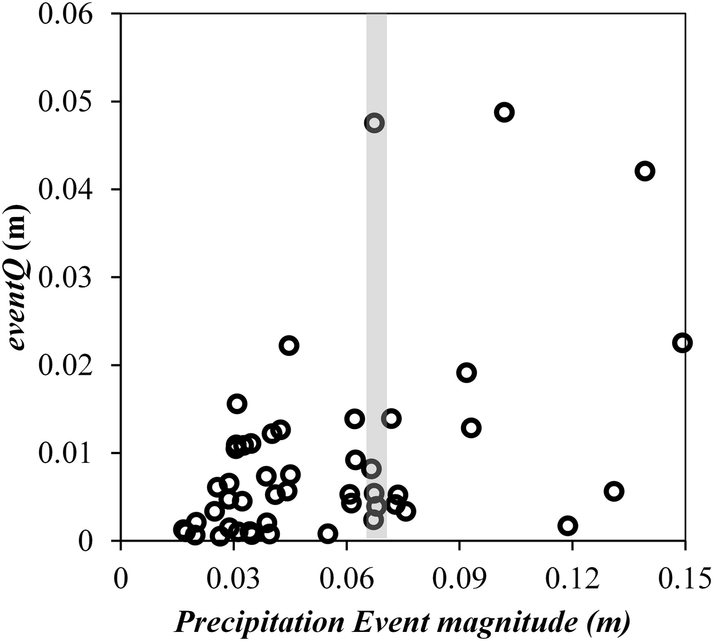
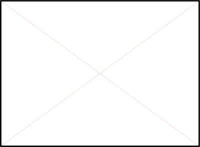
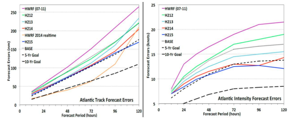
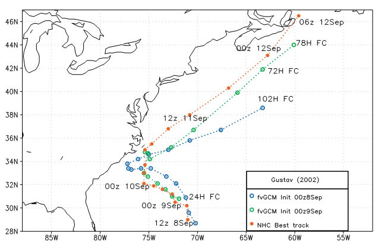
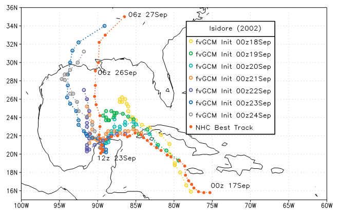
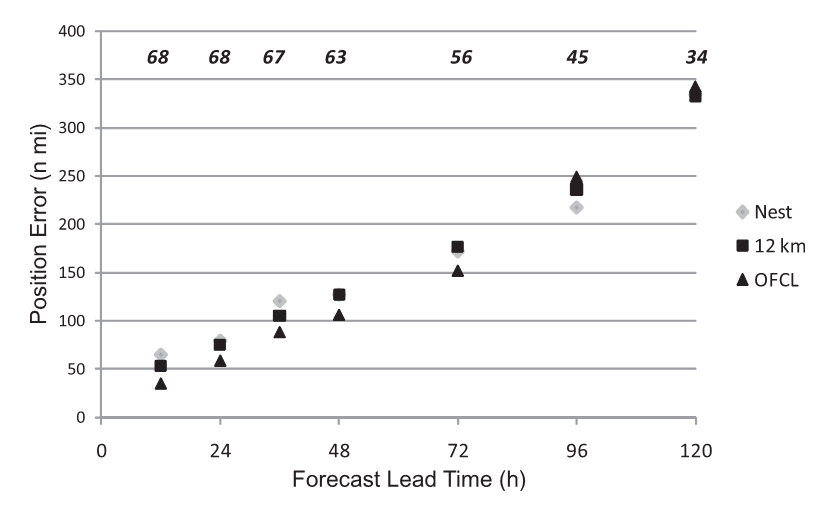
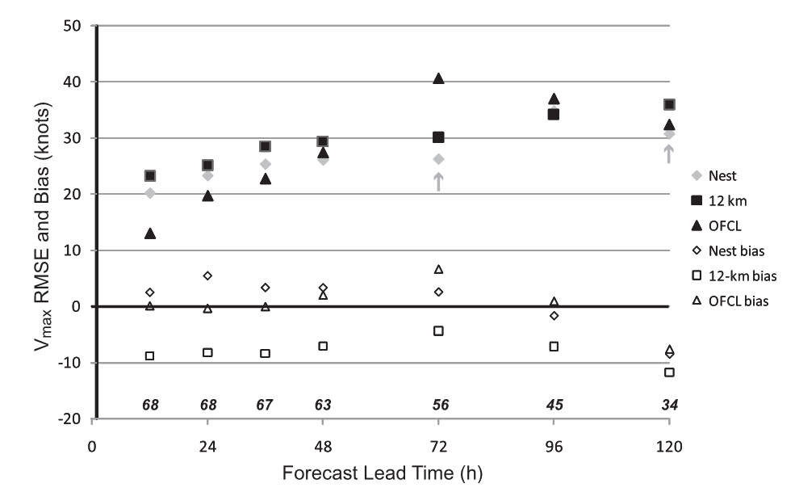

# Part 1: Evaluation of Hurricane Forecasting and Impacts in Louisiana

## Introduction

Hurricanes that occur on the tropical coastal regions of the United States have proven to consistently be some of the most devastating natural disasters experienced in the country. The prevalence of hurricane related disasters in coastal Louisiana has the potential to not only severely impact the communities living in this region, but also to drastically alter both the hydrology and topography of the surrounding landscapes. Coastal Louisiana is especially prone to large hurricanes because of its geographic location in the north-central Gulf of Mexico.

Hurricanes are classified as severe tropical wind storms with wind speeds above 74 miles per hour (mph). From the Saffir-Simpson Hurricane Wind Scale, the intensity of a hurricane can be further classified into five categories based on their wind speed as seen in the table below (NOAAb, 2017).

Table 1. Saffir-Simpson Wind Hurricane Categories

| Category | Wind Speeds (mph) | Impact |
| -------- | ----------------- | ------ |
| 1 | 74-95 | Produces some damage. May affect structures, trees, power lines, and poles.|
| 2 | 96-110 | Cause extensive damage. Structures likely to experience damage, severe power outages expected. |
| 3 | 111-129 | Cause devastating damage. Structures (i.e. roofs and frames) severely damaged, severe power and water outages expected, potentially for several weeks.|
| 4 | 130-156 | Cause catastrophic damage. Structures likely to lose roof structure and walls, residential areas likely to be isolated by power poles and tree uprooting, area likely uninhabitable for weeks to months.|
| 5 | 157 or higher | Cause catastrophic damage. High percent of framed homes will be destroyed, power outages likely for months, area likely uninhabitable for week to months.|

Forecasting the likelihood of a hurricane is extremely important in order to provide adequate time for communities to prepare or evacuate if they are in the path of these storms. Besides the direct results from high wind intensities and high levels of precipitation, other hydrological consequences such as storm surges and flooding also have the potential to cause a significant amount of harm. In turn, there have been tremendous attempts by the North American Oceanic and Atmospheric Administration (NOAA) to improve hurricane forecasts in the United States. In 2009, NOAA formulated an interagency collaborative program in order to increase the accuracy of hurricane forecasts in the Atlantic Basin of the United States. This program, called the Hurricane Forecast Improvement Program (HFIP) set a goal of an error reduction in track and intensity forecasting by 20% in 2014, and a 50% reduction by 2019. HFIP has been relying on its own data, other agencies, and the scientific community at large in order to meet this goal (NOAAb, 2017).

Ensemble forecasts are the most widespread type of forecasts typically used in the United States. Rather than predicting the exact location of the storm with a single forecast, an ensemble will be used to provide a range of potential events. Single forecasts are bound to have an extensive range of inaccuracy, especially when seeking to make an accurate prediction far in advance, due to the high extent of variability in fluid dynamics (for both air and water). Ensemble forecasts, on the other hand, acknowledge that there will be atmospheric, oceanic, and model variability. An ensemble forecast will then take the means and variances of multiple individual forecasts, and formulate them into one in order to increase accuracy. An ensemble forecast will in turn provide a range of possible outputs. The smaller the range provided by an ensemble, the better the forecast. Ensembles also provide an advantage over individual forecasts because they provide a range of uncertainty from the start (WMO, 2012).

## METHODS

### Track and Intensity Forecasting Methods

One of the most prevalent issues with hurricane forecasting is determining a model which can accurately portray the path of a hurricane while simultaneously predicting the intensity. The majority of hurricanes will cover large expanses of space, often encompassing a horizontal area over 100 km and a vertical height of over 20km. This wide range of space requires that models that forecast hurricanes require an immense amount of computational data. Typically, the forecasting of hurricanes will utilize statistical and physical models in order to interpret the likelihood of an event occurring in a specific place. Many of these models will put different portions of the storm into a three-dimensional grid in order to determine what path a hurricane is likely to take and where it is bound to have impacts on coastal communities. Some of these forecasts can have path errors on the range of 100 km. This inability to predict where a hurricane will land can have devastating consequences for a community ill-prepared to withstand the impacts caused by these events.

One of the main models utilized throughout the United States is the Geophysical Fluid Dynamics Laboratory (GDFL) Forecast-oriented Low Ocean Resolution (FLOR) model. GFDL models have been utilized in the United States since 1995. In the studies performed by Murakami et al., the FLOR model was coupled with statistical probabilities of hurricane paths in order to predict hurricane paths and intensities from 1980-2014. FLOR is a dynamic model with meshed land, ice, and sea components. The FLOR model is composed of 32 vertical layers, however all initial conditions are based on oceanic and oceanic ice conditions. In this sense, the ocean is the main driver for the model, however the model also measures atmospheric fluxes, which in turn take into account the precipitation and wind fluxes that can occur during a hurricane. FLOR models contribute to NMME databases and data utilized by the National Hurricane Center (NHC), and are one of the few models that can accurately predict hurricane intensity. Coupled with statistical “best-track” models provided by NHC, the FLOR model can provide a step by step analysis of the track and corresponding intensities of certain hurricane events. Murakami et al. utilized four different clusters (managed by an algorithm) in order to analyze the accuracy of the model in different regions (Murakami et al., 2016).

Another model used frequently in North American hurricane forecasting is the Hurricane Weather and Research Forecast (HWRF). HWRF began being utilized by the NHC in 2007 as a means to improve hurricane forecasts in real-time. Like the FLOR model, HWRF creates a nested grid in order to begin model simulation. The HWRF model has a 9-km horizontal resolution with 42 vertical levels. Unlike the FLOR model, on the other hand, the HWRF model seeks to incorporate real-time satellite imagery in order to continuously update both initial and boundary conditions. HWRF has the potential to increase accuracy by continuously updating the initialization process within the model. Since its inception in 2007, HWRF models have been updated yearly in order to increase the accuracy of boundary conditions along with providing numerical improvements to microphysics and computational power. In 2010, the NOAA Hurricane Forecast Improvement program aimed to reduce track and intensity errors by 50% by 2020. The HWRF model has been one of the models seeking to make this possible (Tallapragada et al., 2015).

Another forecasting model recently utilized in hurricane prediction was the Operational Multiscale Environmental model with Grid Adaptivity, or OMEGA. OMEGA is an adaptive model that uses an unstructured triangular prism grid rather than a traditional cubic grid to model potential hurricanes. OMEGA utilizes physical characteristics such as longwave radiation and water microphysics in order to establish cloud characteristics and wind intensities during the formation of a hurricane, while also incorporating surrounding boundary conditions with multiple dispersion models. Under the assumption of atmospheric stratification, the unstructured grid of the model is fixed in the vertical direction and allows for more variability in the horizontal direction. With these parameters, the OMEGA model looks at atmospheric convection in order to provide a model that mimics the wind and water flow experienced in a hurricane. [Gopalakrishnan](https://www.google.com/url?q=http://journals.ametsoc.org/author/Gopalakrishnan%252C%2BS%2BG&sa=D&ust=1606077043734000&usg=AOvVaw1v9ERQXmzvh9Fd_MXMyFzV) et al. utilized the OMEGA model to evaluate eight previous storms on the Gulf of Mexico and the Atlantic to determine the accuracy of the model ([Gopalakrishnan](https://www.google.com/url?q=http://journals.ametsoc.org/author/Gopalakrishnan%252C%2BS%2BG&sa=D&ust=1606077043734000&usg=AOvVaw1v9ERQXmzvh9Fd_MXMyFzV) et al. 2002).

A high-resolution finite volume general circulation model (fvGCM) is used at the NASA Goddard Space Flight Center and Ames Research Center for hurricane forecasting. The model is based on a finite volume dynamical core with terrain-following Lagrangian control volume discretization. This model allows for better global resolution, which helps to more realistically represent tropical storms. The fvGCM resolves problems such as erratic track, abrupt recurvature, intense extratropical transition, multiple landfall and re- intensification, and interaction among vortices experienced in other models (Atlas et al. 2005).

One of the most difficult parts of hurricane forecasting is determining which model is best to use. Standard practice has been to select one “best” model, and has ignored the uncertainty of this model selection procedure. For this reason, an alternative has been developed, called Bayesian Model Averaging (BMA). The BMA procedure assumes that all models created are capable of explaining the collected data in some way, so it is better to use them all. BMA takes each model and averages the predictions from each. It assigns a weight to each prediction, giving greater weight to predictions from models with the higher posterior probability, which is essentially the likelihood of the model producing the observed data. This effectively produces a consensus forecast (Jagger and Elsner 2010).

The improvement of predicting the intensity of hurricanes has been slow moving compared to the improvements in forecasting the storms position. The Hurricane Forecast Improvement Project (HFIP) was organized by NOAA to address the challenge of improving forecasts of hurricane intensity. The goal of this project was to decrease the grid spacing in the model from about 10 km to 1-4 km and produce an improved intensity and structure prediction, without decreasing the accuracy of the track forecasts. This enhanced resolution was achieved by using moveable, nested grids. (Davis et al. 2010).

### Streamflow and Storm Surge Forecasting Methods

Understanding flood response to hurricane storms is a key component in effective reservoir management, water resource allocation, and risk assessment in affected watersheds (Chen, et al. 2015). The geometrical and hydrodynamic complexity of the coastal Louisiana region creates a challenge for correctly modeling hurricane-induced flooding. The accuracy of the models developed closely depends upon the selected domain, physics, computational resolution, algorithms, and the speed of the software and hardware. A specific and significant challenge in modeling streamflow response to hurricane-season storms is the large variance present, highlighted in Figure 1 by the grey shaded column. Despite the challenges present, models have been developed to provide increasingly accurate streamflow forecasts, and research has been conducted to deepen our understanding of the roles of the contributing physical processes.

Figure 1. Observed streamflow responses due to large hurricane-season events (magnitude larger than 0.016 m) (Chen, et al. 2015)

Coastal surge and flooding is caused by a variety of complex processes, including wind, atmospheric pressure gradients, tides, river flow, short-crested wind waves, and rainfall. The Penn State Integrated Hydrologic Model (PIHM), a physically based distributed hydrologic model developed by Kumar et al. in 2009, was used to identify and evaluate dominant hydrologic controls on streamflow amount variability. The North American Land Data Assimilation System (NLDAS-2) provided hourly climate data for the model, including precipitation, temperature, relative humidity, wind velocity, solar radiation, and vapor pressure (Chen, et al. 2015). These datasets, and a closely coupled GIS framework, were used to parameterize the model domain. Wind-driven coastal surge from large hurricanes was discovered to be the most influential contributor to devastating regional flooding. Maximum high water levels were also influenced by atmospheric pressure, tides, riverine currents, waves, and rainfall.

Forecasting models are being used to resolve the features important to storm surge propagation on a local scale while providing accurate model forcing and parameterization of physical processes. One such model, developed by Westerink et al., utilizes a basin-to-channel scale unstructured grid hurricane storm surge model. The Advanced Circulation (ADCIRC) basin to channel-scale unstructured grid circulation model is also used in the high-resolution coupled riverine flow, tide, wind, wind wave, and storm surge model developed by Bunya, et al. and combines several popular models in one to leverage all of their strengths. The second of which is the NOAA Hurricane Research Division Wind Analysis System (H\*WIND), a distributed system that uses real time observations of storms in an object relational database. The measurements are adjusted to a common framework, and then graphically display the data. The Wave Model (WAM) was also incorporated to generate deep-water wave fields and directional spectra. The Wave Model (WAM), a discrete spectral wave model, was used to solve the wave action balance equation (Bunya, et al. 2010). The Interactive Objective Kinematic Analysis (IOKA) was utilized in kinematic wind analyses. The Steady-State Irregular Wave (STWAVE) model generated a nearshore wind wave model by solving the steady-state conservation of spectral action balance along backward-traced wave rays (Bunya, et al. 2010).

## RESULTS

### Track and Intensity Forecasting Results

The results of the forecasts provided Murakami et al. provided various results. As seen in Figure 2 below, the accuracy of the clusters varies upon region. The FLOR models have a much wider range of significance than the actual storms, and the cluster chosen has a significant impact on how close the forecast is to the actual hurricane event. Murakami et al. found that Cluster 3 had little to no skill in predicting storms, however Cluster 2 had a high level of skill, especially when determining what affects a hurricane will have upon landfall. It is significant to note that Cluster 2 is geographically representative of the Gulf of Mexico and the Caribbean, and could be relevant when forecasting Louisiana storms.  Each cluster also varies widely spatially, however Cluster 2 again proves to be the best model because of its accurate scope of storm path.

Figure 2. Black lines represent FLOR predictions, green lines represent actual storms, and red lines represent the mean path for each cluster. Blue lines are the areas of influence in the United States.

As seen in Figure 3 below, the ability of the HWRF model to predict both track and intensity of hurricanes has been improving with each subsequent HWRF model. The 2014 HWRF model has reached the 5-year goal of a drop in error by 20%, and has the potential to reach the 10-year goal of an error decrease of 50% by 2019.

Figure 3. Comparison of Atlantic track and intensity errors with multiple HWRF models against the 5-year (20% reduction in error) and 10-year (50% reduction in error) goals.

When [Gopalakrishnan](https://www.google.com/url?q=http://journals.ametsoc.org/author/Gopalakrishnan%252C%2BS%2BG&sa=D&ust=1606077043737000&usg=AOvVaw0yJfLPeH8M7OTeAPSxdpCQ) et al. utilized the OMEGA model on eight previous storms, it was found that OMEGA forecasted the specific storms approximately 20% better than those forecasts provided by the National Hurricane Center. It was also determined that the OMEGA system was more accurate in determining large-scale predictions about precipitation and that OMEGA-simulated storms often gave more information about conditions surrounding the storm. Although the model functioned well when compared with real data, there was no instance mentioned in the paper where forecasts were utilized in real-life situations. Even with increases in accuracy and intensity, the paths of the OMEGA-simulated storms still had track errors of up to 58 kilometers. ([Gopalakrishnan](https://www.google.com/url?q=http://journals.ametsoc.org/author/Gopalakrishnan%252C%2BS%2BG&sa=D&ust=1606077043737000&usg=AOvVaw0yJfLPeH8M7OTeAPSxdpCQ) et al. 2002).

The fvGCM was used to forecast several hurricanes including Gustav (2002) and Isidore (2002), as shown in the figures below. This model relies heavily on the initial conditions available. This is shown in Figure 4, in the initial forecast, Gustav is not yet present in the initial conditions, so the projected path is not following the actual path of the hurricane. The second run, however, is much closer to the actual path, due to a better defined vortex in the initial conditions. This dependance on initial conditions is illustrated again in Figure 5, where the initial conditions were very poorly defined (Atlas et al. 2005).

Figure 4. The red points and line shows the actual path of Hurricane Gustav (2002), the blue shows the initial forecasted path made by fvGCM on September 8, the green shows the forecast made by the model the following day (September 9).

Figure 5. The red points and line shows the actual path of Hurricane Isidore (2002), the remaining points show various forecasts made by the fvGCM between September 18 and September 24.

When Jagger and Elsner compared the consensus forecast model to several single “best” models, it was found that Bayesian Model Averaging (BMA) provided a more accurate prediction than the single best models. They performed many cross-validation exercises and it was found that the BMA procedure out performs other model selection procedures in producing a more accurate forecast. It is noted that, although the consensus forecast will not always give the smallest forecast error, it will always provide a better assessment of forecast uncertainty as compared to a forecast from a single best model (Jagger and Elsner 2010).

Davis et al. studied the impact of increased horizontal resolution on the improvement of hurricane forecasting. They compared the results produced by the high-resolution (nested) forecast to forecasts with 12-km grid spacing. The results produced compared position and intensity forecasts of each model. For position forecasts, little difference was found between the nested and 12-km forecasts as shown in Figure 6. Storm intensity was slightly better forecast in the nested simulations than in the 12-km forecasts, as shown in Figure 7. The nested forecast proved most beneficial for storms of category 3 or greater intensity (Davis et al. 2010).

Figure 6. Comparison of the root mean square (RMS) position errors and forecast lead times. The nested forecasts are denoted by the grey diamonds and the 12-km forecasts are denoted with black squares.

Figure 7. Comparison of the root mean square (RMS) intensity errors and forecast lead times. The nested forecasts are denoted by the grey diamonds and the 12-km forecasts are denoted with black squares.

### Streamflow and Storm Surge Forecasting Results

The Penn State Integrated Hydrologic Model (PIHM) and supporting dataset indicates that variability in flood response in the study area (Lake Michie watershed) is primarily driven by antecedent soil moisture conditions near the land surface and evapotranspiration during postevent streamflow recession periods. These parameters are functions of precipitation history and prevailing vegetation and meteorological conditions (Chen, et al. 2015). The results and analyses of the study can help prioritize measurements during future observation and remote sensing campaigns.

The Advanced Circulation (ADCIRC) basin to channel-scale unstructured grid circulation model used by both Westerink et al. and Bunya, et al. was validated using hindcasts that produced a 0.43 mean peak surge error for Hurricane Betsy and 0.27 for Hurricane Andrew. Comparisons of the modeled to observed peak storm surges show that the model on average lies approximately 10% below the observations. A final model skill assessment demonstrates the peak storm surge height estimates have a mean absolute error of 0.30 m. Model errors appear to be mostly associated with regions where topographic data are sparse and where raised features have not been included in the model grid. A similar error was also encountered by Bunya, et al. in developing their high-resolution coupled riverine flow, tide, wind, wind wave, and storm surge model. Bunya et al. discovered that their model severely under predicted surge analysis in upland locations in the vicinity of steep topography.

## DISCUSSION

### Track and Intensity Forecasting Discussion

As seen by the data provided above, there are several methods utilized in order to forecast the track and intensity of different hurricanes. Although there are similarities amongst many of the models, each model utilizes different conditions in order to provide accurate results.

One of the most influential restrictions on track and intensity forecasts are the initial conditions and boundary conditions input into the model. All of the literature cited difficulty in the initialization process. The initialization process essentially requires extremely accurate initial conditions, which can be difficult to parameterize when one is unsure where the eye of the storm is located and what kind of oceanic and atmospheric conditions exist at the time. Some of the more accurate models, like the HWRF, found more success in forecasting when real-time remote sensing data was incorporated into the model. Unfortunately, this need for real-time data can inherently create a lag between satellite data and the model, which can be detrimental when trying to provide accurate forecasts to communities that may be affected by these storms. Increasing the ability to quickly incorporate satellite data into these models could be an integral part of predicting hurricane conditions. Better data, especially that which can portray conditions at the center of the storm have the potential to dramatically increase forecasting capabilities.

Another issue that many of these forecasting methods experience is lack of computational power. The further discretized the three-dimensional storm is, the more computation required. Because of all the information and parameters that must be input into these models (i.e. physical restrictions, boundary conditions, fluxes, oceanic conditions, and atmospheric conditions) it is easy to see how quickly a system may become bogged down by an excess of input information. Those forecasts that use smaller discretizations in the horizontal plane (i.e. are of a higher resolution) may not necessarily provide more accurate results as seen in the study performed by Davis et al. Therefore, there must be more analysis in order to determine which inputs have a more significant influence on the actual accuracy of the forecast.

Due to the large expanse that most hurricanes cover, it is easy to see why it may be so difficult to accurately portray hurricane paths. For a hurricane that has an influence of over 100 km, even the smallest error in track estimation can de-rail the forecast by tens of kilometers. The accuracy of hurricane forecasts also increases when the length of the forecast decreases. This is because the decreased time-step allows for more data to be gathered, and for initial conditions to be better evaluated. Ultimately long-term forecasts are preferred because they allow the public more time to prepare, but are more difficult to produce accurately. Incorporation of multiple models into ensemble forecasts may in the future allow for better long-term forecast accuracy.

Although there have been tremendous improvements in increasing the accuracy of hurricane forecasts, there is still relatively little data to compare these forecasts to actual hurricane data. Between the years of 2000-2010, only 11 hurricanes occurred on the Atlantic Basin (NOAA, 2017a). This means that the accuracy of certain forecasts only has a very limited number of actual data sets to compare to. Unfortunately, this means that error reduction in these models is likely to occur the more often that actual hurricanes occur.

### Streamflow and Storm Surge Forecasting Discussion

The variability and large rainfall and storm surge events resulting from hurricanes makes them particularly difficult to model, but the large hydrological and economical impacts has necessitated research into competent models. One of the most comprehensive models developed is the Advanced Circulation (ADCIRC), which incorporates the strengths of many other existing models. ADCIRC is used to predict storm surge, a major factor of inland inundation during hurricanes, but is sensitive to accurate topographical data. Therefore, a further challenge exists in the ability to apply these models to the many areas impacted by hurricanes, which have widely varying hydrological and topographic parameters. However, as available data improves, models will reach greater levels of accuracy and be able to help design better storm protection infrastructure to reduce risk and damages in hurricane prone areas.
