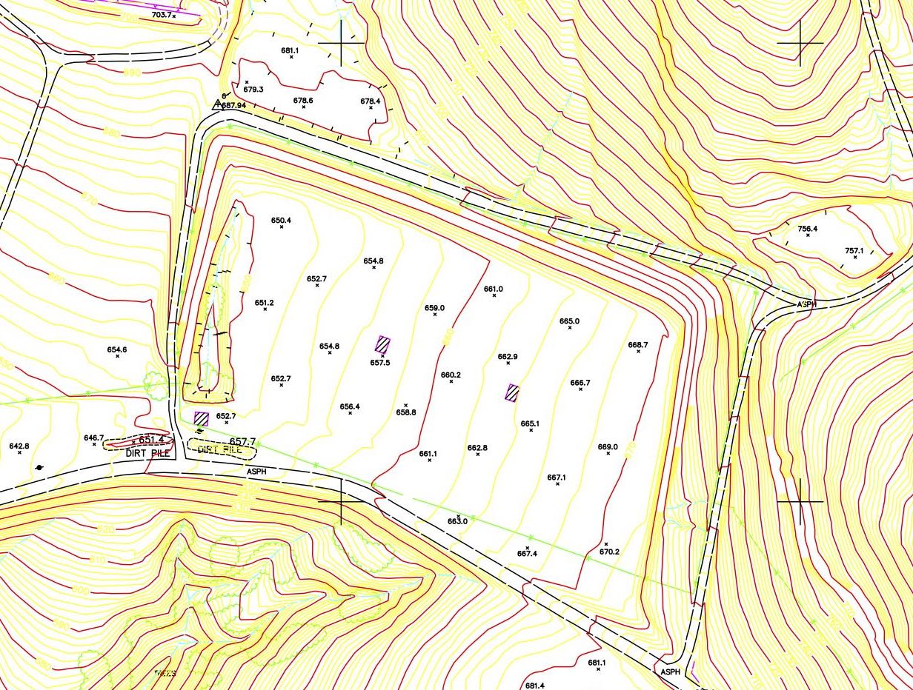
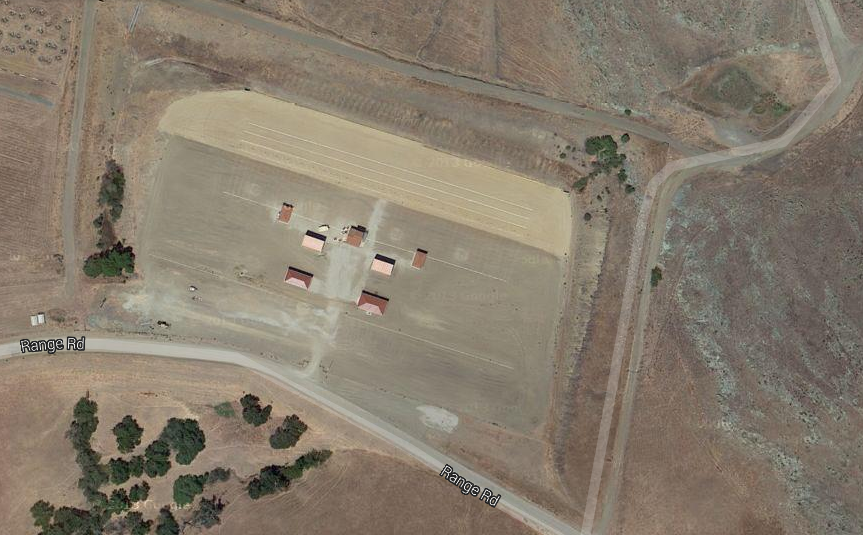
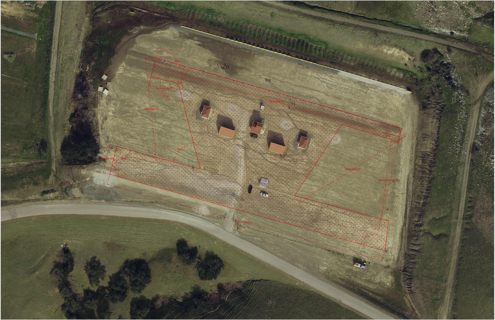
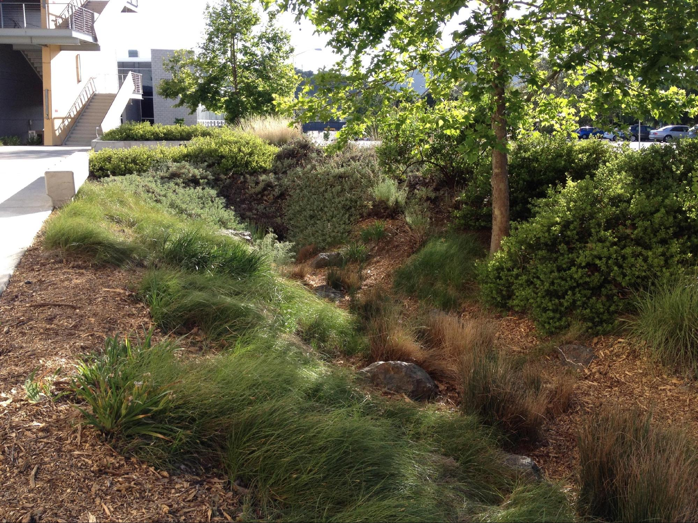

As a water resources specialist for Camp San Luis Obispo, I
performed hydrology analysis for the 5 acre Alpha Range and
subsequently developed a feasibility report for implementing
best management practices. The study involved determining the
appropriate detention basin size, designing a site plan, and
performing a rough order of magnitude cost estimate. I advised
on design practices to minimize mud build-up, erosion, and
sedimentation.

## Introduction

Camp San Luis Obispo is located just three miles north of the city limit and covers roughly 6,000 acres. The portion of the land examined in this report is the upper most shooting range (35.343704, -120.695366) nestled in the hills on the east side of highway 1. The Alpha Range site sits on a 5-acre piece of bare land with little to no vegetation.

The purpose of this report is to prepare a plan and recommendations for reducing the erosion on this range. The current site is considered a hazard during storm events due to excess mud build up and sedimentation. The project constraints carefully considered include: poor soil properties, steep slopes of the adjacent land, existing buildings and parking lot.

The environmentally sensitive erosion and sedimentation issues can be managed on-site through the implementation of best management practices and low impact development. The plan entails reducing bare soil surface area, providing a conveyance system, and proper detention.

Figure 1. A plan view of the Alpha Range in Camp San Luis Obispo. (Google Maps)

### Design Approach and Recommendations

The main elements considered in the erosion control plan are presented below. All three must be implemented simultaneously to ensure best results. Hydrologic analysis of the site was done prior using the Hydraflow Hydrographs extension for AutoCAD Civil 3D. Reference Appendix A for results.

### Surface Preparation

The soil properties of the area surrounding the shooting range were examined using an online soil survey provided by the National Resources Conservation Services (NRCS). The table below lists the soil type and percent slope of the examined area. Please refer to the Appendix B for a map of the areas examined.

The results included a large percentage of poor draining soils. The Zaca Clay, which occupies roughly 20% of the tributary area, is classified under Hydrologic Soil Group D. The characteristics of Soil Group D include very low infiltration rates. The Diablo Clay, Los Osos Loam and Nacimiento Silt are all considered Soil Group C, which also exhibit low infiltration rates. The rock outcrop, poor soil properties and steep slopes create an extremely high runoff potential in the areas surrounding the site.

Although the tributary area will not be changed, the bare soil surface of the range can be greatly improved. The roughly 2.75 acres of the range that are frequently used include the parking lot and areas surrounding the existing structures. In order to reduce the mud hazard, the soil should be compacted to 85% relative compaction and layered with 3 inches of class II base aggregate (Reference Figure 2).

.

Figure 2. Proposed area of base aggregate. Courtesy of Camp San Luis.

Placing base course on over half the site will greatly reduce sedimentation. When rain hits bare soil, it displaces and carries it with. The remaining bare soil surface area of the site should be covered with mulch or hydroseed to eliminate bare soil surface area entirely. By mulching (applying plant residue to) the remainder of the disturbed bare soil, the overland flow velocities will be reduced. Mulching also “fosters plant growth by increasing the available moisture and providing insulation against extreme heat or cold” (FHWA Drainage Design Manual). Mulching provides a cheaper alternative to seeding and requires much less maintenance.

## Conveyance

A bioswale is a shallow, vegetated channel constructed strategically to convey water to a detention basin. Bioswales allow for an aesthetic yet effective method for conveying runoff to the detention basin. Bioswales utilize low impact design to reduce runoff velocity and consequently increase infiltration. The existing site is longitudinally sloped at around 2-3% and will allow sufficient flow with a proper cross section. Native vegetation should be planted in the swale to reduce maintenance and create a consistent visual aesthetics in the area. A sampling of native species that may be included in bioswale is provided in Appendix C.

The channel dimensions and specifications were designed to accommodate a 25-year storm event. The occurrence of a 100-year storm, however, will not cause property damage because a 6” freeboard (additional height above design flow) was designed as a factor of safety against the increased flow. The cross section has been sized to facilitate flow velocity less than 5 ft./sec in order to control erosion. A flow velocity of 1.5 ft./sec would increase the water quality but is unnecessary and would require a larger cross section. Stone check dams should be constructed at 50-foot intervals to increase residence time.

The channel was designed with 2:1 side slope, 2-foot shoulder, and a 4-foot bottom width in order to allow easy maintenance and increase infiltration surface. Please reference Appendix C for a schematic of the channel and crossing cross-section.

Figure 3. A bioswale example on the Cal Poly campus by Bldg. 192

Currently, the rain collected by the gutter system on the five existing buildings is let out directly on to the bare soil. This flow produced by the rain collected contributes largely to the erosion due to its high velocity. Placing riprap and vegetation underneath the downspout would greatly reduce this problem. Constructing an underground pipe network that conveys the rainwater directly to the bioswale or detention basin is an alternative solution but may be costly in comparison.

## Storage

The high runoff velocity results in sedimentation on the northern side of the site where the basin is located. The detention basin outlet is currently blocked by debris and sedimentation after large storm events. The above-mentioned measures should reduce the volume of sediments entering the basin greatly, and eliminate this problem. The southern side of the basin should be sloped at 2:1 and vegetated similarly to the bioswale to prevent further erosion. Additionally, a silt fence can be placed at the toe of the range (head of the basin) to further reduce the introduction of sediments to the basin. The maximum effective life of a silt fence is approximately six months, so it should only be placed during the wet seasons when storm events are expected.

## References

California Department of Transportation. Highway Design Manual. 2013. Web.

<http://www.dot.ca.gov/hq/oppd/hdm/hdmtoc.htm>

City of San Luis Obispo Public Works Department. Drainage Design Manual. 2003.

 Web. <http://www.slocity.org/publicworks/download/wmp/ddm.pdf>

City of San Luis Obispo Public Works Department. Engineering Standards. 2010.

 Print.

City of San Luis Obispo Public Works Department. Hydrolgic Report. 2005.

 Web. <http://www.slocountywater.org/site/Water%20Resources/Reports/pdf>

Cudato, Donald P. Geotechnical Engineering Principles and Practices. Vol. 2. Print.

State of Oregon Department of Environmental Quality. Biofilters. 2003. Web.

 <http://www.deq.state.or.us/wq/stormwater/docs/nwr/biofilters.pdf>

U.S. Department of Transportation, Federal Highway Administration. Highway

 Hydrology. 2002\. Web. <http://isddc.dot.gov/OLPFiles/FHWA/013248.pdf>
