## Problem Introduction

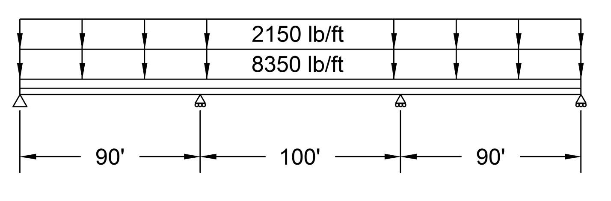

 This project’s topic is analyzing the I-beams supporting a freeway overpass. Analysis like this is a vital part of the overpass design process, which ensures such a bridge is safe for public use. Bridges are often supported using roller-type connections to allow expansion and minor movement (Carmichael). We have therefore simplified the overpass as an indeterminate beam on pin and roller connections supporting a distributed load. Using Matlab, we have created a program that finds:

- The bridge’s support reactions
- Shear, bending moment, angle and displacement diagrams
- Maximum and minimum of each of these
- Locations where the moment equals zero
- Required wide-flange beam cross-section
- Stress state at various points, including transformations and principal stresses
- Overall factor of safety.

In approaching our problem, we hoped to meet the objectives of:

- Improving our statics skills
- Solving for indeterminate reactions
- Finding shear and bending moment equations and diagrams for beams
- Becoming more proficient with Matlab
- Finding beam displacement equations
- Using failure criteria and principal stresses to find factor of safety
- Solving systems of linear equations, by hand and with numerical methods
- Using numerical methods to find roots
- Selecting beam cross-section using maximum bending moment criteria

To ensure a realistic bridge design, we based the distance between the supports on the Krenek bridge in Crosby, Texas (“Chapter 3”) and the cross-section on a sample provided by the U.S. Department of Transportation (“Concrete Deck Design”). We determined the distributed load due to the concrete deck by multiplying a typical concrete density supplied by the Portland Cement Association (“Frequently Asked Questions”) times the deck’s cross-sectional area. The distributed load representing traffic was estimated based on maximum truck lengths (“Vehicle Lengths”) and weights (“Weight Limitations”) allowed by CalTrans. Our factor of safety was based on a CalTrans document on bridge design stating 2.2 is a typical factor of safety for structural steel (“Chapter 1”). Material properties were drawn from Mechanics of Materials by Beer, while some of our superposition equations used in our solution also came from Strength and Stiffness of Engineering Systems by Frederick Leckie and a sheet put out by the National Technical University of Athens (“Beam Deflection Formulae”).

## Problem Statement

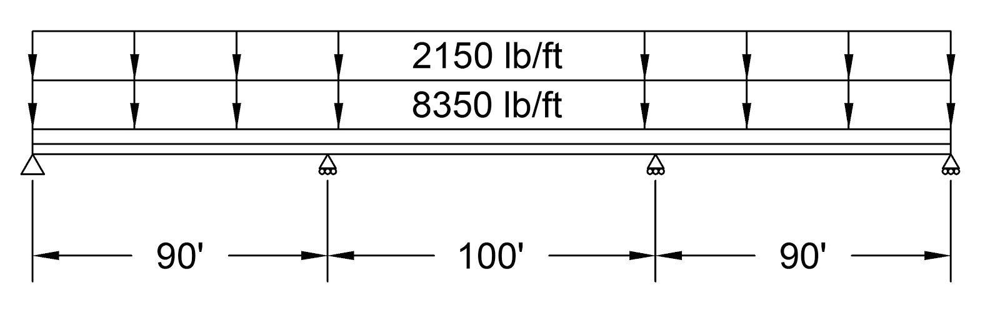

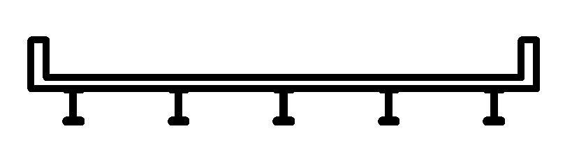

The above freeway bridge is held up by one pin support and three roller supports. The concrete deck is supported by five wide-flanged I-beams, and it can be represented by a distributed load of 8350 lbs/ft. The bridge’s maximum potential load can be approximated by a distributed load of 2150 lbs/ft (assuming bumper-to-bumper semi-trucks carrying maximum loads). Assume that all five I-beams carry an equal load, the weights of the beams are negligible, and that the concrete deck has no structural significance. For one beam:

1. Find all reaction forces and moments.
2. Plot the shear and bending moment diagrams.
3. Find the positions on the beam where the bending moment is zero.
4. Find the minimum and maximum shear force and bending moment.
5. Using the maximum bending moment, for the following materials, find a wide-flanged beam cross-section that will support the bridge, given a factor of safety of 2.2.
    - Structural steel: σyield = 58 ksi, E = 29x106 psi
    - Aluminum alloy 7075-T6: σyield = 73 ksi, E = 10.4x106 psi
    - Titanium: σyield = 120 ksi, E = 16.5x106 psi
    1. Plot deflection and slope, and find the maximum deflection and slope.
6. Find the state of stress (σxx, σyy, τxy) for the point on the beam x = 100 ft, y = 9 in. Transform the stress to an angle of 45° use stress transformation equations. Plot σxx, σyy, τxy with respect to transformation angle, and draw Mohr’s Circle for the point.
7. Make a false color plot of factor of safety using von Mises failure criteria. Identify the beam’s overall factor of safety.

## Calculations

### Initial Distributed Load Calculations

Truck Length = 75 ft  
Truck Weight = 80,000 lbs  

Distributed Load of 2 Trucks = \= 2134

Bridge:  
  
Length                 280 ft  
Outside Shoulder         10 ft  
Lane Width                 12 ft  
Deck Depth                 1 ft  
Rail Width                1.5 ft  

Total Bridge Width =  = 47ft

Typical Concrete Unit Weight = 145 (“Frequently Asked Questions”)

Bridge Weight =  = 2,334,500 lbs

Distributed Load due to Bridge Deck Weight =  = 8,337.5 

Total Distributed Load = 2134\+ 8,338  = 10,472

Per beam =  = 2094.4

To make the numbers even for the problem statement and result in a slightly conservative estimate, we rounded the distributed load for the trucks up to 2150 lbs/ft and the distributed load for the deck up to 8350 lbs/ft, resulting in a total distributed load of 10,500 lbs/ft and a load of 2,100 lbs/ft for each beam.

Solve for Reactions for the Support Pins on the Beam

Sum of forces in the “Y” direction:

ΣFy = 0 →    

Sum of the moments around pin A:

ΣMa \= 0 →    

Displacement of the beam at pin B and C equals zero (“Beam Deflection Formulae”):  
Pin B:

yb \= 0 →      

Pin C:

yc \= 0 →    

Put above equations into a matrix. The coefficients go into matrix \[A\], variables into matrix {R}, and the constants into matrix {b}:

 

\[A\]= {b}=

{R}=

Perform the LU factorization on the matrixes:

L= U=

Perform forward and back substitution in order to find the {R} matrix:

  → 

  →  

Reaction Values:

Ra\=73.488 kips  
Rb\=220.512 kips  
Rc\=220.512 kips  
Rd\=73.488 kips

Shear-Moment Equations

Where  is the distance from the end to the supports (90 ft) and  is the length of the beam (280 ft):

Section AB

 


 


Section BC

 


 


Section CD

 


 


Maximum/Minimum Shear

Maximum shear is found at the beginnings of each section:


Minimum shear is found at the ends of each section:


Maximum/Minimum Moment

Maximum moment is found where the derivative equals zero in each section:


Minimum moment is found at the beginnings or ends of each section:


Solve for locations where M = 0:


Section AB

Section BC

Section CD

a = -1.050

a = -1.050

a = -1.050

b = 73.49

b = 294.00

b = 514.51

c = 0

c = -19845.90

c = -61742.80

x = 0 ft, 69.99 ft

x = 113.56 ft, 166.44 ft

x = 210.01 ft, 280 ft

Using the quadratic formula like this finds an exact solution; the fzero function used in our program instead applies numerical methods to find an approximation.

I-Beam Selection (Structural Steel)


Beams that exceed this S:

W36x302, 

Only possible beam, therefore it must be used

W36x302

Depth: 

Flange Width: 

Flange Thickness: 

Web Thickness: 

Moment of Inertia: 

### Slope/Deflection

The equations for the deflection (δ) were derived using superposition. Our beam can be broken up into two cases, a simply supported beam under a uniform distributed load (weight of materials and the weight of the traffic load), and two equal, symmetrically positioned point loads (the two center supports). The deflection equation for a simply supported beam under a uniform distributed:


The deflection equations for two symmetrically placed, equal point loads are:

 for  

and

 for 

For our example the two point loads are supports in the middle, which requires a sign change in the equation. To combine the equations we simply add the displacement equations together to yield the following displacement equations. To derive the slope (θ) equations we took the derivative of the displacement equations to yield the following slope equations.

Slope (θ):


Displacement (δ):


Stress State at arbitrary point (100 ft, 9 in)

All measurements in inches unless stated otherwise

Beam Dimensions:

d = 37.3 in

tf = 1.680 in

tw = .9450 in

bf = 16.70 in

Moment and Shear Calculations:

V = 294.00 – 2.100(100)

V = 84.0 kips

M = -1.050(100)2 \+ 29.40(100)-19,845.9

M = -945.9 kip\*lb

Stress Calculations:

I = 21,100in4 (taken from appendix in Mechanics of Materials by Beer)

Q = 

Q = 597.48 in3

\= 

 = 


xx = 

xx = 


### Stress Transformation

θ = 45° (arbitrary angle)

\+ cos(2) 


Principal Stresses


Principal Plane


Factor of Safety at point, von Mises Criteria


### Script Files

FUNCTION 1 Script File

```matlab
function \[R\] = LUfact(A,b)

%A) Name:LUfact.m. Purpouse:If given matrix A and matrix b, returns the unknowns of

%the eqation1; \[A\]\*{x}={b}. To find {x}, LUfact(A,b) performs LU

%factorization to change the equation1 to equation2 and equation3;

%\[L\]\*{d}={b} and \[U\]\*{x}={d} respectively. By performing {d}\\\[U\], we can

%then find x values. To check, perform matrix multiplication of \[A\]\*{x} to

%see if the {b} matrix is returned.

%B) Program written:Feb. 23, 2013 Creators:Casey Kawahira, Itai Axelrad,

%   Loren Martin, & Steven Ambers for

%CE-251 project.

%C) Definitions of varibles: \[A\]=coefficents of the equation A(m,n)\*x(n)=b(n).

%{x}=varibles or unknowns of equation stated before. {b}=constants of the equation stated before.

%\[U\]=upper triangular matrix found with Guass Elimination of \[A'\]. \[L\]=lower

%triangular matrix of \[A'\] found with Guass Elimination. {d}=varibles of

%equation L(m,n)\*d(n)=b(n).

\[m,n\]=size(A); \[z,x\]=size(b);

if n~=z, error('inner dimenstions need to match'), end;

\[L, U\] = lu(A);

d=L\\b;

R=U\\d;

B=A\*R;

if B~=b, error('x values should return matrix b'), end;

fprintf('       Ra            Rb             Rc              Rd         (kips)\\n')

fprintf('%10.3f     %10.3f     %10.3f     %10.3f\\n',R')

end
```

FUNCTION 2 Script File

```matlab
function\[ min\_shear, min\_moment, max\_shear, max\_moment,V1func,V2func, ...

 V3func,M1func,M2func,M3func\] = shear\_moment(w, L, a, P, R)

%shear\_moment.m calculates the reaction forces and the maximum shear and

%maximum bending moments for an overpass under a uniformly distributed

%load, with two symetrical suports in the middle.

%Created by Loren Martin, Itai Axelrad, Casey Kawahira, and Steven Ambers

%on February 15, 2013

%

%input arguments:

%w=distributed load in kips

%L=length of the overpass in feet

%a=the distance from the end of the overpass to the closest middle support,

%  in feet.

%P=support reaction of centermost supports in kips. Assumes symmetrical beam.

%R=support reaction of outermost supports in kips. Assumes symmetrical beam.

%Output arguments:

%min\_shear=minimum shear along the beam in kips

%min\_moment=minimum bending moment along the beam in kip-feet

%max\_shear=maximum shear along the beam in kips

%max\_moment=maximum bending moment along the beam in kip-feet

%V1,V2,V3=Function handles for shear equations. Take argument x in feet and

%   return shear in kips

%M1,M2,M3=Function handles for moment equations. Take argument x in feet

%   and return bending moment in kip-feet.

%Shear and Moment for 0 <= x <= a

x1=0:a;

V1func=@(x1) R-w\*x1;

V1=V1func(x1);

M1func=@(x1) R\*x1-(w/2)\*x1.^2;

M1=M1func(x1);

%Shear and Moment for a <= x <= L - a

x2=a:(L-a);

V2func=@(x2) R+P-(w\*x2);

V2=V2func(x2);

M2func =@(x2) -(-(R\*x2)-(P\*(x2-a))+((w/2)\*(x2.^2)));

M2=M2func(x2);

%Shear and Moment for L - a <= x <= L

x3=(L-a):L;

V3func=@(x3) -R+w\*(L - x3);

V3=V3func(x3);

M3func=@(x3) R\*(L-x3)-((w/2)\*((L-x3).^2));

M3=M3func(x3);

% Add connecting lines between shear

V0\_5=\[0 V1(1)\];

x0\_5=\[x1(1) x1(1)\];

V1\_5=\[V1(end) V2(1)\];

x1\_5=\[x1(end) x2(1)\];

V2\_5=\[V2(end) V3(1)\];

x2\_5=\[x2(end) x3(1)\];

V3\_5=\[V3(end) 0\];

x3\_5=\[x3(end) x3(end)\];

A=\[min(V1) min(V2) min(V3)\];

B=\[min(M1) min(M2) min(M3)\];

C=\[max(V1) max(V2) max(V3)\];

D=\[max(M1) max(M2) max(M3)\];

min\_shear= min(A);

min\_moment= min(B);

max\_shear=max(C);

max\_moment=max(D);

% Make axes for shear/moment plots

xaxis\_x = \[x1(1)-1 x3(end)+1\];

xaxis\_y = zeros(size(xaxis\_x));

yaxis\_V = \[-1.1\*max(abs(\[min\_shear max\_shear\])) 1.1\*max(abs(\[min\_shear ...

 max\_shear\]))\];

yaxis\_M = \[-1.1\*max(abs(\[min\_moment max\_moment\])) 1.1\*max(abs(\[min\_moment ...

 max\_moment\]))\];

yaxis\_x = zeros(size(yaxis\_V));

subplot(2,1,1)

plot(x1,V1,'r',x1\_5,V1\_5,'r',x2,V2,'r',x2\_5,V2\_5,'r',x3,V3,'r', ...

 x3\_5,V3\_5,'r',xaxis\_x,xaxis\_y,'k',yaxis\_x,yaxis\_V,'k',x0\_5,V0\_5,'r');

grid

xlabel('length (ft)')

ylabel('shear (kips)')

legend('Shear')

title('Shear Diagram')

subplot(2,1,2)

plot(x1,M1,'b',x2,M2,'b',x3,M3,'b',xaxis\_x,xaxis\_y,'k',yaxis\_x,yaxis\_M,'k');

grid

xlabel('length (ft)')

ylabel('moment (kip-ft)')

legend('Moment')

title('Bending Moment Diagram')

fprintf('\\n Min Shear(kips)   Max Shear(kips)   Min Moment(kip-ft)  Max Moment(kip-ft)\\n')

fprintf('%10.3f        %10.3f          %10.3f          %10.3f\\n',min\_shear,max\_shear,min\_moment,max\_moment)
```

FUNCTION 3 Script File

```matlab
function \[name, A, d, bf, tf, tw, Ixx\] = wbeamselect(M\_max, sigma\_max, FS)

% wbeamselect.m

% Selects a standard wide-flanged I-beam cross section based on a given

% maximum moment, material yield stress, and factor of safety.

% NOTE: Please pay close attention to the input and output units

% Follows method described in Mechanics of Materials, Sixth Edition by

% Beer, Section 5.4.

% First created February 15, 2013 by Steven Ambers, Itai Axelrad, Loren

% Martin, and Casey Kawahira

%

% Input Variables:

%   M\_max = Maximum moment experienced by the beam, in KIP-FEET

%   sigma\_max = Yield strength of material being used for the beam, in KSI

%   FS = Factor of safety for the design

%

% Output Variables:

%   name = Selected beam's designation

%   A = Beam's cross-sectional area, in square INCHES

%   d = Beam's depth, in INCHES

%   bf = Flange width of the beam, in INCHES

%   tf = Flange thickness, in INCHES

%   tw = Web thickness, in INCHES

%   Ixx = Moment of inertia about the XX axis, in (INCHES)^4

% Parameter Values

% Beam properties taken from Mechanics of Materials, Sixth Edition by Beer,

% Appendix C

% Convert kip-feet to kip-inches

M\_max = M\_max\*12;

% Number of cross sections in each beam category

size\_list = \[2 2 2 2 2 3 4 5 10 9 10 11 5 2 1\]';

% Cross-section designations

name\_list = {'W36 x 302' 'W36 x 135' '' '' '' '' '' '' '' '' ''; % W36

 'W33 x 201' 'W33 x 118' '' '' '' '' '' '' '' '' ''; % W33

 'W30 x 173' 'W30 x 99' '' '' '' '' '' '' '' '' ''; % W30

 'W27 x 146' 'W27 x 84' '' '' '' '' '' '' '' '' ''; % W27

 'W24 x 104' 'W24 x 68' '' '' '' '' '' '' '' '' ''; % W24

 'W21 x 101' 'W21 x 62' 'W21 x 44' '' '' '' '' ... % W21

 '' '' '' '';

 'W18 x 106' 'W18 x 76' 'W18 x 50' 'W18 x 35' '' ... % W18

 '' '' '' '' '' '';

 'W16 x 77' 'W16 x 57' 'W16 x 40' 'W16 x 31' ... % W16

 'W16 x 26' '' '' '' '' '' '';

 'W14 x 370' 'W14 x 145' 'W14 x 82' 'W14 x 68' ... % W14

 'W14 x 53' 'W14 x 43' 'W14 x 38' 'W14 x 30'...

 'W14 x 26' 'W14 x 22' '';

 'W12 x 96' 'W12 x 72' 'W12 x 50' 'W12 x 40' ... % W12

 'W12 x 35' 'W12 x 30' 'W12 x 26' 'W12 x 22' 'W12 x 16' '' '';

 'W10 x 112' 'W10 x 68' 'W10 x 54' 'W10 x 45' ... % W10

 'W10 x 39' 'W10 x 33' 'W10 x 30' 'W10 x 22' ...

 'W10 x 19' 'W10 x 15' '';

 'W8 x 58' 'W8 x 48' 'W8 x 40' 'W8 x 35' ... % W8

 'W8 x 31' 'W8 x 28' 'W8 x 24' 'W8 x 21' ...

 'W8 x 18' 'W8 x 15' 'W8 x 13';

 'W6 x 25' 'W6 x 20' 'W6 x 16' 'W6 x 12' ... % W6 

 'W6 x 9' '' '' '' '' '' '';

 'W5 x 19' 'W5 x 16' '' '' '' '' '' '' '' '' ''; % W5

 'W4 x  13' '' '' '' '' '' '' '' '' '' ''}; % W4

% Beam Weights (Matches second number of designation), in pounds per foot

weight\_list = \[302 135 0 0 0 0 0 0 0 0 0; % W36

 201 118 0 0 0 0 0 0 0 0 0; % W33

 173 99 0 0 0 0 0 0 0 0 0; % W30

 146 84 0 0 0 0 0 0 0 0 0; % W27

 104 68 0 0 0 0 0 0 0 0 0; % W24

 101 62 44 0 0 0 0 0 0 0 0; % W21

 106 76 50 35 0 0 0 0 0 0 0; % W18

 77 57 40 31 26 0 0 0 0 0 0; % W16

 370 145 82 68 53 43 38 30 26 22 0; % W14

 96 72 50 60 35 30 26 22 16 0 0; % W12

 112 68 54 45 39 33 30 22 19 15 0; % W10

 58 48 40 35 31 28 24 21 18 15 13; % W8

 25 20 16 12 9 0 0 0 0 0 0; % W6

 19 16 0 0 0 0 0 0 0 0 0; % W5

 13 0 0 0 0 0 0 0 0 0 0\]; % W4

% Cross sectional area, in square inches

A\_list = \[88.8 39.7 0 0 0 0 0 0 0 0 0; % W36

 59.2 34.7 0 0 0 0 0 0 0 0 0; % W33

 51.0 29.1 0 0 0 0 0 0 0 0 0; % W30

 43.1 24.8 0 0 0 0 0 0 0 0 0; % W27

 30.6 20.1 0 0 0 0 0 0 0 0 0; % W24

 29.8 18.3 13.0 0 0 0 0 0 0 0 0; % W21

 31.1 22.3 14.7 10.3 0 0 0 0 0 0 0; % W18

 22.6 16.8 11.8 9.13 7.68 0 0 0 0 0 0; % W16

 109 42.7 24.0 20.0 15.6 12.6 11.2 8.85 7.69 6.49 0; % W14

 28.2 21.1 14.6 11.7 10.3 8.79 7.65 6.48 4.71 0 0; % W12

 32.9 20.0 15.8 13.3 11.5 9.71 8.84 6.49 5.62 4.41 0; % W10

 17.1 14.1 11.7 10.3 9.12 8.24 7.08 6.16 5.26 4.44 3.84;% W8

 7.34 5.87 4.74 3.55 2.68 0 0 0 0 0 0; % W6

 5.56 4.71 0 0 0 0 0 0 0 0 0; % W5

 3.83 0 0 0 0 0 0 0 0 0 0\]; % W4

% Beam Depth, in inches

d\_list = \[37.3 35.6 0 0 0 0 0 0 0 0 0; % W36

 33.7 32.9 0 0 0 0 0 0 0 0 0; % W33

 30.4 29.7 0 0 0 0 0 0 0 0 0; % W30

 27.4 26.70 0 0 0 0 0 0 0 0 0; % W27

 24.1 23.7 0 0 0 0 0 0 0 0 0; % W24

 21.4 21.0 20.7 0 0 0 0 0 0 0 0; % W21

 18.7 18.2 18.0 17.7 0 0 0 0 0 0 0; % W18

 16.5 16.4 16.0 15.9 15.7 0 0 0 0 0 0; % W16

 17.9 14.8 14.3 14.0 13.9 13.7 14.1 13.8 13.9 13.7 0; % W14

 12.7 12.3 12.2 11.9 12.5 12.3 12.2 12.3 12.0 0 0; % W12

 11.4 10.4 10.1 10.1 9.92 9.73 10.5 10.2 10.2 10.0 0; % W10

 8.75 8.50 8.25 8.12 8.00 8.06 7.93 8.28 8.14 8.11 7.99;% W8

 6.38 6.20 6.28 6.03 5.90 0 0 0 0 0 0; % W6

 5.15 5.01 0 0 0 0 0 0 0 0 0; % W5

 4.16 0 0 0 0 0 0 0 0 0 0\]; % W4

% Flange Width, in inches

bf\_list = \[16.7 12.0 0 0 0 0 0 0 0 0 0; % W36

 15.7 11.5 0 0 0 0 0 0 0 0 0; % W33

 15.0 10.50 0 0 0 0 0 0 0 0 0; % W30

 14.0 10.0 0 0 0 0 0 0 0 0 0; % W27

 12.8 8.97 0 0 0 0 0 0 0 0 0; % W24

 12.3 8.24 6.50 0 0 0 0 0 0 0 0; % W21

 11.2 11.0 7.50 6.00 0 0 0 0 0 0 0; % W18

 10.3 7.12 7.00 5.53 5.50 0 0 0 0 0 0; % W16

 16.5 15.5 10.1 10.0 8.06 8.00 6.77 6.73 5.03 5.00 0; % W14

 12.2 12.0 8.08 8.01 6.56 6.52 6.49 4.03 3.99 0 0; % W12

 10.4 10.1 10.0 8.02 7.99 7.96 5.81 5.75 4.02 4.00 0; % W10

 8.22 8.11 8.07 8.02 8.00 6.54 6.50 5.27 5.25 4.01 4.00;% W8

 6.08 6.02 4.03 4.00 3.94 0 0 0 0 0 0; % W6

 5.03 5.00 0 0 0 0 0 0 0 0 0; % W5

 4.06 0 0 0 0 0 0 0 0 0 0\]; % W4

% Flange Thickness, in inches

tf\_list = \[1.68 0.790 0 0 0 0 0 0 0 0 0; % W36

 1.15 0.740 0 0 0 0 0 0 0 0 0; % W33

 1.07 0.670 0 0 0 0 0 0 0 0 0; % W30

 0.975 0.640 0 0 0 0 0 0 0 0 0; % W27

 0.750 0.585 0 0 0 0 0 0 0 0 0; % W24

 0.800 0.615 0.450 0 0 0 0 0 0 0 0; % W21

 0.940 0.680 0.570 0.425 0 0 0 0 0 0 0; % W18

 0.76 0.715 0.505 0.440 0.345 0 0 0 0 0 0; % W16

 2.66 1.09 0.855 0.720 0.660 0.530 0.515 0.385 ... % W14

 0.420 0.335 0;

 0.900 0.670 0.640 0.515 0.520 0.440 0.380 0.425 ... % W12

 0.265 0 0;

 1.25 0.770 0.615 0.620 0.530 0.435 0.510 0.360 ... % W10

 0.395 0.270 0;

 0.810 0.685 0.560 0.495 0.435 0.465 0.400 0.400 ... % W8

 0.330 0.315 0.255;

 0.455 0.365 0.405 0.280 0.215 0 0 0 0 0 0; % W6

 0.430 0.360 0 0 0 0 0 0 0 0 0; % W5

 0.345 0 0 0 0 0 0 0 0 0 0\]; % W4

% Web Thickness, in inches

tw\_list = \[0.945 0.600 0 0 0 0 0 0 0 0 0; % W36

 0.715 0.550 0 0 0 0 0 0 0 0 0; % W33

 0.655 0.520 0 0 0 0 0 0 0 0 0; % W30

 0.605 0.460 0 0 0 0 0 0 0 0 0; % W27

 0.500 0.415 0 0 0 0 0 0 0 0 0; % W24

 0.500 0.400 0.350 0 0 0 0 0 0 0 0; % W21

 0.590 0.425 0.355 0.300 0 0 0 0 0 0 0; % W18

 0.455 0.430 0.305 0.275 0.250 0 0 0 0 0 0; % W16

 1.66 0.680 0.510 0.415 0.370 0.305 0.310 0.270 ... % W14

 0.255 0.230 0;

 0.550 0.430 0.370 0.295 0.300 0.260 0.230 0.260 ... % W12

 0.220 0 0;

 0.755 0.470 0.370 0.350 0.315 0.290 0.300 0.240 ... % W10

 0.250 0.230 0;

 0.510 0.400 0.360 0.310 0.285 0.285 0.245 0.250 ... % W8

 0.230 0.245 0.230;

 0.320 0.260 0.260 0.230 0.170 0 0 0 0 0 0; % W6

 0.270 0.240 0 0 0 0 0 0 0 0 0; % W5

 0.280 0 0 0 0 0 0 0 0 0 0\]; % W4

% Moment of Inertia about the XX axis, in (inches)^4

Ixx\_list = \[21100 7800 0 0 0 0 0 0 0 0 0; % W36

 11600 5900 0 0 0 0 0 0 0 0 0; % W33

 8230 3990 0 0 0 0 0 0 0 0 0; % W30

 5660 2850 0 0 0 0 0 0 0 0 0; % W27

 3100 1830 0 0 0 0 0 0 0 0 0; % W24

 2420 1330 843 0 0 0 0 0 0 0 0; % W21

 1910 1330 800 510 0 0 0 0 0 0 0; % W18

 1110 758 518 375 301 0 0 0 0 0 0; % W16

 5440 1710 881 722 541 428 385 291 245 199 0; % W14

 833 597 391 307 285 238 204 156 103 0 0; % W12

 716 394 303 248 209 171 170 118 96.3 68.9 0; % W10

 228 184 146 127 110 98.0 82.7 75.3 61.9 48.0 39.6; % W8

 53.4 41.4 32.1 22.1 16.4 0 0 0 0 0 0; % W6

 26.3 21.4 0 0 0 0 0 0 0 0 0; % W5

 11.3 0 0 0 0 0 0 0 0 0 0\]; % W4

% Calculation Section

sigma\_all = sigma\_max/FS; % Calculate maximum allowable stress

S\_min = abs(M\_max)/sigma\_all; % Calculate minimum section modulus

% Preallocate matrices to store indices and matching weights

% for a beam from each category

% Weight matrix preassigned a value of Inf because selection

% will be based on lightest beam, and no beam can weigh Inf

beams\_ind = zeros(\[1 15\]);

beams\_wght = Inf\*ones(\[1 15\]);

% Iterate through beam types and record the index and weight of the

% first beam with a sufficient section modulus

\[m,n\] = size(weight\_list);

for i = 1:m

 % Iterate backwards through each beam type

 for j = size\_list(i):-1:1

 if (Ixx\_list(i,j)/(d\_list(i,j)/2)) >= S\_min

 beams\_ind(i) = j;

 beams\_wght(i) = weight\_list(i,j);

 break

 end

 end

end

% Find which of these valid beam types has the lightest weight

% minw stores the minimum weight, minwindex records the index

% of the corresponding beam

\[minw,minwindex\] = min(beams\_wght);

% If the "minimum" supposedly weighs Inf, no beams met the section

% modulus.  Return the W36 x 302 beam and display a warning

if minw == Inf

 fprintf('Warning: No available beam met the required section modulus.\\n')

 fprintf('A W36 x 302 beam has been returned.\\n')

 name = char(name\_list(1,1));

 A = A\_list(1,1);

 d = d\_list(1,1);

 bf = bf\_list(1,1);

 tf = tf\_list(1,1);

 tw = tw\_list(1,1);

 Ixx = Ixx\_list(1,1);

% Otherwise, return the corresponding beam cross section

else

 name = char(name\_list(minwindex, beams\_ind(minwindex)));

 A = A\_list(minwindex, beams\_ind(minwindex));

 d = d\_list(minwindex, beams\_ind(minwindex));

 bf = bf\_list(minwindex, beams\_ind(minwindex));

 tf = tf\_list(minwindex, beams\_ind(minwindex));

 tw = tw\_list(minwindex, beams\_ind(minwindex));

 Ixx = Ixx\_list(minwindex, beams\_ind(minwindex));

end

fprintf('\\n')

fprintf('Beam type: %s\\n', name)

fprintf('Area: %.3f in^2\\n',A)

fprintf('Depth: %.3f in\\n',d)

fprintf('Flange Width: %.3f in\\n',bf)

fprintf('Flange Thickness: %.3f in\\n',tf)

fprintf('Web Thickness: %.3f in\\n',tw)

fprintf('Moment of Inertia: %.3f in^4\\n',Ixx)
```

FUNCTION 4 Script File

```matlab
function\[min\_slope, min\_displacement, max\_slope, max\_displacement\]=ang\_disp(w,P,L,a,E,I,mat)

% First created February 16, 2013 by Steven Ambers, Itai Axelrad, Loren

% Martin, and Casey Kawahira

%ang\_disp.m calculatets the maximum and minimum slope and maximum and minimum displacement

%for an I-beam in an overpass under a uniformly distributed

%load, with two symmetrical suports in the middle.

%input arguments:

%w=distributed load in kips

%L=lenght of the overpass in feet

%E=modulus of elasticity for the I-beam in ksi

%I=moment of inertia for the I-beam in inches^4

%a=the distance from the end of the overpass to the closest middle support, in feet.

% P = reactions at center supports in kips

% mat = name of material being used

%Output arguments

%min\_slope = minimum slope on beam, unitless

%min\_displacement = minimum displacement on beam, in inches

%max\_slope = maximum slope on beam, unitless

%max\_displacement = maximum displacement on beam, in inches

%Slope and Deflection for 0 <= x <= a

x1 = 0:a;

theta1 = (-w/(24\*E\*I))\*(L^3 - 6\*L\*x1.^2 + 4\*x1.^3) + (P/(2\*E\*I))\*(L\*a - a^2 - x1.^2);

delta1 = 12\*((-w/(24\*E\*I))\*(L^3\*x1 - 2\*L\*x1.^3 + x1.^4)+(P/(6\*E\*I))\*(3\*L\*a\*x1 - 3\*a^2\*x1 - x1.^3));

%Slope, and Deflection for a <= x <= L - a

x2 = a:(L-a);

theta2 = (-w/(24\*E\*I))\*(L^3 - 6\*L\*x2.^2 + 4\*x2.^3) + (P\*a/(2\*E\*I))\*(L - 2\*x2);

delta2 = 12\*((-w/(24\*E\*I))\*(L^3\*x2 - 2\*L\*x2.^3 + x2.^4)+(P\*a/(6\*E\*I))\*(3\*L\*x2 - 3\*x2.^2 - a^2));

%Slope, and Deflection for L - a <= x <= L

x3 = (L-a):L;

theta3 = -((-w/(24\*E\*I))\*(L^3 - 6\*L\*(L - x3).^2 + 4\*(L - x3).^3) + (P/(2\*E\*I))\*(L\*a - a^2 - (L - x3).^2));

delta3 = 12\*((-w/(24\*E\*I))\*(L^3\*(L - x3) - 2\*L\*(L - x3).^3 + (L - x3).^4)+(P/(6\*E\*I))\*(3\*L\*a\*(L - x3)- 3\*a^2\*(L - x3) - (L - x3).^3));

% Minimum and Maximum slope and displacement

A=\[min(theta1) min(theta2) min(theta3)\];

B=\[min(delta1) min(delta2) min(delta3)\];

C=\[max(theta1) max(theta2) max(theta3)\];

D=\[max(delta1) max(delta3) max(delta3)\];

min\_slope = min(A);

min\_displacement = min(B);

max\_slope = max(C);

max\_displacement = max(D);

% Make axes for shear/moment plots

xaxis\_x = \[x1(1)-1 x3(end)+1\];

xaxis\_y = zeros(size(xaxis\_x));

yaxis\_S = \[-1.1\*max(abs(\[min\_slope max\_slope\])) 1.1\*max(abs(\[min\_slope ...

 max\_slope\]))\];

yaxis\_D = \[-1.1\*max(abs(\[min\_displacement max\_displacement\])) 1.1\*max(abs(\[min\_displacement ...

 max\_displacement\]))\];

yaxis\_x = zeros(size(yaxis\_S));

figure

subplot(2,1,1)

plot(x1,theta1,'r',x2,theta2,'r',x3,theta3,'r',xaxis\_x,xaxis\_y,'k',yaxis\_x,yaxis\_S,'k');

grid

xlabel('length (ft)')

ylabel('angle')

legend('Slope')

title(\['Slope Diagram, ' mat\])

subplot(2,1,2)

plot(x1,delta1,'b',x2,delta2,'b',x3,delta3,'b',xaxis\_x,xaxis\_y,'k',yaxis\_x,yaxis\_D,'k');

grid

xlabel('length (ft)')

ylabel('displacement (ft)')

legend('Displacement')

title(\['Displacement Diagram, ' mat\])

fprintf('\\n Min Slope     Max Slope     Min Displacement(in)   Max Displacement(in)\\n')

fprintf('%10.3d    %10.3d     %10.3d        %10.3d\\n',min\_slope,max\_slope,min\_displacement,max\_displacement)
```

FUNCTION 5 Script File

```matlab
function \[sigma\_xxp, sigma\_yyp, tau\_xyp, min\_princ, max\_princ, thetap1, ...

 thetap2\] = stressstate(x, y, v1, M1, r1, v2, M2, r2, v3, M3, r3, ...

 theta\_d, beamd, beambf, beamtf, beamtw, beamIxx)

% stressstate.m

% Calculates the state of stress at an arbitrary point on a beam, given the

% properties of the I-beam's cross-section and three shear and moment

% equations.

% NOTE: Please pay close attention to the input and output units

% First created February 16, 2013 by Steven Ambers, Itai Axelrad, Loren

% Martin, and Casey Kawahira

%

% Input Variables:

% x = Horizontal location on the beam, in FEET, for which the stress state

%   is desired

% y = Vertical location from the neutral axis on the beam, in INCHES, for

%   which the stress state is desired

% v1, v2, v3 = Function handles for three shear force equations, in KIPS

% M1, M2, M3 = Function handles for three bending moment equations, in

%   KIP-FEET

% r1, r2, r3 = Vectors indicating the range in FEET over which each

%   shear/moment equation is valid. rx(1) is the lower bound, rx(2) is the

%   upper bound

% theta\_d = Angle of stress transformation, in DEGREES

% beamd = Cross-section beam depth, in INCHES

% beambf = Flange width, in INCHES

% beamtf = Flange thickness, in INCHES

% beamtw = Web thickness, in INCHES

% beamIxx = Moment of inertia of cross-section about the XX-axis, in

%   INCHES^4

%

% Output Variables:

% sigma\_xxp = Axial stress, in the xx direction, in KSI

% sigma\_yyp = Axial stress, in the yy direction, in KSI

% tau\_xyp = Shear stress, on the xy plane, in KSI

% min\_princ = Minimum principal stress, in KSI

% max\_princ = Maximum principal stress, KSI

% thetap1, thetap2 = Principal stress angles, in DEGREES

% If matrices of points are entered, check that the dimensions of x and y

% match

\[m, n\] = size(x);

\[o, p\] = size(y);

if (m ~= o) || (n ~= p)

 error('Matrices x and y must have the same dimensions')

end

% If the dimensions do match, iterate through all pairings of x and y, and

% find the stress state for those points

% Preallocate matrices to return the stress states

sigma\_xx = zeros(\[m n\]);

sigma\_yy = zeros(\[m n\]);

tau\_xy = zeros(\[m n\]);

min\_princ = zeros(\[m n\]);

max\_princ = zeros(\[m n\]);

thetap1 = zeros(\[m n\]);

thetap2 = zeros(\[m n\]);

% Iterate through points

% Do in loops rather than as matrix operations because if statements are

% needed for logic to work

for i = 1:m

 for j = 1:n

 % Make sure that y is not outside the thickness of the beam

 if abs(y(i,j)) > beamd/2

 fprintf('x = %d y = %d\\n',x(i,j),y(i,j))

 error('y must be a point on the beam.')

 end

 % Calculation Section

 % Calculate the shear force and moment at the given point

 % In the process, convert moments from pound-feet to pound-inches

 if (x(i,j) >= r1(1)) && (x(i,j) <= r1(2))

 v = v1(x(i,j));

 M = M1(x(i,j))\*12;

 elseif (x(i,j) >= r2(1)) && (x(i,j) <= r2(2))

 v = v2(x(i,j));

 M = M2(x(i,j))\*12;

 elseif (x(i,j) >= r3(1)) && (x(i,j) <= r3(2))

 v = v3(x(i,j));

 M = M3(x(i,j))\*12;

 else

 fprintf('x = %d y = %d\\n',x(i,j),y(i,j))

 error('X must be within a range given for one of the equations.')

 end

 % sigma\_yy will always be zero, since this is not a pressure vessel

 % Therefore, no need to reassign the default zeros matrix

 % sigma\_xx comes from the moment, = -My/I

 sigma\_xx(i,j) = -M\*y(i,j)/beamIxx;

 % tau\_xy comes from the shear, VQ/It

 % Calculate Q and determine t

 if abs(y(i,j)) <= (beamd/2-beamtf)

 % Add the shear flow regions' areas times their centroids

 Q = ((beamtf\*beambf)\*(beamd/2-beamtf/2)+ ...

 (((beamd/2-beamtf)+abs(y(i,j)))/2)\* ...

 ((beamd/2-beamtf-abs(y(i,j)))\*beamtw));

 t = beamtw;

 else

 Q = ((beamd/2-abs(y(i,j)))\*beambf)\*((beamd/2+abs(y(i,j)))/2);

 t = beambf;

 end

 % Calculate tau\_xy

 % Use a negative v to compensate for the fact that the sign conventions for

 % beam shear and Mohr's circle are opposite.

 tau\_xy(i,j) = -v\*Q/(beamIxx\*t);

 % Principal planes and stresses given sigma\_xx, sigma\_yy and tau\_xy

 A=\[sigma\_xx(i,j) tau\_xy(i,j); tau\_xy(i,j) sigma\_yy(i,j)\];

 \[vectors,values\]=eig(A);

 min\_princ(i,j) = values(1,1);

 max\_princ(i,j) = values(2,2);

 end

% Stress Transformation for Mohr's Circle given theta, sigma\_xx, sigma\_yy and tau\_xy

theta = theta\_d\*pi/180;

sigma\_xxp=((sigma\_xx+sigma\_yy)/2)+((sigma\_xx-sigma\_yy)/2).\*cos(2\*theta)+(tau\_xy.\*sin(2\*theta));

sigma\_yyp=((sigma\_xx+sigma\_yy)/2)-((sigma\_xx-sigma\_yy)/2).\*cos(2\*theta)-(tau\_xy.\*sin(2\*theta));

tau\_xyp =-((sigma\_xx-sigma\_yy)/2).\*sin(2\*theta)+(tau\_xy.\*cos(2\*theta));

% Instead of displaying the eigenvectors we have chosen the tangent formula

% to calculate the principal angles because we want to show the

% transformation angle instead of the orientation vectors.

thetap1 = (atan((2\*tau\_xy)./(sigma\_xx-sigma\_yy))/2)\*180/(pi);

thetap2 = thetap1+90;

end
```

FUNCTION 6 Script File

```matlab
function transplot(x, y, v1, M1, r1, v2, M2, r2, v3, M3, r3, ...

 beamd, beambf, beamtf, beamtw, beamIxx, mat)

% transplot.m

% Run wbeamselect to determine I-beam properties

% Run stressstate function to determine sigma\_xxp, sigma\_yyp and tau\_xyp

% Plot sigma\_xxp, sigma\_yyp and tau\_xyp versus theta

% Plot Mohr's Circle with R from points (sigma\_xx,tau\_xy) and (sigma\_yy,tau\_xy)

% Created February 22, 2013 by Steven Ambers, Itai Axelrad, Loren

% Martin, and Casey Kawahira

% -

% Input Variables:

% x = Horizontal location on the beam, in FEET, for which the stress state

%   is desired

% y = Vertical location from the neutral axis on the beam, in INCHES, for

%   which the stress state is desired

% v1, v2, v3 = Function handles for three shear force equations, in KIPS

% M1, M2, M3 = Function handles for three bending moment equations, in

%   KIP-FEET

% r1, r2, r3 = Vectors indicating the range in FEET over which each

%   shear/moment equation is valid. rx(1) is the lower bound, rx(2) is the

%   upper bound

% beamd = Cross-section beam depth, in INCHES

% beambf = Flange width, in INCHES

% beamtf = Flange thickness, in INCHES

% beamtw = Web thickness, in INCHES

% beamIxx = Moment of inertia of cross-section about the XX-axis, in INCHES^4

% mat = Name of material used

% -

theta\_d = 0:360;

sigma\_xxp = zeros(size(theta\_d));

sigma\_yyp = zeros(size(theta\_d));

tau\_xyp = zeros(size(theta\_d));

for i = 1:length(theta\_d)

\[sigma\_xxp(i), sigma\_yyp(i), tau\_xyp(i), min\_princ, max\_princ\] = stressstate(x, y, v1, M1, r1, v2, M2, r2, v3, M3, r3, ...

 theta\_d(i), beamd, beambf, beamtf, beamtw, beamIxx);

end

% Generate points for axes

xaxis\_y = zeros(size(theta\_d));

yaxis\_y = \[-1.1\*max(abs(sigma\_xxp)) 1.1\*max(abs(sigma\_xxp))\];

yaxis\_x = zeros(size(yaxis\_y));

% Plot: sigma\_xxp, sigma\_yyp and tau\_xyp versus theta

figure

plot(theta\_d, sigma\_xxp,'-r', theta\_d, sigma\_yyp,'-b', theta\_d, tau\_xyp,'-g', ...

 theta\_d, xaxis\_y, 'k', yaxis\_x, yaxis\_y, 'k')

title(\['Stress Transformation vs. Theta, ' mat\])

xlabel('Theta')

legend('sigma xx','sigma yy','tau xy')

% Plot: Mohr's Circle

r = (max\_princ-min\_princ)/2;

sigma\_avg = (max\_princ+min\_princ)/2;

xx = \[sigma\_avg-1.1\*r sigma\_avg+1.1\*r\];

yy = \[-1.1\*r 1.1\*r\];

sigma = \[sigma\_yyp(1) sigma\_xxp(1)\];

tau = \[-tau\_xyp(1) tau\_xyp(1)\];

figure

plot(sigma\_xxp, -tau\_xyp,'-r',xx,zeros(size(xx)),'-black',zeros(size(yy)),yy,'-black',sigma,tau,'-or')

title(\['Mohrs Circle, ' mat\])

xlabel('Sigma(psi)')

ylabel('Tau(psi)')

legend('Mohrs Circle')

end
```

FUNCTION 7 Script File

```matlab
function \[FS\] = fsplot(sigma\_max, v1, M1, r1, ...

 v2, M2, r2, v3, M3, r3, beamd, beambf, beamtf, beamtw, beamIxx, mat)

% fsplot.m

% Makes a false-color plot of factor of safety along the beam and returns

% the beam's overall factor of safety, given the properties of the

% I-beam's cross-section and three shear and moment equations.

% High stresses / low factors of safety are indicated by blue/green colors,

% while red colors indicate low stresses / high factors of safety

% Uses user-defined function stressstate.m

% NOTE: Please pay close attention to the input and output units

% First created February 21, 2013 by Steven Ambers, Itai Axelrad, Loren

% Martin, and Casey Kawahira

%

% Input Variables:

% sigma\_max = Yield strength of material being used for the beam, in KSI

% v1, v2, v3 = Function handles for three shear force equations, in KIPS

% M1, M2, M3 = Function handles for three bending moment equations, in

%   KIP-FEET

% r1, r2, r3 = Vectors indicating the range in FEET over which each

%   shear/moment equation is valid. rx(1) is the lower bound, rx(2) is the

%   upper bound

% beamd = Cross-section beam depth, in INCHES

% beambf = Flange width, in INCHES

% beamtf = Flange thickness, in INCHES

% beamtw = Web thickness, in INCHES

% beamIxx = Moment of inertia of cross-section about the XX-axis, in

%   INCHES^4

%

% Output Variables:

% FS = Factor of Safety for the beam

% Create an x and y range over which to evaluate

% Range should cover the entire beam

x\_min = min(\[r1 r2 r3\]);

x\_max = max(\[r1 r2 r3\]);

x\_range = \[x\_min:0.1:x\_max\];

y\_range = linspace(-beamd/2,beamd/2,50);

% Use meshgrid to convert these into matching matrices of points

\[x\_mesh, y\_mesh\] = meshgrid(x\_range, y\_range);

% Generate arrays for the stress states

\[sigma\_xx, sigma\_yy, tau\_xy,minprinc, maxprinc, thetap1,thetap2\] = ...

 stressstate(x\_mesh, y\_mesh, v1, M1, r1, v2, M2, r2, v3, M3, r3, 0, ...

 beamd, beambf, beamtf, beamtw, beamIxx);

% Generate an array for factor of safety

\[m, n\] = size(x\_mesh);

FS\_plot = zeros(\[m n\]); % Preallocate factor of safety plot

FS\_plot = (sigma\_max\*ones(size(minprinc)))./sqrt(minprinc.^2 - ...

 minprinc.\*maxprinc + maxprinc.^2);

% Make false color plot of beam

figure

shading interp

h=pcolor(x\_mesh, y\_mesh, FS\_plot);

contourcbar % Draw color bar

caxis(\[0 10\])

set(h,'edgecolor','none'); % Disable edge color so that plot is visible

% Approach from http://www.mathworks.com/support/solutions/en/data/

% 1-1U78P7/index.html?product=SL&solution=1-1U78P7

title(\['Factor of Safety Plot, ' mat\])

xlabel('Horizontal Position (Feet)')

ylabel('Vertical Position (Inches)')

% Create and draw lines to indicate the flanges on the beams

flange\_x = \[x\_min x\_max\];

flange\_y1 = (beamd-beambf)/2\*ones(\[1 2\]);

flange\_y2 = -(beamd-beambf)/2\*ones(\[1 2\]);

hold on

plot(flange\_x, flange\_y1, 'k', flange\_x, flange\_y2, 'k')

hold off

FS = min(min(FS\_plot));
```

MAIN SCRIPT

```matlab
clc

clear all

close all

%

% masterscript.m

% First created February 21, 2013 by Steven Ambers, Itai Axelrad, Loren

% Martin, and Casey Kawahira

% Runs all seven function and organizes outputs and plots

% Uses user-defined functions: LUfact.m, shear\_moment.m, wbeamselect.m,

% ang\_disp.m, stressstate.m, transplot.m and fsplot.m

%

% Input Variables:

% w=distributed load in kips

% L=lenght of the overpass in feet

% a=the distance from the end of the overpass to the closest middle support

% b=length from edge support to third support in feet

% E\_steel=Modulus of elasticity for structural steel in ksi

% E\_Al=Modulus of elasticity for aluminum alloy 7075-T6 in ksi

% E\_Ti=Modulus of elasticity for titanium in ksi

% Y\_Steel=Yielding strength for structural steel in ksi

% Y\_Al=Yielding strength for aluminum alloy 7075-T6 in ksi

% Y\_Ti=Yielding stregth for titanium in ksi

% FS=Design factor of safety

%

% Output Variables:

% root = location where bending moment is zero

% FSS = factor of safety for structural steel

% FSAl = factor of safety for Aluminum alloy 7075-T6

% FSTi = factor of safety for Titanium

%

L=280;

a=90; if a>=L,error('a must be less than L'),end;

b=L-a; if L-b~=a,error('beam is not symmetrical'),end;

w=2.1;

E\_steel=29000; %Modulus of elasticity for structural steel in ksi

E\_Al=10400; %Modulus of elasticity for aluminum alloy 7075-T6 in ksi

E\_Ti=16500; %Modulus of elasticity for titanium in ksi

Y\_Steel=58; %Yielding strength for structural steel in ksi

Y\_Al=73; %Yielding strength for aluminum alloy 7075-T6 in ksi

Y\_Ti=120; %Yielding stregth for titanium in ksi

FS=2.2; %Design factor of safety

A=\[1 1 1 1;0 a b L;0 ((a^2)\*(b^2))/(3\*L) -(2\*(a^4)-(a^2)\*(L^2))/(6\*L) 0;...

 0 -(((a^3)\*L)-(3\*b\*L\*a^2)+(3\*a\*L\*b^2)+(2\*b^4)-(L\*b^3)-((b^2)\*(L^2)))/(6\*L) ((a^2)\*(b^2))/(3\*L) 0\];

B=\[w\*L;((w\*L^2)/2);(w/24)\*((a^4)-(2\*L\*a^3)+(a\*L^3));(w/24)\*((b^4)-(2\*L\*b^3)+(b\*L^3))\];

R=LUfact(A,B);%R = reactions.

% Calculate and plot Shear and Moment

\[min\_shear, min\_moment, max\_shear, max\_moment,V1func,V2func, ...

 V3func,M1func,M2func,M3func\] = shear\_moment(w, L, a, R(2), R(1));

% Find locations where moment is zero

root = zeros(\[1 6\]); % Preallocate an array for roots

root(1)=fzero(M1func,\[0 a/2\]);

root(2)=fzero(M1func,\[a/2 a\]);

root(3)=fzero(M2func,\[a L/2\]);

root(4)=fzero(M2func,\[L/2 L-a\]);

root(5)=fzero(M3func,\[L-a L-a/2\]);

root(6)=fzero(M3func,\[L-a/2 L\]);

fprintf('\\nMoment is zero at points (feet):\\n')

fprintf('%10.3f  %10.3f  %10.3f %10.3f %10.3f %10.3f\\n',root)

% Perform analyses on structural steel

fprintf('\\n Structural Steel \\n')

\[name, A, d, bf, tf, tw, Ixx\] = wbeamselect(max(abs(\[min\_moment max\_moment\])),...

 Y\_Steel, FS);

% Calculate and plot slope and displacement of the beam

\[min\_slope, min\_displacement, max\_slope, max\_displacement\]=ang\_disp(w,R(2),L,a,E\_steel,Ixx,'Structural Steel');

% Calculate stress at arbitrary state (100ft,9in) and angle theta of 45 degrees

theta\_d=45;

\[sigma\_xxp, sigma\_yyp, tau\_xyp, min\_princ, max\_princ, thetap1, thetap2\]...

 = stressstate(100, 9, V1func, M1func, \[0 a\], V2func, M2func, \[a b\], V3func, M3func, \[b L\], ...

 theta\_d, d, bf, tf, tw, Ixx);

fprintf('\\n sigma xx (ksi)    sigma yy(ksi)   tau xy(ksi)   angle(degrees)\\n')

fprintf('%10.3f    %10.3f      %10.3f     %10.3f\\n',sigma\_xxp,sigma\_yyp,tau\_xyp,theta\_d)

fprintf('\\n Principle Stresses (ksi)         Principle Planes (degrees) \\n')

fprintf('%10.3f     %10.3f      %10.3f     %10.3f\\n',min\_princ,max\_princ,thetap1,thetap2)

% Plot stresses with respect to angle and Mohr's Circle at (100ft,9in)

transplot(100, 9, V1func, M1func, \[0 a\], V2func, M2func, \[a b\], V3func, M3func, \[b L\], ...

 d, bf, tf, tw, Ixx, 'Structural Steel');

% Make false-color plot of Factor of Safety

FSS=fsplot(Y\_Steel, V1func, M1func, \[0 a\], V2func, M2func, \[a b\], V3func, M3func, \[b L\], ...

 d, bf, tf, tw, Ixx, 'Structural Steel');

fprintf('\\n Overall Factor of Safety: %f\\n',FSS)

%----------------------------------------------------------------------------

% Perform analyses on Aluminum alloy 7075-T6

fprintf('\\n Aluminum alloy 7075-T6 \\n')

\[name, A, d, bf, tf, tw, Ixx\] = wbeamselect(max(abs(\[min\_moment max\_moment\])),...

 Y\_Al, FS);

% Calculate and plot slope and displacement of the beam

\[min\_slope, min\_displacement, max\_slope, max\_displacement\]=ang\_disp(w,R(2),L,a,E\_Al,Ixx,'Aluminum alloy 7075-T6');

% Calculate stress at arbitrary state (100ft,9in) and angle theta of 45 degrees

theta\_d=45;

\[sigma\_xxp, sigma\_yyp, tau\_xyp, min\_princ, max\_princ, thetap1, thetap2\]...

 = stressstate(100, 9, V1func, M1func, \[0 a\], V2func, M2func, \[a b\], V3func, M3func, \[b L\], ...

 theta\_d, d, bf, tf, tw, Ixx);

fprintf('\\n sigma xx (ksi)    sigma yy(ksi)   tau xy(ksi)   angle(degrees)\\n')

fprintf('%10.3f    %10.3f      %10.3f     %10.3f\\n',sigma\_xxp,sigma\_yyp,tau\_xyp,theta\_d)

fprintf('\\n Principle Stresses (ksi)         Principle Planes (degrees) \\n')

fprintf('%10.3f     %10.3f      %10.3f     %10.3f\\n',min\_princ,max\_princ,thetap1,thetap2)

% Plot stresses with respect to angle and Mohr's Circle at (100ft,9in)

transplot(100, 9, V1func, M1func, \[0 a\], V2func, M2func, \[a b\], V3func, M3func, \[b L\], ...

 d, bf, tf, tw, Ixx, 'Aluminum alloy 7075-T6');

% Make false-color plot of Factor of Safety

FSAl=fsplot(Y\_Al, V1func, M1func, \[0 a\], V2func, M2func, \[a b\], V3func, M3func, \[b L\], ...

 d, bf, tf, tw, Ixx, 'Aluminum alloy 7075-T6');

fprintf('\\n Overall Factor of Safety: %f\\n',FSAl)

%----------------------------------------------------------------------------

% Perform analyses on Titanium

fprintf('\\n Titanium \\n')

\[name, A, d, bf, tf, tw, Ixx\] = wbeamselect(max(abs(\[min\_moment max\_moment\])),...

 Y\_Ti, FS);

% Calculate and plot slope and displacement of the beam

\[min\_slope, min\_displacement, max\_slope, max\_displacement\]=ang\_disp(w,R(2),L,a,E\_Ti,Ixx,'Titanium');

% Calculate stress at arbitrary state (100ft,9in) and angle theta of 45 degrees

theta\_d=45;

\[sigma\_xxp, sigma\_yyp, tau\_xyp, min\_princ, max\_princ, thetap1, thetap2\]...

 = stressstate(100, 9, V1func, M1func, \[0 a\], V2func, M2func, \[a b\], V3func, M3func, \[b L\], ...

 theta\_d, d, bf, tf, tw, Ixx);

fprintf('\\n sigma xx (ksi)    sigma yy(ksi)   tau xy(ksi)   angle(degrees)\\n')

fprintf('%10.3f    %10.3f      %10.3f     %10.3f\\n',sigma\_xxp,sigma\_yyp,tau\_xyp,theta\_d)

fprintf('\\n Principle Stresses (ksi)         Principle Planes (degrees) \\n')

fprintf('%10.3f     %10.3f      %10.3f     %10.3f\\n',min\_princ,max\_princ,thetap1,thetap2)

% Plot stresses with respect to angle and Mohr's Circle at (100ft,9in)

transplot(100, 9, V1func, M1func, \[0 a\], V2func, M2func, \[a b\], V3func, M3func, \[b L\], ...

 d, bf, tf, tw, Ixx, 'Titanium');

% Make false-color plot of Factor of Safety

FSTi=fsplot(Y\_Ti, V1func, M1func, \[0 a\], V2func, M2func, \[a b\], V3func, M3func, \[b L\], ...

 d, bf, tf, tw, Ixx, 'Titanium');

fprintf('\\n Overall Factor of Safety: %f\\n',FSTi)
```

Script File Output

 Ra            Rb             Rc              Rd         (kips)

 73.488        220.512        220.512         73.488

 Min Shear(kips)   Max Shear(kips)   Min Moment(kip-ft)  Max Moment(kip-ft)

 -115.512           115.512           -1891.094            1285.825

Moment is zero at points (feet):

 0.000      69.988     113.562    166.438    210.012    280.000

 Structural Steel

Beam type: W36 x 302

Area: 88.800 in^2

Depth: 37.300 in

Flange Width: 16.700 in

Flange Thickness: 1.680 in

Web Thickness: 0.945 in

Moment of Inertia: 21100.000 in^4

 Min Slope     Max Slope     Min Displacement(in)   Max Displacement(in)

\-5.789e-05     5.789e-05     -1.681e-02               000

 sigma xx (ksi)    sigma yy(ksi)   tau xy(ksi)   angle(degrees)

 -0.096         4.938          -2.421         45.000

 Principle Stresses (ksi)         Principle Planes (degrees)

 -1.071          5.914         -23.055         66.945

 Overall Factor of Safety: 2.891594

 Aluminum alloy 7075-T6

Beam type: W33 x 201

Area: 59.200 in^2

Depth: 33.700 in

Flange Width: 15.700 in

Flange Thickness: 1.150 in

Web Thickness: 0.715 in

Moment of Inertia: 11600.000 in^4

 Min Slope     Max Slope     Min Displacement(in)   Max Displacement(in)

\-2.936e-04     2.936e-04     -8.528e-02         2.665e-15

 sigma xx (ksi)    sigma yy(ksi)   tau xy(ksi)   angle(degrees)

 0.829         7.979          -4.404         45.000

Principle Stresses (ksi)         Principle Planes (degrees)

 -1.268         10.077         -19.534         70.466

 Overall Factor of Safety: 2.214556

 Titanium

Beam type: W36 x 135

Area: 39.700 in^2

Depth: 35.600 in

Flange Width: 12.000 in

Flange Thickness: 0.790 in

Web Thickness: 0.600 in

Moment of Inertia: 7800.000 in^4

 Min Slope     Max Slope     Min Displacement(in)   Max Displacement(in)

\-2.752e-04     2.752e-04     -7.994e-02               000

 sigma xx (ksi)    sigma yy(ksi)   tau xy(ksi)   angle(degrees)

 2.467        10.633          -6.550         45.000

 Principle Stresses (ksi)         Principle Planes (degrees)

 -1.169         14.268         -15.970         74.030

Overall Factor of Safety: 2.317189

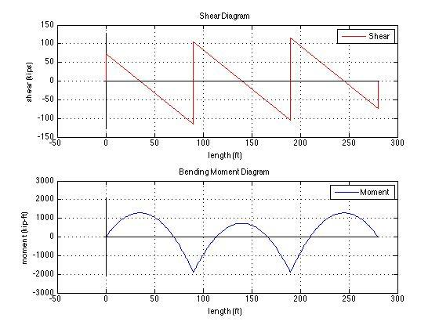

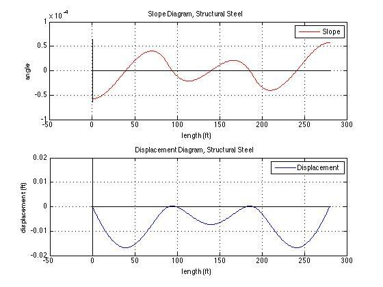

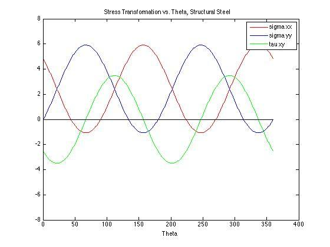

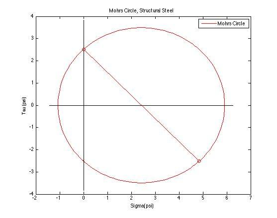

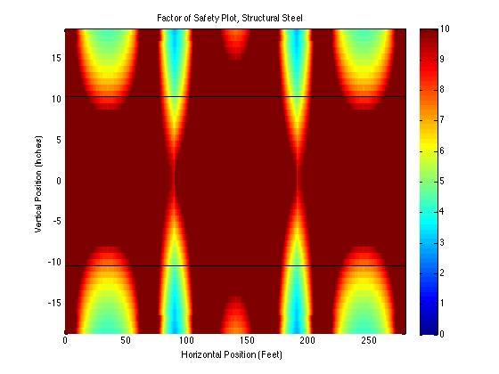

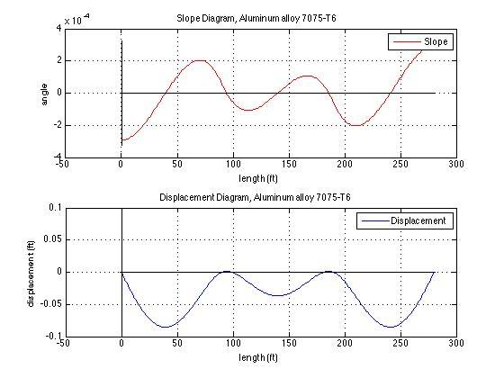

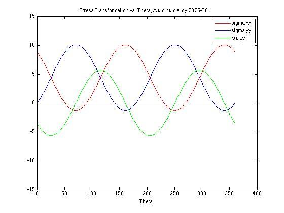

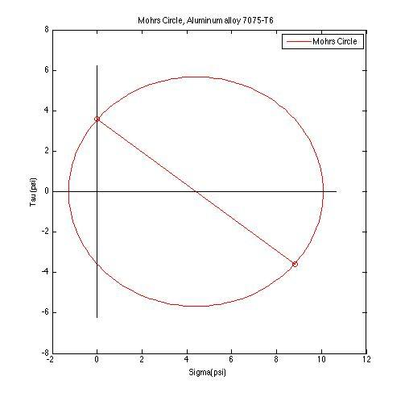

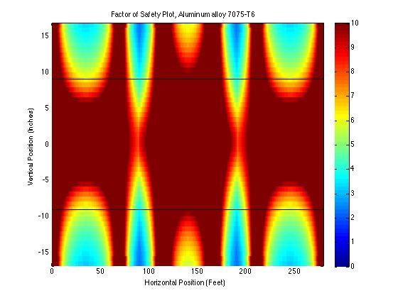

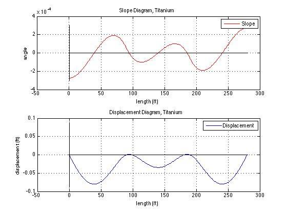

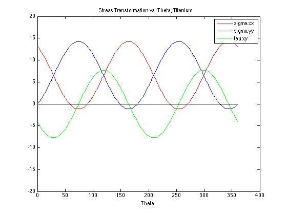

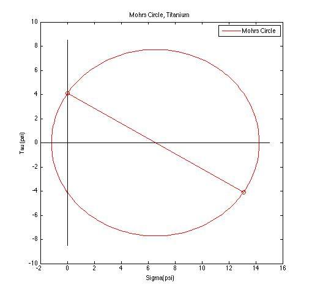

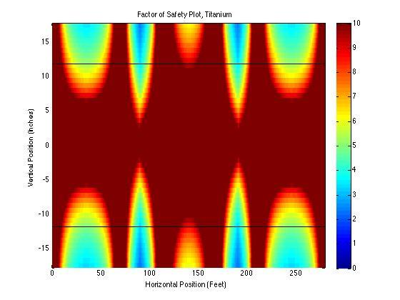

## Conclusion

For this project, we analyzed I-beam structural members of a freeway overpass. We determined the beam reactions; plotted shear, bending moment, slope, and deflection; found the maximum and minimum shear, moment, slope and deflection; located where the moment equals zero; found a suitable I-beam for each material; analyzed stress states across the beam; and found factor of safety. As thorough as our solution was, many possible sources of error exist. The most error will come from our numerous assumptions needed to make our problem solvable, given our limited knowledge. Realistically, our beams do have weight, all five beams do not carry equal loading, and traffic loading is not truly uniform. Small errors may potentially exist due to rounding errors with Matlab’s limited precision, but this precision is high enough that these are negligible. Errors may also exist in finding maximum shear, moment, slope, or deflection because they are found by calculating a series of points and choosing the maximum of those values; accuracy is therefore dependent on the number of points analyzed. Error might be also found in the calculation of our moment roots because Matlab’s fzero function, a numerical method, only finds an approximation rather than an exact solution. Lastly, there is also the very real possibility of human error in deriving the formulae and functions used in solving this problem.

Our chosen solution has several advantages. By defining everything in our program in terms of a few easily obtained variables, we can now analyze any similar symmetrical, pin-roller supported beam with a distributed load by only changing these variables at the beginning of the program. Furthermore, by implementing this as a Matlab program, calculating results takes only a fraction of the time of doing it by hand. Matlab is also capable of carrying out calculations to much higher precision than by hand or with a calculator. A disadvantage is that this is a fairly specific case, restricted to a symmetrical bridge under a uniform distributed load with exactly four supports. We also have the disadvantage of having to rely on our assumptions, when they do not perfectly represent reality.

---

## References

“Beam Deflection Formulae.” National Technical University of Athens. Web. 14 Feb. 2013. <courses.arch.ntua.gr/fsr/141842/Elastiki%20grammi.pdf>.

Beer, Ferdinand P., et al. Mechanics of Materials. 6th ed. New York: McGraw-Hill, 2012. Print.

Carmichael, Adam and Nathan Desrosiers. Comparative Highway Bridge Design. Worchester Polytechnic Institute, 28 Feb. 2008. Web. 14 Feb. 2013. <www.wpi.edu/Pubs/E-project/>

“Chapter 1: Bridge Design Specifications.” Bridge Design Practice. California Department of Transportation, Oct. 2011. Web. 14 Feb. 2013. <www.dot.ca.gov/hq/esc/techpubs/>

“Chapter 3: Applications for Transportation Projects.” Geotechnical Engineering Circular No. 8: Design and Construction of Continuous Flight Auger Piles. U.S. Department of Transportation Federal Highway Administration, 7 April 2011. Web. 14 Feb. 2013. <www.fhwa.dot.gov/engineering/geotech/pubs/gec8/03.cfm>.

“Concrete Deck Design Example Design Step 2.” LRFD Steel Girder SuperStructure Design Example. U.S. Department of Transportation Federal Highway Administration, 5 April 2011. Web. 8 Feb. 2013. <www.fhwa.dot.gov/bridge/lrfd/us\_ds2.htm>.

“Frequently Asked Questions.” Concrete Technology. Portland Cement Association. Web. 8 Feb. 2013. <www.cement.org/tech/faq\_unit\_weights.asp>.

Leckie, Frederick and Dominic Dal Bello. Strength and Stiffness of Engineering Systems. New York: Springer Science + Business Media, 2009.

“Weight Limitations.” California Department of Transportation. California Department of Transportation, 6 July 2012. Web. 9 Feb. 2013. <www.dot.ca.gov/hq/traffops/trucks/>

“Vehicle Lengths.” California Department of Transportation. California Department of Transportation, 19 July 2012. Web. 8 Feb. 2013. <www.dot.ca.gov/hq/traffops/trucks/>
