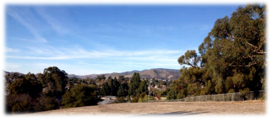
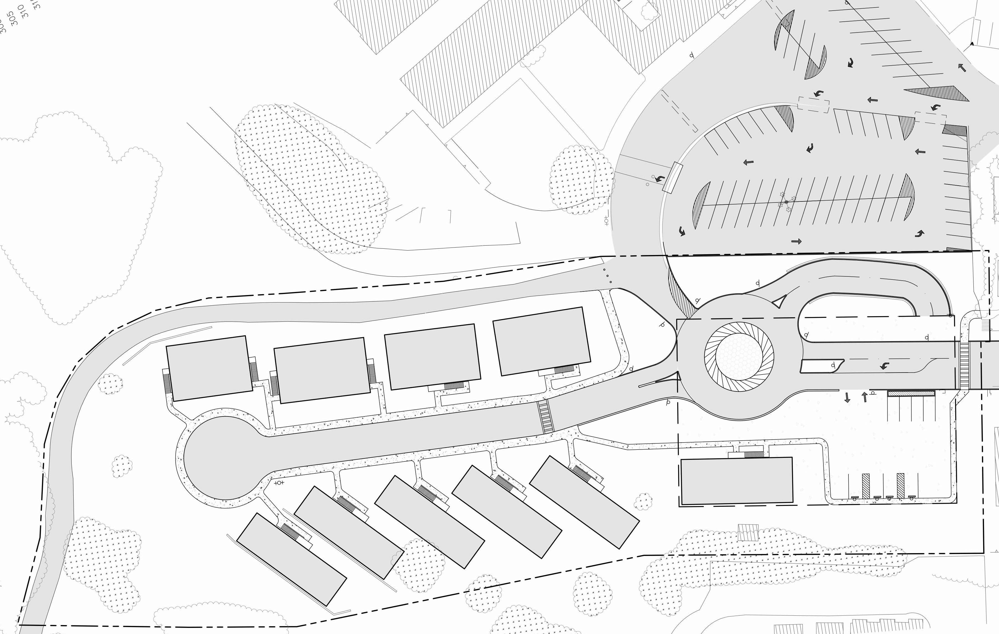

## Introduction

The proposed Johnson Avenue Housing Project (JAHP) provides an opportunity for  the San Luis Coastal Unified School District (SLCUSD) to generate revenue by  developing unused land. The site, which is surrounded by SLO High School, San Luis  Coastal Adult School, and single and multi\-family residences, is currently zoned as a  Public Facility. Amending the General Plan to rezone the area for high\-density  housing allows for a development that will meet the full range of community needs.  Maintaining suitable land development patterns with minimal impact to the  surrounding low\-density residential areas has been made possible by collaborating  with public agencies and public utilities.

## Scope of Work

The Johnson Avenue Housing Project includes distinct yet integrated design  elements that correspond to the SLO Design Consultants team specialties.  We pride ourselves on using the most current industry practices to deliver an effective design that maximizes the potential of this development.  

## Geotechnical and Structural

The geotechnical and structural elements designed include foundations, vertical  reinforcing members, and retaining walls. The subterranean parking garage  foundation system consists of spread footings, strip footings, and deep piles.  The system has been designed to minimize cost and take advantage of the site’s  subsurface stratigraphy. The residential mat foundations have been analyzed for  lateral seismic demands, and designed accordingly. The vertical reinforcing  members of the subterranean parking garage have been designed to resist the high  loads associated with the structure. 

Developing housing on the steep slope of this site requires the use of retaining walls. The strategic placement of retaining walls has increased the unit count of the  development. All of the retaining walls have been designed to resist multiple failure  modes including bearing, sliding and overturning.  

## Water Resources and Utilities

The steep terrain and addition of impervious surfaces require an on\-site  management system. The system design includes a detention basin and low impact  development methods that maintain the pre\-construction stormwater runoff  volumes. 

A development project of this scope requires sewer tie\-ins, telecommunication  hook\-ups, power hook\-ups, and water connection. The inventory of existing storm  drain, sewer main, and water main within the project site vicinity was used to plan  for the location of these connections. Our team coordinated with distribution  facilities to obtain required permits to keep the project on schedule.  

## Transportation and Traffic

The increase in daily trips requires a proper layout and geometric design for the  residential complex access and reconfigured circulation roadways. The horizontal  and vertical alignment design meets AASHTO standards. A parking lot with  sufficient parking spaces must be designed to accommodate the new residents. 

## Engineer’s Cost Estimate 

The project is funded by San Luis Coastal Unified School District and thus is  considered a public work with limited funding availability. We recognize the  importance of minimizing costs associated with this project and remaining within  the allotted budget. Please refer to the Engineer’s Cost Estimate (Appendix E) for  details concerning the budget.

The engineer’s cost estimate reflects the rough order of magnitude of costs  associated with the construction of the Johnson Avenue Housing Project. This  includes materials, labor and equipment. General requirements are assumed to be  seven percent of the total cost of construction. A two percent adjustment factor has  been added to compensate for the location of the project. All materials and  equipment are assumed to be from local suppliers.   

All values for the cost estimate were calculated using data strictly from the RSR Means Construction Cost Manual 2013 edition. Dimensions for structural members  that were not found in the -S\-Means Manual were matched as closely as possible.  

Exceeding the originally proposed budget of $8,000,000 has been justified by the  large increase in revenue generated by the added units. Refer to Appendix E for an  itemized cost estimate of the project.  

## Construction Staging Plan 

The location of this project prompts numerous public and private considerations,  and requires the involvement of several stakeholders and regulatory agencies. A Construction Staging Plan has been developed to identify the required  construction sequencing, timeline, and phasing to keep the neighboring streets fully  operational until construction completion.  

The plan includes a detailed truck route through the city and locations for the  material storage and construction trailer. Operations occupying any traffic lanes,  parking lanes, parkways or any other public right of way will require closure. All  such closures will be per the Manual of Uniform Traffic Control Devices. A Public  Works & Transportation Department Occupation Permit will be obtained prior to  the public right\-of\-way use. 

\-educed parking from construction operations will be compensated for using the  parking lot for the near\-by high school sports field, and will be scheduled for hours  when it is available. The number of workers and the areas where their vehicles will  be parked throughout construction will be indicated. Best Management Practices  will be implemented to ensure that the work site and public right\-of\-way will be  maintained. 

## Design Constraints and Data

The SLO Design Consultants team utilized the available site data in order to evaluate  and design for the specific constraints that the Johnson Avenue Housing Project  presented.  

## Location and Topography

The site map was designed with the budget in mind using a provided AutoCAD file  containing the existing site topography and property boundaries. Additionally, the  inventory of existing storm drain, sewer main, and water main within the project  site vicinity was consulted.

## Geotechnical Data and Subsurface Stratigraphy

The slope of the project site presents significant geotechnical issues that we have  carefully considered. Earth System Pacific provided a geotechnical investigation and  soils engineering report with subsurface stratigraphy data from laboratory testing  of hollow stem auger borings and test pit excavations. This information was used in  the foundation and retaining wall design.  

## Geologic Hazards Resources

The site is located in an active earthquake\-faulting region, so a thorough seismic  analysis was critical to the integrity of the structural portions of design. The Safety  Element of the San Luis Obispo County General Plan presents a summary of the  regional and local geologic settings, which was used to evaluate the geologic hazards  of the site and the necessary lateral seismic resistance of the residential foundation  level.

We have worked closely with environmental agencies to protect threatened or  endangered plant and animal species and mitigate the partially removed  seasonal wetland. The archeological site located within the project boundary has  been properly covered and protected.

## Transportation Data

The City of San Luis Obispo’s transportation planning and engineering program  provides an analysis of the traffic circulation system. This data was used in  designing the layout for the residential complex access and reconfigured circulation  roadways. 

## Design Approach and Recommendations

The SLO Design Consultants team’s approach to the tasks enumerated in the scope  of work is presented below. Recommendations pertaining to these tasks have been  made following thorough analysis and calculations.  

## Subterranean Parking Garage Design

The parking structure is designed for an occupancy of 70 passenger vehicles  underground and temporary and handicap parking on the surface level. The road  and roundabout to the housing units lie on top of the subterranean parking  structure and are expected to service heavy vehicles, such as fire trucks and delivery  trucks. The top of the parking structure will serve as a parking lot, which may need  to provide access to delivery and fire trucks.  

## Foundation Design

The parking structure will be supported by a combination of 44 shallow and deep  foundations along with a strip footing running along the back wall. The shallow  foundations will support column loads on the above grade side of the structure. The  deep foundations will support loads on the below grade side of the structure.  The  strip footing will support both the perimeter loads and the loads from the retaining  wall. All foundations are designed to support a load of 466,570 pounds, the  maximum load expected to be carried by any single column.

It is important to note that the following foundation design is based on a limited  number of borings that were conducted at the project site. Subsurface conditions  are assumed to be consistent with the findings in these borings.  In the case that  subsurface conditions vary from what is expected, the foundation design may need  to be altered.  For this reason, a soils engineer should continually check the site  during the excavation process to observe unexpected changes in underlying soil  conditions.

## Site Preparation

Prior to foundation construction, intensive excavation and grading procedures will  be performed at the building site. The topsoil on site contains a large percentage of  clay and ranges in depth from 3 to 6 feet. All this topsoil will be excavated and  hauled off site due to its expansive nature. Once the topsoil is removed, cut and fill  procedures on the underlying sandstone will be conducted to flatten the building  pad. The ground will be excavated and graded to an elevation of 313 feet. Native  sandstone meeting this elevation does not need to be compacted. As recommended  in the 2009 Soils Engineering -eport produced by Earth Systems Pacific,'crushed  sandstone that is filled to meet this grade will be scarified, moisture conditioned,  and re\-compacted to a relative density of at least 90% for a depth of 1 foot below  grade. The soil will remain continually moisture conditioned throughout  construction. 

Shallow foundations will be placed directly on native sandstone. A friction angle of  54 degrees was calculated for the sandstone based on an index correlation for  corrected blow counts (see Appendix for calculations). Blow counts were taken from  the weakest sandstone encountered in the area. A friction angle of 45 degrees was  assumed in design calculations as a more conservative measurement for soil  strength. The existing water table depth is shown to vary from 6 to 20 ft. For design  purposes, the water table depth was assumed to be located at ground surface to  consider for the worst\-case scenario. Following the recommendations stated in the  Soils Engineering Report produced by Earth Systems Pacific, shallow foundations  will be embedded into the sandstone to a depth of 2 feet. Considering the load and  the factors just discussed, a square 6 by 6 foot foundation was determined to be  sufficient for supporting the garage structure. It is assumed that the strip footing  will assume the same width. We have noted that a layer of shale exists several feet  below multiple shallow footings. Blow counts in this layer demonstrate that the soil  has sufficient strength to support the foundations. Therefore we do not recommend  that it be excavated from the site. No shallow footings will penetrate this layer.  

## Deep Footing Design

Deep foundations will be used to support loads on the below grade side of the  parking structure. In this area, crushed sandstone will be filled and compacted to  meet grade. Although compacted sandstone may provide sufficient bearing capacity  to support shallow foundations, there is a concern for differential settlement  between foundations on compacted soil and foundations on native soil. To utilize  shallow foundations, a large volume of earth would need to be excavated so that the  entire building pad lies on native sandstone.  This excessive excavation will  significantly drive up construction prices. Alternatively, deep foundations will be  placed directly on bedrock to eliminate the need for large\-scale excavation. Drilled  shafts rather than driven piles will be used because noise pollution from  construction in the surrounding area is a concern.  

In accordance with the Table 4.4.8.1.2B of the Caltrans Bridge Design Specifications  2003, the unconfined compressive strength of the sandstone bedrock was assigned  a minimum value of 1400 ksf. Using this value, guidelines from the NCH\-P  Synthesis 360 were followed to determine a sufficient foundation diameter. The  high strength of the bedrock requires a minimum diameter of only 0.7 feet.  However, for constructability purposes, the driven piles will have a diameter of 3  feet so that the column load can sit fully on top of the foundation. Side friction was  neglected in these calculations because base resistance provides enough support.  The lengths of the shafts will vary based on the distance from the starting point to  the bedrock elevation. The bedrock depth is located at an approximate elevation of  287 feet, making the longest shaft span 25 feet. Shafts will be embedded a minimum  depth of 6 in into bedrock. 

As recommended by the Soils Engineering -eport, a 24\-inch layer of free draining  non\-expansive material will be placed underneath the entire garage pad. The fill  material will be imported from an outside source and will meet the criteria of ASTM  2488\-06. The top 12 inches of the fill will be compacted to a minimum of 95% of the  maximum dry density. The will sit on top of the fill at a final elevation of 315 feet.  

## Transportation

The number of required spaces was determined using the City’s standards in  community development. Based on one bedroom and two bedroom units, the total  number of spaces required for all 40 housing units is 72. The subterranean parking  garage will have 73 spaces total, 15 compact spaces and 9 motorcycle spaces. The  surface parking lot will have 4 handicap spaces, 1 van accessible space and 4  additional spaces. The parking spaces will exceed the minimum requirements. An  elevator and stairs will be installed in the parking garage to the surface parking lot  above it.

## Retaining Walls Design

All retaining walls have been designed to resist multiple failure modes. It is assumed  that all retaining walls will rotate enough to mobilize the internal friction of the soil  resulting in active resistance. For sliding resistance, base force was calculated using  the coefficient of friction given in the Soils Engineering -eport. Wet conditions were  

determined using the active equivalent fluid pressure for crushed sandstone. For  seismic considerations, peak ground acceleration was determined from the USGS  Designs Map Detailed Report. Bearing capacity was calculated through Vesic’s  analysis instead of Terzaghi’s analysis because the factor of safety determined was  extremely large. See Appendix A for full retaining wall calculations and dimensions.

## Slope Stability

A total of five retaining walls will be constructed to stabilize slopes where slope  failure is a concern. We have chosen to implement concrete gravity walls for their  ease of construction. Retaining walls have been designed to resist bearing, sliding  and overturning failure for dry, wet, and seismic loads. Global stability was not considered in our design because the shear strength in the native sandstone is high  enough that a global slope failure is highly unlikely.  

## Site Preparation

To prepare the site for retaining wall construction, all clay topsoil will be  removed. Based on boring logs received, it is estimated that topsoil depth ranges  from two to three feet. The retaining walls will bear 12 inches into native  sandstone, which is below the 6\-inch frost penetration zone of the region. For the  parking structure ramp walls, soil will be excavated a distance of 3 feet behind the  location of where the toe will be located. Temporary timber shoring will be used to  stabilize cut slopes during construction.

Without proper drainage, hydrostatic forces can increase horizontal loads by  285%. This is the most common cause of retaining wall failure. To prevent these  excess loads, a 4 inch perforated pipe will be installed along the backside of all  retaining walls to divert water away from the structure. A 1\-foot by 1\-foot free  draining gravel blanket will encompass the pipe to allow water to drain  freely. Imported free draining gravel will comply with ATSM 2488\-06. A permeable  filter fabric will be installed along the backfill\-gravel boundary to prevent mixing of  the two materials. Filter fabric will be chosen to comply with Caltrans Standard  Specification, Section 88\-1.03 for underdrains and will not be exposed to daylight  for more than 72 hours without UV protection.

After the walls are constructed, crushed sandstone from previous on\-site  excavations will be used as backfill soil in order to minimize the quantity of material  off\-hauled. Strength properties of crushed sandstone were estimated from USCS  typical values and the equivalent fluid pressure was taken to be 55 psf based on  recommendations from the Soils Engineering -eport. Crushed sandstone will be  compacted to a relative density of 95%. See Appendix A for calculations.  

## Parking Structure and Walls

Two retaining walls will line either side of the ramp descending down to the  entrance of the parking structure. The outer wall will contain concave segments.  The geometry of these segments will naturally give the extra support against  overturning, since a rotational failure would involve concrete cracking. The inner  wall contains convex segments and will need additional reinforcement. To provide  additional support, the amount of reinforcement will be increased by 10%.  

Since the two ramp walls will be highly exposed to public view, the following  strategies will be used to protect the aesthetics of the walls.  First, these walls will  be finished with a material that does not crack under the flexure of the retaining  walls. Second, the retaining walls will be thoroughly waterproofed to prevent any  seepage through the wall, resulting in undesirable streak marks. 

## Roadway Design 

The design speed of the entrance and main road is 15 mph due to the geometric  constraints and residential area. The design speed of the ramp is 5 mph because of  the steep slope and sharp curves. Using Highway Design Manual, the sight distances  and minimum radii were determined. All of the curves met the requirements. Due to  the hilly slope and high elevation of the existing road existing from the adult school,  a 12.6% slope is necessary in order to minimize cut/fill costs and improve drainage.  The ramps, curves and roundabout were designed using Caltrans turning templates  of various vehicles. AASHTO standards were used in AutoCAD in order to meet the  minimum requirements for the vertical and horizontal alignments. 

The Caltrans method for the pavement design was used for this project. A design life  of 20 years is used because of the roads’ size and location. The conservative design  and relatively low usage of the roads will produce a much greater lifetime. The  number of trips generated from 40 housing units was determined using ITE trip  generation manual. The projected traffic, in addition to the existing traffic, will not  lower any of the levels of service of the adjacent streets. The layers used to design  the roads included Hot Mix Asphalt (HMA) and Class 2 Aggregate Base above the  subgrade. The subgrade was assumed to have an --value of 10. Sidewalks, curbs and  gutters are designed as per City of SLO standards. These three require a 0.5 ft. layer  of class 3 Aggregate Sub\-base under the concrete. The main road will have 0.25 ft. of  HMA above 1.4 ft. of Class 2 AB. The entrance road will have 0.15 ft. of HMA above  the 0.5 ft. concrete slab above the subterranean parking garage. The concrete slab is  capable of handling the traffic loads, but for consistency and a crowned cross slope  we added a small layer of HMA. The roundabout will have a similar pavement design  as the entrance road because it is above the parking garage as well. Due to the steep  slope of 8.81% of the ramp leading into the subterranean parking garage, a 0.1 ft.  layer of Open Grade Friction Course (OGFC) will be paved over the Hot Mix Asphalt  layer. The fire access road has a steep slope of 15.5%, therefore, the OGFC will be  paved for the entire section. Cal Fire requires a slip resistant layer if the slope is  between 12\-16%, or if it is in a hilly area. Refer to Appendix D for supporting  calculations for roadway and pavement design. 

## Parking Lot Reconfiguration

A portion of the existing San Luis Adult School parking lot will be demolished during  the construction of the JAHP, and requires reconfiguration. First, a slurry seal will be  paved over the remaining parking lot. Next, the parking lot will be restriped using  City of SLO standards. The proposed striping will be single\-line in order to be  consistent with the existing striping. The existing number of spaces is 93, and the  proposed parking lot will have 74 spaces. Although there is a 25% reduction in  number of the spaces, this parking lot is extremely underutilized and it will be able  to accommodate future parking. The current handicap spaces do not meet the  standards. The proposed design has 2 handicap spaces and 1 van accessible space.  Instead of converting the school entrance into a 2\-way street for an exit, the traffic  will go in a similar route as existing. Traffic will continue through the parking lot to  the roundabout and then exit similar to the housing residents.  

## Drainage Plan 

The city of San Luis Obispo requires the development of a Master Drainage Plan  (MDP) for all new construction. This plan was developed in accordance with the SLO  Drainage Design Manual. The MDP considers drainage and flooding impacts of the  proposed development. The intent of the plan is to ensure post\-development runoff  is equal to or better than existing conditions. This assessment meets the  requirements of the California Environmental Quality Act (CEQA). 

The proposed project will increase the area of impervious surface at the site and will  result in higher runoff rates and volumes. The project incorporates an improved  drainage plan to mitigate this impact and prevent excess runoff. 

Drainage Improvements include maximizing infiltration area by using Low Impact  Development (LID) practices, collecting surface water in swales throughout the  property, a detention basin to collect excess surface and groundwater, metered  output to reduce the rate of drainage and new drainage connections. Preliminary hydrologic and hydraulic analysis was conducted to develop the scale of  design. The final drainage design meets city approval and the guidelines set out by  SLO Drainage Design Manual. The design accounts for the peak runoff of 2 and 10  year periodic storms. The entire project site resides outside of the 100\-year periodic  storm flood zone and flooding concerns are not significant. 

## References

ACI Standard Building Code Requirements for Reinforced Concrete (ACI 318-71) Reported by ACI Committee 318. Detroit: American Concrete Institute, 1973. Print.

California Building Code. Sacramento, CA: California Building Standards Commission,  2010. Print.

California Department of Transportation. “Highway Design Manual.” 2013. Web. (http://www.dot.ca.gov/hq/oppd/hdm/hdmtoc.htm) 

City of San Luis Obispo Public Works Department. “Engineering Standards.” 2010.  Print.

Cudato, Donald P. Geotechnical Engineering Principles and Practices. Vol. 2. Print.

Federal Highway Administration. “Standard Highway Signs.” 2004,2012. Web. (http://mutcd.fhwa.dot.gov/ser-shs\_millennium.htm)

Institute of Transportation Engineers. “ITE: Trip Generation.” 2010. Print. 

King, Judd J. Soils Engineering \-eport, Johnson Avenue Housing. Rep. no. SL-14457- SB. San Luis Obispo: Earth Systems Pacific, 2009. Print

Minimum Design Loads for Buildings and Other Structures. Vol. 2. \-eston: American  Society of Civil Engineers, 2013. Print. 

Moss, \-obb. "Foundations Shallow and Deep." Senior Design Technical Module #2. Cal  Poly, San Luis Obispo. Apr. 2014.

Moss, \-obb. "Stability Analysis of Traditional Retaining Walls." Senior Design  Technical Module #1. Cal Poly, San Luis Obispo. Mar. 2014. 

\-oess, \-oger P. Traffic Engineering. 4th Ed. 2011. Print.

Standard Specifications. CalTrans Department Of Transportation, May 2006. PDF.

Turner, John. NCH\-P Synthesis 360. National Cooperative Highway Research Program,  2006. PDF.

Valadeo, Paul. “Pavement Design.” Senior Design Transportation Module #2. Cal Poly,  San Luis Obispo. Apr. 29, 2014.