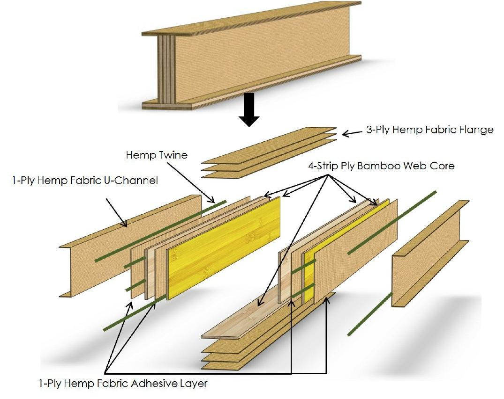
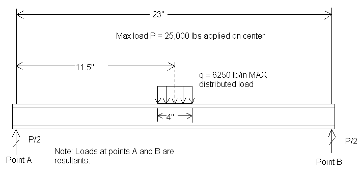
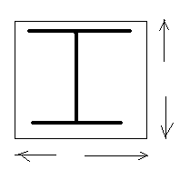
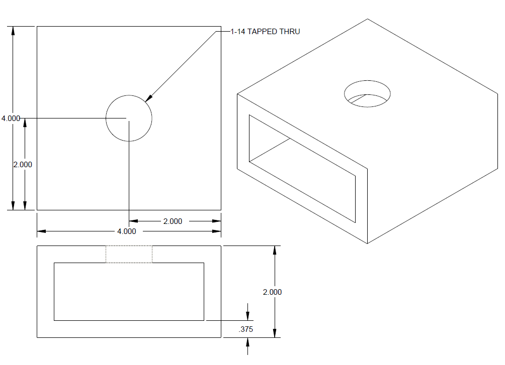
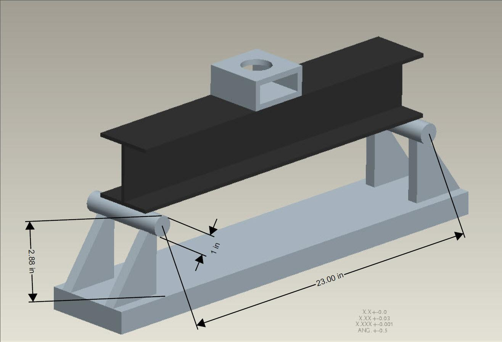

As the Vice President of the Cal Poly SAMPE Chapter (2012 to 2014) I organized fundraising events and lead a competitive composite material beam design team. Our beam placed 4th in the annual international SAMPE competition.

The beam geometry was developed using empirical evidence compiled from previous test results and iterative analysis. Abaqus and Mathcad solution helped us optimize the final design. We also considered manufacturing concerns while designing the geometry.


```matlab
clc
clear all
close all

L=23; %total length of highway overpass in inches
a=9.5; if a>=L,error('a must be less than L'),end; %length from edge support to closest support in inches
b=L-a; if L-b~=a,error('beam is not symmetrical'),end; %length from edge support to third support in feet
w=750; %distributed loading on the overpass due to concrete and traffic in pounds per inch
E_Bamboo=29000; %Modulus of elasticity for bamboo in psi
Y_Bamboo=58; %Yielding strength for bamboo in psi
FS=1.2; %Design factor of safety

A=[1 1 1 1;0 a b L;0 ((a^2)*(b^2))/(3*L) -(2*(a^4)-(a^2)*(L^2))/(6*L) 0;...
    0 -(((a^3)*L)-(3*b*L*a^2)+(3*a*L*b^2)+(2*b^4)-(L*b^3)-((b^2)*(L^2)))/(6*L) ((a^2)*(b^2))/(3*L) 0];
B=[w*L;((w*L^2)/2);(w/24)*((a^4)-(2*L*a^3)+(a*L^3));(w/24)*((b^4)-(2*L*b^3)+(b*L^3))];
R=LUfact(A,B);%R = reactions.

% Calculate and plot Shear and Moment
[min_shear, min_moment, max_shear, max_moment,V1func,V2func, ...
    V3func,M1func,M2func,M3func] = shear_moment(w, L, a, R(2), R(1));

% Find locations where moment is zero
root = zeros([1 6]); % Preallocate an array for roots
root(1)=fzero(M1func,[0 a/2]);
root(2)=fzero(M1func,[a/2 a]);
root(3)=fzero(M2func,[a L/2]);
root(4)=fzero(M2func,[L/2 L-a]);
root(5)=fzero(M3func,[L-a L-a/2]);
root(6)=fzero(M3func,[L-a/2 L]);
fprintf('\nMoment is zero at points (feet):\n')
fprintf('%10.3f  %10.3f  %10.3f %10.3f %10.3f %10.3f\n',root)

% Perform analyses on structural steel
fprintf('\n Structural Steel \n')
[name, A, d, bf, tf, tw, Ixx] = wbeamselect(max(abs([min_moment max_moment])),...
    Y_Steel, FS);

% Calculate and plot slope and displacement of the beam
[min_slope, min_displacement, max_slope, max_displacement]=ang_disp(w,R(2),L,a,E_steel,Ixx,'Structural Steel');

% Calculate stress at arbitrary state (100ft,9in) and angle theta of 45 degrees
theta_d=45;
[sigma_xxp, sigma_yyp, tau_xyp, min_princ, max_princ, thetap1, thetap2]...
    = stressstate(100, 9, V1func, M1func, [0 a], V2func, M2func, [a b], V3func, M3func, [b L], ...
    theta_d, d, bf, tf, tw, Ixx);
fprintf('\n sigma xx (ksi)    sigma yy(ksi)   tau xy(ksi)   angle(degrees)\n')
fprintf('%10.3f    %10.3f      %10.3f     %10.3f\n',sigma_xxp,sigma_yyp,tau_xyp,theta_d)
fprintf('\n Principle Stresses (ksi)         Principle Planes (degrees) \n')
fprintf('%10.3f     %10.3f      %10.3f     %10.3f\n',min_princ,max_princ,thetap1,thetap2)

% Plot stresses with respect to angle and Mohr's Circle at (100ft,9in)
transplot(100, 9, V1func, M1func, [0 a], V2func, M2func, [a b], V3func, M3func, [b L], ...
    d, bf, tf, tw, Ixx, 'Structural Steel');

% Make false-color plot of Factor of Safety
FS=fsplot(Y_Steel, V1func, M1func, [0 a], V2func, M2func, [a b], V3func, M3func, [b L], ...
    d, bf, tf, tw, Ixx, 'Structural Steel');
fprintf('\n Overall Factor of Safety: %f\n',FS)
```

2014 SAMPE Bridge Competition Proposal

Bridge Registration number: 07- 884

Category:  Category C, I-beam natural fiber

School:  Cal Poly, San Luis Obispo

Team Members:  Dylan Manning (team [dilmanning@hotmail.com](mailto:dilmanning@hotmail.com)), Itai Axelrad. Faculty Advisor: Eltahry Elghandour, eelghand@calpoly.edu, 805-756-1728

Manufacturing Process

1. 3.5x26 inch strips of hemp canvas were cut. These strips are used for constructing the web of the bridge. Since the thickness of the web will determine the amount of shear reinforcement we cut out 7 strips.

 1. Six 5.5x26 inch strips of hemp canvas were then cut. These strips will be used to construct the outward pointing C-channels to create the full I-beam.

 2. Four 6-strip ply paulownia wood web cores are layered with the hemp canvas. Four are placed in the web, one on the bottom and one on top to withstand compressive force.

-   The majority of the force applied to the bridge will be absorbed by the web. The web of the bridge will make up the majority of the weight and will have a thickness of 0.55 inches in order to comply with the design restrictions.
-   Hemp canvas is good in tension so there are extra layers on the bottom of the beam.
-   We wetted the hemp canvas with epoxy, squeegeed excess off, and then layered each piece on our metal mold.  
    

-   The first and last layers are cut larger and laid on the center of the mold. The inner layers are laid with an offset. This is so the web of the C-channels will be twice as thick as the C-channel flanges.  
    

-   Hemp twine, which helps resist tears in the canvas and fill void space, is placed in between the layers, which are then all sealed in a vacuum bag.  
    

-   Once the beam has been vacuum-bagged, it is placed in an autoclave to cure.  
    

-   The cured beam is then cut and sanded down in order to reduce and even out the weight.

Beam Schematic



Beam schematic courtesy of Jay Lopez

Materials

Part

Description

Quantity

5.5” x 26” Hemp Ply

10 oz. Canvas

6

2.5” x 26” Hemp Ply

10 oz. Canvas

13

2.7” x 26” Paulownia Ply

.25” Thickness

1

24 oz. Resin/Hardener

Epoxy

1

26” Hemp Twine

Braid

8

2013 SAMPE Bridge Competition Proposal

  

Bridge Registration number: 07- 48

Category:  Category C, I-beam natural fiber

School:  Cal Poly, San Luis Obispo

Team Members:  Miles Murphy (team leader, [mmurph12@calpoly.edu](mailto:mmurph12@calpoly.edu)), Itai Axelrad. Faculty Advisor: Eltahry Elghandour, eelghand@calpoly.edu, 805-756-1728

  
  
Manufacturing Process

1. 2.5x26 inch strips of hemp canvas were cut. These strips are used for constructing the web of the bridge. Since the thickness of the web will determine the amount of shear reinforcement we cut out 7 strips.

 1. Six 5.5x26 inch strips of hemp canvas were then cut. These strips will be used to construct the outward pointing C-channels to create the full I-beam.

 2. Four 6-strip ply bamboo web cores are layered with the hemp canvas. Four are placed in the web, one on the bottom and one on top to withstand compressive force.

  

-   The majority of the force applied to the bridge will be absorbed by the web. The web of the bridge will make up the majority of the weight and will have a thickness of 0.57 inches in order to comply with the design restrictions.
-   Hemp canvas is good in tension so there are extra layers on the bottom of the beam.
-   We wetted the hemp canvas with epoxy, squeegeed excess off, and then layered each piece on our metal mold.  
    

-   The first and last layers are cut larger and laid on the center of the mold. The inner layers are laid with an offset. This is so the web of the C-channels will be twice as thick as the C-channel flanges.  
    

-   Hemp twine, which helps resist tears in the canvas and fill void space, is placed in between the layers which are then all clamped together in the mold.  
    

-   Once the epoxy has hardened we remove the beam from the mold and place it in the sun to cure for four days.  
    

-   The cured beam is then cut and sanded down in order to reduce and even out the weight.

Beam Schematic


Beam schematic courtesy of Jay Lopez

Materials

Part

Description

Quantity

5.5” x 26” Hemp Ply

10 oz. Canvas

6

2.5” x 26” Hemp Ply

10 oz. Canvas

13

2.7” x 26” Bamboo Ply

Sanded to 0.1” Thickness

6

24 oz. Resin/Hardener

Epoxy

1

26” Hemp Twine

Braid

8

Beam Characteristics

Trial

Characteristics

Ultimate Load (lbf)

Weight (lbf)

Strength-to-Weight Ratio

1

2-Ply Bamboo Web Core

1597

1.13

1413

2

3-Ply Bamboo Web Core

2057

1.21

1700

3

4-Ply Bamboo Web Core

Bamboo Bottom Flange

Hemp Twine Fillers

2743

1.59

1729

4

2-Ply Bamboo Web Core

Bamboo Top Flange

Hemp Twine fillers

2310

1.77

1306

5

4-Ply Bamboo Web Core

Bamboo Top and Bottom Flanges

Hemp Twine Fillers

3093

1.63

1901

6

4-Ply Bamboo Web Core

Bamboo Top and Bottom Flanges

Hemp Twine Fillers

2467

1.49

1658

Beam Schematic


Materials Used

Part

Description

Quantity

4” x 26” Hemp Ply

10 oz. Canvas

4

2” x 26” Hemp Ply

10

2” x 16” Bamboo Ply

Sanded to 0.1” Thickness

4

24oz Resin/Hardener

Ecopoxy

1

26” Hemp Twine

Braid

8

Note: Beam schematic courtesy of Jay Lopez

### Hempcrete

Subject: 165 kg of carbon can be theoretically absorbed and locked up by 1 m3 of hempcrete wall over many decades.

165 kg of carbon can be theoretically absorbed and locked up by 1 m3 of hempcrete wall over many decades.

Hempcrete is easier to work than traditional lime mixes and acts as an insulator and moisture regulator. It lacks the brittleness of concrete and consequently does not need expansion joints

However, the typical compressive strength is around 1 MPa,\[4\] around 1/20 that of residential grade concrete.

Hempcrete walls must be used together with a frame of another material that supports the vertical load in building construction. Wood stud framing is most common making it suitable for low-rise construction. Hempcrete buildings ten stories high have been built in Europe.

Hempcrete's density is 15% of traditional concrete

Fully cured hempcrete blocks float in a bucket of water

Hempcrete was discovered in a bridge abutment in France built in the 6th century. Given it has survived 14 centuries, people expect hempcrete buildings will have a long life.

Fireproof? Soundproof?

They’re resistant to mold, mildew, fire and insects, and the lime absorbs carbon, making the walls carbon-negative.

inorganic salts to provide fire and pest resistance.

A German company produces a product called Mehabit, a hemp hurd substance covered with coal-based bitumen, which is sticky, and when leveled out on a hemp cement floor, will dry to form a thermally and phonetically insulated floor.

The product, sold by Asheville-based Hemp Technologies, mixes four parts ground-up hemp stalks with one part water and one part lime to create durable, resilient walls that European researchers have found can last up to 700 or 800 years.

To do this, set up a plywood frame (preferably hemp plywood), then fill with a mixture of hemp hurd (wood chip-like substance) and combine with lime, sand, plaster, some cement, and enough water to dampen, and let the mixture set for a day. Then take the frame down, but let the mixture continue to harden for about a week.

United States: Since 1997, the Lakota Sioux at Pine Ridge Reservation in South Dakota have passed multiple pro-hemp resolutions and declarations.This year, the tribe sowed about two acres by an already growing field of wild hemp. Since Native reservations are considered as independent nations for many purposes, the DEA has made no official response

Hemp bale construction?

Washington State University has produced hemp fiberboard, which is lighter, twice as strong, and three times as elastic as wood fiberboard, plus it has sound proofing and pressure isolative characteristics absent from wood fiberboard. The process involves chipping the hemp stalk, bonding it together with resins and glues, and clamping it down into molds under high pressure until it hardens.

Foundation floors can be made in much the same way as the foundation. Hemp resists seepage, and so hemp cement is applicable for pouring onto a soil base to make a foundation floor. The floor insulation hardens into a solid mass which will not shift under pressure.

Concrete pipes can be made out of hemp fiber which cost 1/3 that of polypropylene. These pipes have greater flexibility, greater elasticity, and are resistant to cracking.

## Natural Fiber I-Beam Measurements

Length = 24”

Width = 4”

Height = 4”

Single Web = 0.6”

Load = 3,000 lbs. force

1.  The following rules apply to all categories except the Open Design Category:

1.  Testing will consist of a modified 3 point bend on 23” centers.  No design shall interfere with the nature of the loading by bracing against the supports or similar method.
2.  Geometric requirements as specified in attached Figures (see below) are simple but will be strictly enforced.  All bridges must be at least 24” in length. 
3.  An I-beam must have a single web less than or equal to 0.6” thickness.  Caps are not required to be equal in length, width, or thickness.  Cross section may vary along the length of the bridge. 
4.  A square beam may be of open or closed cross section and will have two or three independent webs.  The webs do not have to be perpendicular to the caps.  At no point along its length may the bridge have a solid cross section.  In order to maintain independence of the webs, a minimum gap between the caps of ½” and the webs of ¾” must be maintained along the entire length of the bridge.  Interpreting this rule has been a source of confusion in previous years.  The Governing Committee recommends reviewing your design with the Governing Committee early and before you begin building your bridge to ensure compliance. 
5.  Students are encouraged to focus on manufacturability and optimization of bridge. 
6.  Designs not achieving the above requirements and the general intent as defined in Rules 1 and approved by the Governing Committee will not be allowed in this category—see the Open Design Category.









MANUFACTURING

1.  We began with 8’x2” diameter dried bamboo poles and cut them down to 26” lengths

2.  Cutting the bamboo into uniform strips was problematic due to the bamboo’s curvature. Cutting a straight cut usually lead to non-uniform strips. We found the best method to be hand guiding the strips through a band saw.

3.  Before being sanded the bamboo strips were curved and had ridges at the nodes. These had to be removed in order to create a veneer.

4.  The next step was cutting the bamboo to a uniform width and thickness. We tried running the strips through a planer but ran into problems because the non-uniformity of our strips. We developed a method to uniformly sand our bamboo using a belt sander.

5.  The next step was creating plies from the strips. Although the strips had a uniform width, they were often curved, and this lead to gaps between the edges of adjacent strips. We solved this problem by cinching the bamboo together with tape.

6.  We glued the edges of the taped plies together. When the glue dried, we removed the tape and the resulting bamboo plies had virtually no gaps in between the strips.

7.  We next cut the plies to the mold width using a diamond saw and sanded excess glue off to create a better bonding surface.

8.  We cut various hemp canvas sections for different parts of the beam. We cut full length pieces for web, flange, and sections and cut short strips to reinforce the middle of the beam.

9.  Prior to layup we arranged the cloth and plies in an order and cut strips of hemp twine. On a separate table we wrapped our mold in vacuum bags. Prior to mixing the epoxy we underwent a practice trial to make sure all the pieces were in the correct place.

10.  We assembled the web, flanges, and help C sections   separately. We placed hemp twine at the top and bottom of our web to eliminate voids.

11.  We were able to reduce the amount of voids by clamping the mold instead of using a vacuum bag. We first clamped the web together and tightened the clamps uniformly. We repeated the process for the flanges and added clamps for the web section. Once all the clamps were in place we used a lever to apply the greatest possible pressure on the mold.

12.  After our epoxy cured, we removed the beam from the mold.

13.  We measured the beam and cut it down to size using a diamond saw. After roughly cutting the beam to size we finished it using a belt sander.

14.  After the beam finished curing we tested it using 3 point test on an Intron machine.

15.  Early prototypes failed at the bottom flange at the midpoint of the length.

16.  Our last prototype reached over 3000lbs without failure. We cut holes in the web section to reduce the weight and retested it. The beam failed by shearing lengthwise along the web.

17.  Prototype cross sections arranged from left to right in the order we created them.

18.  Prototypes with weight, and maximum load supported arranged from top to bottom in order we created them. The numbers on the beam second from the bottom are from before the holes were cut.

ANALYSIS

We compiled previous beam dimensions and test data in order to write a MATLAB script file that predicts the maximum load a beam could sustain. We did so by computing the moment of inertia and maximum normal stress then, using the new beam’s dimensions, solved for the theoretical load. We designed the beam to achieve a load that is 10% greater than the desired load of 3,000 pounds. The prediction is reasonable because the design and manufacturing process for the tested beam was identical to the final beam,

DESIGN

Bamboo Veneer: We used bamboo for its high strength to weight ratio. We strove to eliminate spacing between bamboo strips in order to increase the bamboo fiber content of our beam. We originally used bamboo for the web only, but we found that its use along the flanges reduces torsional buckling and increases rigidity.

 Hemp Cloth: Hemp cloth was chosen because hemp fibers are known to have high tensile strength. Hemp cloth provided a medium to soak up the epoxy resin. The cloth improved the bond between bamboo layers.

Hemp Twine: We had a problem with voids along the top and bottom of our web section. We used hemp twine saturated in epoxy to reduce the voids in these sections.

Larger Middle Section: In order to maximize the strength to weight ratio of our beam, we reduced the flange width at areas of lower stress. We also added additional hemp plies along web the top and bottom flanges at this section.

Thick Bottom Flange: Early failures occurred in the center of the beam along the bottom flange. As a result we increased the number of hemp plies in the bottom flange.

Poster ideas…

Design Proceess

-   Bridges with Jay – 2000, 2300, 2700 lbs.

-   Changed design based upon failure method

-   Stress concentrations along edges of bamboo

-   Added hemp twine

-   Voids in beam when vaccum bag was used

-   Changed to clamp

-   Failure in tension side

-   Increased thickness, added bamboo to bottom flange
-   Added extra hemp sections in the middle of the beam

-   Delamination failure

-   Sanded both sides of beam to rectangular section

-   Bridges with Itai 2300, 3100, ???

-   Created beam braced with bamboo in flanges and increased number of hemp plys

-   Problem Extreme deflection

-   Added bamboo to compression side
-   Increased ration of bamboo to hemp
-   Delamination along taped hemp plys

-   New design

-   Used very thin bamboo plys

1.  We began wth 8’x2” diameter dried bamboo poles and cut them down to 26” lengths
2.  Cutting the bamboo into uniform strips was problematic due to the bamboo’s curvature. Cutting a straight cut usually lead to non-uniform strips. We found the best method to be hand guiding the strips through a band saw.
3.  Bamboo strips prior to sanding
4.  The next step was cutting the bamboo to a uniform width and thickness. We tried running the strips through a planer but ran into problems because the non-uniformity of our strips. We developed a method to uniformly sand our bamboo using a belt sander.
5.  Sanded bamboo strips. In early prototypes we only sanded one side of the strips, but as our sanding methods improved we sanded the strips to rectangular sections and achieved uniformity to within 0.01”.
6.  The next step was creating plies from the strips. Although the strips had a uniform width, they were often curved, and this lead to gaps between the edges of adjacent strips. We solved this problem by cinching the bamboo together with tape and gluing the edges together. When the glue dried, we removed the tape and the resulting bamboo plies had virtually no gaps in between the strips.
7.  We next cut the plies to the mold width using a diamond saw and sanded excess glue off the surface to create a better bonding surface.
8.  We cut various hemp canvas sections for different parts of the beam.
9.  Prior to layup we arranged the cloth and plies in an order and cut strips of hemp twine. On a separate table we wrapped our mold in vacuum bags. Prior to mixing the epoxy we underwent a practice trial to make sure all the pieces were in the correct place.
10.  We assembled the web, flanges, and help C sections separately. Shown here is a blown up picture of our web sandwiched between two C sections. We placed hemp twine at the top and bottom of our web to eliminate voids.
11.  We were able to reduce the amount of voids by clamping the mold instead of using a vacuum bag. We first clamped the web together and tightened the clamps uniformly. We repeated the process for the flanges and added clamps for the web section. Once all the clamps were in place we used a lever to apply the greatest possible pressure on the mold.
12.  After our epoxy cured, we removed the beam from the mold.
13.   We measured the beam for cutting and cut the beam down to size using a diamond saw. After roughly cutting the beam to size we finished it using a belt sander
14.  After the beam finished curing we tested it using an Intron machine.
15.  Early prototype failures.
16.  Our last prototype reached over 3000lbs without failure. We cut holes in the web section to reduce the weight and retested it. The beam failed by shearing lengthwise along the web.
17.  Prototype cross sections arranged from left to right in the order we created them.
18.  Prototypes with weight, and maximum load supported arranged from top to bottom in order we created them. The numbers on the beam second from the bottom are from before the holes were cut.

20.  We attempted cutting bamboo strips with diamond saw and a band saw. The moThe bamboo’s curvature posed a problem for the diamond saw, and we found the most effective method to be using a band saw and cut along with the . Due to the curvature of the bamboo it was difficult

-   Prepared area and molds

-   Used 2.3”X2.3”x36” wood sections for the web molds and Aluminum pieces for flange

-   Coated wood with packaging tape and applied nano release
-   Coated aluminum mold with vaccume bag

Aranged our pieces  on our workspace so that we did not need to think about what part went where during the layup

Manufacturing process

-   With Jay

-   Cut bamboo sections using diamond saw

-   Curved bamboo created problems

-   Sanded bamboo to size using 0.5” belt sander

-   Slow and tedious process
-   Only sanded one side

-   With Itai

-   Used campus facilities

-   Split bamboo in half using band saw

-   Followed grains of bamboo rather than trying to cut sections perfectly straight

-   Sanded to semi-uniformity and used planer

-   Planer chewed up edges and burned bamboo
-   Inconsistent results

-   Developed sanding method using 6” belt sander

-   Clamped board nearly touching belt
-   Sanded along inner side until a flat surface was established

-   Used a 8” wood block to apply uniform pressure to the sander

-   Rotated strip placing flat side face down and sanded flat surface on one edge.

-   Used wood block to set a width tolerance and sanded to a uniform width.
-   Even for curved sections we were still able to sand them down to a constant width

-   Rotated once again and repeated process
-   Rotated final time and sanded until a rectangular section was created

-   For final beam we were able to efficiently sand strips to a .01” tolerance.

-   Manufactured bamboo ply’s prior to layup.

-   Synched bamboo together using painters tape.
-    Used many wraps to straighten curved strips.
-   Glued/Epoxyd bamboo together while leaving tape intact
-   After adhesive set, we removed the tape
-   We sanded the plys to roughen surface and improve bonding capability

-   Layup using provided 2h working time epoxy

-   Prepared area and molds

-   Used 2.3”X2.3”x36” wood sections for the web molds and Aluminum pieces for flange

-   Coated wood with packaging tape and applied nano release
-   Coated aluminum mold with vaccume bag

-   Aranged our pieces  on our workspace so that we did not need to think about what part went where during the layup

-   Layup

-   Used epoxy spatulas to thouroughly coat every piece with epoxy.
-   Created web section then each flange
-   Put C plys together and placed upon wood molds
-   Placed web section in between C’s and clamped both ends lightly
-   Placed epoxy coated hemp yarn on top of the web section
-   Placed flange section over hemp yarn and added more epoxy to be sure to fill all the voids
-   Placed aluminum mold on top and flipped over entire piece
-   Repeated same process for bottom flange
-   Clamped sections applying uniform pressure by placing and slowly tightening clamps on opposite ends of the beam
-   Removed beam from mold after 20hours

-   Cutting section down

-   Cut down flanges to bamboo ply width
-   Measured along beam and cut down to 1.75” uniform thickness
-   Created taper to reduce weight using belt sander
-   Cut beam to 24” length making sure that each cross section had bamboo throughout.
-   Cut holes in sections to reduce weight???


# 2013 SAMPE Student Bridge Contest Rules

1.  The contest will be for enrolled students at an accredited university, college, community college or high school only.  The following rules are to be considered as an outline of the requirements and are subject to interpretation by the Governing Committee.  The contest is intended to provide an opportunity for students to learn and expand their abilities in composite manufacturing and design.  Any design or concept which is not consistent with the spirit of these rules will be disqualified.  Students are encouraged to ask for clarification of these rules.  The governing committee will publish the question(s) and the committee’s answer on the SAMPE contest web site: http://sampe.org/chapsociety/SAMPEBridgeContest.aspx.
2.  The intent for the contest is for individual teams composed of four to five members to have a hands-on experience involving design and manufacture of a composite structure.  In order to encourage autonomous function of different teams, each entry must meet two requirements:

3.  The students are encouraged to solicit advice, instruction, and training from faculty, peers, and industry members during the course of the project.  However, all work involved in fabrication of the entry bridges shall be accomplished by the team members themselves without assistance from any other parties.
4.  Each registered team must have unique student team members for each category.  That is, individual student team members may only be on one team per category.  All team members for a given entry MUST be identified on your Bridge Design Proposal for the Governing Committee’s review.  All members of the team must be active students at the university or college entered.  As not all design proposals are submitted at the same time, it is incumbent on the students themselves to ensure their team meets this requirement.  On Test Day where multiple entries from the same college or university are entered in a single category, the Governing Committee will compare all approved Design Proposals including the list of Students on the Teams.  If two (or more) entries from the same school in the same category are without unique team members, the entries will not both be eligible for prizes or points.  They will be tested, but only the lowest scoring entry will be eligible for awards and points. 
5.  Each college or university must enter unique designs in their registered category or categories including the poster category.  To compete separately, approval for designs which will appear similar MUST be obtained during the design proposal phase and will only be granted based on demonstration that the designs are in fact unique.  The student team with the help of their faculty advisor must identify on their design proposal title page any similar entry registration numbers they would like the Governing Committee to approve as unique and eligible to compete against in their category.  On Test Day where multiple entries from the same college or university are entered in a single category, the Governing Committee will compare all approved Design Proposals for those entries.  If two (or more) entries from the same school in the same category which the Governing Committee judges to be of equivalent design and did not receive approval during the Design Proposal Phase will not both be eligible for prizes or points.  They will both be tested, but only the lowest scoring entry will be eligible for points or awards.

6.  Between March 15 and April 15, all teams must submit a design proposal for approval by the Governing Committee (email address: [SAMPEBridgeContest@gmail.com](mailto:SAMPEBridgeContest@gmail.com)) for each registered entry. 

Your proposal must include the following elements or they will be returned without review or approval:

4.  A title page with the following information included:

1.  Bridge Registration Number (e.g., 07-XXXX) Note:  If you registered online, your Bridge Registration Number was generated and sent to you via email as part of the registration process.  If you registered via mail or fax, your Bridge Registration Number will be emailed to the email address provided on your form once SAMPE has received it into the registration system.  If you are unable to location your number, please email priscilla@sampe.org
2.  Category (e.g., Category A:  Carbon I-Beam, Category B: Fiberglass I-Beam, etc.) 
3.  Name of School
4.  Names of students on the team (no more than five per entry); Identify which student is the team leader and include their email address.  The student team leader’s email address will be used by the Governing Committee to provide feedback and/or approval for the proposal submission as well as the Contest Timeline.  The Contest Timeline will be sent about a week before the contest which will give details for where to post your poster, checking in your bridges and your test time.  design (see Rule 2 above)
5.  Faculty advisor Name, email and phone number
6.  List of any registration numbers from your school that you believe will appear similar but are in fact unique to your bridge entry design (see Rule 2 above)

1.  A no more than one page written description of your design, the manufacturing process used to build it and the analysis process used to develop the structural capability (if performed) of your entry. 
2.  An attachment that includes a drawing(s) of your bridge and the materials list you intend to use to construct it.

The Governing Committee will approve or send instructions for required revisions to attain approval no later than April 26, 2013.  Changes may be made to a design after the proposal has been approved; however, the design may be disqualified if the changes violate the spirit of the rules according to paragraphs 1 or 2. 

Registration is allowed through May 7.  However, entries that have not submitted their design proposals for approval by the April 15 deadline must be accompanied by a completed design proposal attached to the bridge on the day of competition, and are subject to disqualification if they are not fully compliant with the competition rules. 

\*\*Students are encouraged to submit design proposals early in order to receive approval and feedback earlier.

4.  Material kits will be supplied to registered teams as in previous years.  However, there will be no separate categories for kit and non-kit bridges.  Students may use supplied or other materials at their discretion.  A materials list shall be included in the design proposal for approval by the governing committee prior to the contest.  Any additional materials may be used without prior approval; however, any unapproved material may be disqualified according to paragraph 1 or 2.  No natural fiber is included in the supplied kits.  No hazardous materials, materials requiring neither special handling nor boron fibers may be used in the bridges.

\*\*A current list of material donations to be included in the kits will be updated on the SAMPE contest web site as donations are received (typically from December-March):

 [http://sampe.org/chapsociety/SAMPEBridgeContest.aspx](https://www.google.com/url?q=http://sampe.org/chapsociety/SAMPEBridgeContest.aspx&sa=D&ust=1606079606684000&usg=AOvVaw1PEnajQO9TT29gQMeu_j2O)

5.  Bridge categories and Design Loads:

1.  I-beam carbon and/or aramid fiber, 9,000 lbf.
2.  I-beam glass fiber, 7,000 lbf.
3.  I-beam natural fiber, 3,000 lbf.
4.  Square beam carbon and/or aramid fiber (no pre-preg), 9,000 lbf.
5.  Square beam glass fiber (no pre-preg), 7,000 lbf.
6.  Square beam natural fiber (no pre-preg), 3,000 lbf.
7.  Open design, 15,000 lbf.

For each category, the designated fiber is meant to be the upper limit on materials, i.e., natural fibers may be used in the I-beam glass fiber category, and glass and natural fibers may also be used in the I-beam carbon/aramid category.

6.  The following rules apply to all categories except the Open Design Category:

1.  Testing will consist of a modified 3 point bend on 23” centers.  No design shall interfere with the nature of the loading by bracing against the supports or similar method.
2.  Geometric requirements as specified in attached Figures (see below) are simple but will be strictly enforced.  All bridges must be at least 24” in length. 
3.  An I-beam must have a single web less than or equal to 0.6” thickness.  Caps are not required to be equal in length, width, or thickness.  Cross section may vary along the length of the bridge. 
4.  A square beam may be of open or closed cross section and will have two or three independent webs.  The webs do not have to be perpendicular to the caps.  At no point along its length may the bridge have a solid cross section.  In order to maintain independence of the webs, a minimum gap between the caps of ½” and the webs of ¾” must be maintained along the entire length of the bridge.  Interpreting this rule has been a source of confusion in previous years.  The Governing Committee recommends reviewing your design with the Governing Committee early and before you begin building your bridge to ensure compliance. 
5.  Students are encouraged to focus on manufacturability and optimization of bridge. 
6.  Designs not achieving the above requirements and the general intent as defined in Rules 1 and approved by the Governing Committee will not be allowed in this category—see the Open Design Category.

7.  Open design category is intended to encourage creativity in design.  The following will be the only restrictions on the design:

1.  Testing will consist of a modified 3 point bend on 23” centers.  No design shall interfere with the nature of the loading by bracing against the supports or similar method. 
2.  All bridges must be at least 24” in length.
3.  The loading Base Fixture and Load Block shall be the same as the other categories. 
4.  May be constructed from any of the materials permissible in the other categories.
5.  Must fit inside loading structure. 
6.  Design must be approved by Governing Committee so as not to put the loading machine in jeopardy.

8.  See Figures 4-6 at end of these Rules for the Fixture Base and Loading Block.  Fixture Base dimensions:  from center to center = 23”; From top to base = 2.88”; Support diameter = 1”  Loading Block dimensions: 4”x4”x2”- 3/8” wall thickness rectangular tube fabricated using steel material stock from [www.industrialtube.com](https://www.google.com/url?q=http://www.industrialtube.com&sa=D&ust=1606079606685000&usg=AOvVaw2Z8gxOe_jMhN6gCvZchUdS). 

9.  All bridge entries must be labeled with your unique Bridge Registration Number.  All Teams should be prepared to check-in your Bridge on Tuesday afternoon.  If your Team has not yet hung your poster for that portion of the Contest or missed the poster deadline, you must bring your poster to the Bridge Check in Area to qualify your bridge entry.  Time and Place for check-in will be sent to the Team Leader using the email address you provided on your Design Proposal at least one week prior to the SAMPE Conference.  All Bridges \*must\* be checked in with a paper copy of their current Design Proposal.  If a Design Proposal was previously approved but has been revised or the Team wishes to change categories, the Proposal must be re-approved by the Governing Committee during the Design Proposal Phase.  Entries that did not gain approval during Design Proposal Phase are at risk of being dis-qualified on Test Day. 

Entries that are legitimate I-Beams or Square Beams may not be moved into Open Design Category just because they are duplicate entries or failed to meet another non design constraint related Contest Rule.

10.  Evaluation Criteria for Individual Bridge Category Awards.  (Note that evaluation criteria have changed from previous contests.) 

1.  Score is taken as maximum load P (up to categories design load) where failure load is taken as the minimum of the ultimate compression failure load, the load at 1” deflection.  Please note that this means there is NO advantage to exceeding the design load.
2.  First place, second place, and third place will be awarded to the highest three loads attained in each category respectively.
3.  In the event that multiple bridges in a category meet the category’s design load, bridge weight shall be used as a tie breaker.  Note that this is not P/W, it is simply minimum weight.
4.  In the event of a tie, all tied entries will be awarded the place finish including points towards the trophy in lieu of awarding first, second or third places.  (e.g., if three posters tie for 1st place, all three will be awarded a first place finish and there will be no second or third place finishes, etc.)
5.  A bridge must hold the minimum load requirement (at least 1500 lbf for categories a, d and g, 1000 lbf for categories b and e, 500 lbf for categories c and f) in order to be eligible for an award.
6.  Participation requirements for Raffle Awards will also be given over the course of the actual Bridge Testing. 

11.  All student team entries must also submit a poster presentation highlighting some material, process and/or design aspects of their bridge.  The poster should clearly document manufacturing processes used in the bridge fabrication.  Bridges without posters will be tested but will not be eligible for prizes.  Each bridge entry requires a poster. All posters must be 24”x36” landscape format (orient it horizontally). Teams should be prepared to submit their posters on Tuesday.  Using the email address you provided on your registration form, the Time and Place will be sent to your Team Leader at least one week prior to the SAMPE Conference.  The posters will be prominently displayed on Tuesday, Wednesday and Thursday.  The Governing Committee will appoint a panel of industry judges to judge the posters, based on technical merit and relevance to the bridge entry. The poster must include the Bridge Registration Number received upon registration in the lower right corner of their entry.  Posters which do not include this number will be disqualified.  Posters not hung by the deadline given in the Contest Timeline will be disqualified.

\*\*Note: Posters may not be removed until Thursday afternoon.  If you would like to have your poster returned and need to leave early, clearly write your shipping address onto the backside of your poster.  SAMPE will collect all of the posters after Thursday afternoon and all posters with a shipping address written clearly on the backside of the poster will be mailed to that address.  All others will be discarded.

12.  Evaluation Criteria for the Poster Category 

1.  The 5 criteria that will be judged include

1.  Depth of technical content
2.  Effective use of images
3.  Readability (e.g., Selection of font, text formatting, concise, etc.)
4.  Presentation and layout (i.e., Informational flow of poster)
5.  Relevance to team’s bridge entry

1.  A panel of industry judges will give each poster a rating of 1 to 5 for each criterion.  The ratings will be summed to yield a total score for each criterion.  The scores from the judges will be a summed and averaged for each poster to derive the entry’s total score.
2.  First place, second place, and third place will be awarded to the highest three total scores respectively.
3.  In the event of a tie, all tied entries will be awarded the place finish including points towards the trophy in lieu of awarding first, second or third places.  (e.g., if three posters tie for 1st place, all three will be awarded a first place finish and there will be no second or third place finishes, etc.)

12.  Awards for individual Bridge and Poster categories are as follows:  Monetary awards for first, second and third place will be given in the form of a check issued to the “Payee” and mailed to the address as identified on your Registration Form.  The “Payee” identified for your team during registration will be responsible for distributing the award to the winning team members. 

Awards for each category will be distributed assuming sufficient entries for 1st, 2nd and 3rd place in each category.  The total prize monies for all categories will be accumulated from donations received in support of the contest.  The total prize monies will be split evenly into each category and distributed as ~50% for first place category winners, ~30% for second place winners, and ~20% for third place winners.  Tied place finishers in the poster category will split the award monies for the consecutive place finishes (e.g., 2 winners for first place and one winner for third place= total award monies will now be split 40:40:20)

13.  Evaluation Criteria for Trophy – The Bridge Trophy will be awarded to the university or college which performs best overall in the competition.  Their school’s name will be engraved on the trophy and they will be allowed to house the trophy through March of the following year under the care of their advisor.  (Teams which fail to return or irrevocably damage the trophy will be banned from the competition, given 39 lashes, and publicly humiliated) 

1.  Scoring for the trophy will be as follows: All entries (including poster entries) from a particular university or college will be added together to tally the total points garnered.  The university or college with the most points is the ‘best overall in the competition’. 

First place finish – 3 Points

 Second place finish – 2 Points

Third place finish – 1 Point

2.  In the event of a tie breaker the winner will be determined as follows:  For each category a mean score will be calculated.  For each entry a percent deviation from the category mean will be calculated.  The School with the highest average percent deviation from the mean wins.  This average is to include all entries from that school, not just winning entries. 

14.  Question submission guidelines: When submitting a question, please reference the relevant paragraph(s) in the rules, and include any supporting pictures/images in a Microsoft Word document.  All questions and responses will be posted to SAMPE website: http://sampe.org/chapsociety/SAMPEBridgeContest.aspx

Submit question(s) for review by the Governing Committee (email address:  SAMPEBridgeContest@gmail.com).

The Governing Committee consists of the following members:

Rich Lort, Eastman, Engineer

Thomas Zimmerman, The Boeing Company, Engineer

LaNetra Tate, NASA, Ph.D

Karin Anderson, LMI Aerospace, Director, Composites Technology Center of Excellence (CTCE), Committee Chair

- - -

Figures


Figure 1:  maximum dimension for I-beam cross-section is 4”x4”


Figure 2:  Closed x-section box beam.  Maximum dimensions of Box beam cross-section 4”x4”


Figure 3:  Open cross-section box beam.  Maximum dimensions of Box Beam Cross-section 4”x4”


Figure 4:  Isometric of a typical bridge with loading fixture

(I-beam as depicted in the Figure 1 cross-section is shown for reference only; all configurations will be loaded in the same manner)


The test fixture load will be applied at the Load Block (see Figure 6 below) using an aligned vertical load with zero degrees of freedom at the load entry point.  Freebody depicts the resulting distributed load (q) at the Load Block to Bridge interface, the equivalent load (P) and resultant loads (P/2) at Points A and B.

Figure 5: Free body diagram of basic load case. 


Figure 6: Loading block drawing