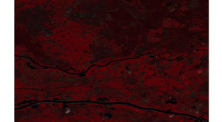

Today's learning objectives

At the end of the lecture, you should be able to:

• Have an overview of what can be achived when combining raster and vector data in R • Be able to extract raster data using vector data

## Introduction

In the previous lectures we saw how to deal with Raster data using R, as well as how to deal  with vector data and the multiple classes of the sp package. In the current lesson, we'll see what  can be done when the two worlds of vector data and raster data intersect.

## Conversions

You will find some utilities in R to convert data from raster to vector format and vice-versa.  However, whenever you start converting objects, you should wonder whether you are taking the  right approach to solve your problem. An approach that does not involve converting your data  from vector to raster or the opposite should almost always be preferred.

As a result, because these functions are only useful for some very particular situations, I only give  below a brief description of them.

## Vector to Raster

There is one function that allows to convert an object in vector to a raster object. It is the rasterize() function.

## Raster to Vector

Three functions allow to convert raster data to vector; the rasterToPoints(), rasterToContour(), and rasterToPolygons() functions. The latter can be useful to convert the result of a classification. In that case, set dissolve = to TRUE so that the polygons  with the same attribute value will be dissolved into multi-polygon regions. This option requires  the rgeos package. Note: These methods are known to perform poorly under R. Calling gdal_translate directly or through the gdalUtils package can be much faster.

## Geometric operations

Raw raster data do not usually conform to any notion of administrative or geographical  boundaries. Vector data (and extents) can be used to mask or crop data to a desired region of  interest.

## Crop

Cropping consists in reducing the extent of a spatial object to a smaller extent. As a result, the  output of crop() will automatically be rectangular and will not consider any features such as  polygons to perform the subsetting. It is often useful to crop data as tightly as possible to the area  under investigation to reduce the amount of data and have a more focused view when visualizing  the data.

Crop uses objects of class extent to define the new extent, or any object that can be coerced to  an extent (see ?extent for more info on this). This means that practically all spatial objects  (raster or vector) can be used directly in crop. Considering two raster objects r1 and r2 with r2 smaller than r1, you can simply use crop(r1, r2) in order to crop r1 to the extent of r2.

You can easily define an extent interactively (by clicking) thanks to the drawExtent() function. Mask

mask() can be used with almost all spatial objects to mask (= set to NA) values of a raster object.  When used with a SpatialPolygon object, mask will keep values of the raster overlayed by  polygons and mask the values outside of polygons.

Note the very useful inverse= argument of mask(), which allows to mask the inverse of the  area covered by the features. We will use this feature of mask later in the tutorial to exclude  water areas of a raster, defined in an independent SpatialPolygons object.

## Extract

The most common operation when combining vector and raster data is the extraction. It simply  consists in extracting the values of a raster object for locations specified by a vector object. The  object can be one of the class of the sp package, or an extent object.

When using extract() with SpatialPolygons or SpatialLines, individual features of the  vector layer may overlay or intersect several pixels. In that case a function (fun =) can be used to  summarize the values into one. Note that although most often the function min, max, mean and median are used for the spatial aggregation, also any custom-made function can be used. extract() provides many options for the return object, such as a data frame or a new sp object  with extracted values appended to the attribute table. See ?extract() example section.

## Examples

A simple land cover classification of Wageningen from Landsat 8 data

In the example below we will do a simple supervised land cover classification of Wageningen. The  example uses the same data as you used in the exercise of the raster lesson.

Step by step we will:

• Download the Landsat 8 data of Wageningen

• Download and prepare administrative boundary data of the Netherlands • Download Water area data of Wageningen

• Mask the data to match the boundaries of the city

• Mask the data to exclude water bodies

• Build a calibration dataset using Google Earth image interpretation

• Export the Google Earth file and import it in R

• Extract the surface reflectance values for the calibration pixels

• Calibrate a model with the classifier

• Predict the land cover using a Landsat image

## Prepare the data

library(raster) 

## Download, unzip and load the data 

download.file(url = 'https://raw.githubusercontent.com/fyousef/UCLA-remote-sens ing/master/Data/Lab4/landsat8.zip', destfile = 'landsat8.zip', method = 'auto') 

unzip('landsat8.zip') 

## Identify the right file 

landsatPath <- list.files(pattern = glob2rx('LC8\*.grd'), full.names = TRUE) wagLandsat <- brick(landsatPath) 

## Loading required package: sp 

We can start by visualizing the data. Since it is a multispectral image, we can use plotRGB() to  do so.

# plotRGB does not support negative values, so they need to be removed wagLandsat\[wagLandsat < 0\] <- NA 

plotRGB(wagLandsat, 5, 4, 3)

## Download municipality boundaries 

nlCity <- raster::getData('GADM',country='NLD', level=2) 

class(nlCity) 

## \[1\] "SpatialPolygonsDataFrame" 

## attr(,"package") 

## \[1\] "sp" 

## Investigate the structure of the object 

head(nlCity@data) 

## OBJECTID ID_0 ISO NAME_0 ID_1 NAME_1 ID_2 NAME_2 HASC_2 ## 1 1 158 NLD Netherlands 1 Drenthe 1 Aa en Hunze NL.DR.AH ## 2 2 158 NLD Netherlands 1 Drenthe 2 Assen NL.DR.AS ## 3 3 158 NLD Netherlands 1 Drenthe 3 Borger-Odoorn NL.DR.BO ## 4 4 158 NLD Netherlands 1 Drenthe 4 Coevorden NL.DR.CO ## 5 5 158 NLD Netherlands 1 Drenthe 5 De Wolden NL.DR.DW ## 6 6 158 NLD Netherlands 1 Drenthe 6 Emmen NL.DR.EM ## CCN_2 CCA_2 TYPE_2 ENGTYPE_2 NL_NAME_2 VARNAME_2 

## 1 NA Gemeente Municipality 

## 2 NA Gemeente Municipality 

## 3 NA Gemeente Municipality 

## 4 NA Gemeente Municipality 

## 5 NA Gemeente Municipality 

## 6 NA Gemeente Municipality 

It seems that the municipality names are in the NAME_2 column. So we can subset the SpatialPolygonsDataFrame to the city of Wageningen alone. To do so we can use simple  data frame manipulation/subsetting syntax.

nlCity@data <- nlCity@data\[!is.na(nlCity$NAME_2),\] # Remove rows with NA wagContour <- nlCity\[nlCity$NAME_2 == 'Wageningen',\] 

We can use the resulting wagContour object, to mask the values out of Wageningen, but first,  since the two objects are in different coordinate systems, we need to reproject one to the  projection of the other.

Question 1: Would you rather reproject a raster or a vector layer? Give two reasons why you would choose to  reproject a raster or vector.

## Load rgdal library (needed to reproject data) 

library(rgdal) 

wagContourUTM <- spTransform(wagContour, CRS(proj4string(wagLandsat))) 

Now that the two objects are in the same CRS, we can do the masking and visualize the result.  Let's first crop and then mask, to see the difference.

wagLandsatCrop <- crop(wagLandsat, wagContourUTM) 

wagLandsatSub <- mask(wagLandsat, wagContourUTM) 

## Set graphical parameters (one row and two columns)

opar <- par(mfrow=c(1,2)) 

plotRGB(wagLandsatCrop, 5, 4, 3, main = 'Crop()') 

plotRGB(wagLandsatSub, 5, 4, 3, main = 'Mask()') 

plot(wagContourUTM, add = TRUE, border = "green", lwd = 3) 

## Reset graphical parameters 

par(opar) 

Example of crop and mask

In the figure above, the left panel displays the output of crop, while the second panel shows the  result of masking the Landsat scene using the contour of Wageningen as input.

We also have a water mask of Wageningen in vector format. Let's download it and also reproject  it to the CRS of the Landsat data.

download.file(url = 'https://raw.githubusercontent.com/fyousef/UCLA-remote-sens ing/master/Data/Lab4/wageningenWater.zip', destfile = 'wageningenWater.zip', me thod = 'auto') 

unzip('wageningenWater.zip') 

## Check the names of the layers for input in readOGR() 

ogrListLayers('Water.shp') 

water <- readOGR('Water.shp', layer = 'Water') 

waterUTM <- spTransform(water, CRS(proj4string(wagLandsat))) 

## OGR data source with driver: ESRI Shapefile 

## Source: "data/Water.shp", layer: "Water" 

## with 632 features 

## It has 32 fields 

Note the use of inverse = TRUE in the code below, to mask the pixels that intersect with the  features of the vector object.

wagLandsatSubW <- mask(wagLandsatSub, mask = waterUTM, inverse = TRUE) plotRGB(wagLandsatSubW, 5, 4, 3) 

plot(waterUTM, col = 'blue', add = TRUE, border = 'blue', lwd = 2)

For the rest of the example, we'll use the wagLandsatCrop object, for I have a few doubts about  the spatial accuracy of the two vector layers we used in the masking steps. You can check for  yourself by converting them to KML and opening them in Google Earth. (Let us know during the  lesson, what do you think? Any solutions?)

## Build a calibration dataset in Google Earth

Below we'll see how we can deal with a calibration dataset in R, for calibrating a classifier. It  involves working with SpatialPointsDataFrame classes, extracting reflectance data for the  corresponding calibration samples, manipulating data frames and building a model that can be  used to predict land cover. But first we need to build the calibration dataset (ground truth), and  for that we will use Google Earth.

Open Google Earth, and search for wageningen. Notice that the the city boundary is similar to the  figure above (turn on the Borders and Labels from the "layers" panel). Now in places, right click  on Temporary Places and select Add a Folder; name it appropriately (it will be your layer = argument afterwards when reading the KML file). Add new placemaks (within the city limits) to  that folder, and put the interpreted land cover in the description field. Keep it to a few classes,  such as agric, forest, water, urban. I also added flood, to categorize the flood plain nearby  the river. When you are done (15 - 30 points), save the file.

Note: in the approach described above, we get to decide where the calibration samples are.  Another approach would be to automatically generate randomly distributed samples. This can be  done very easily in R using the sampleRandom() function, which automatically returns a SpatialPoints object of any given size. In the familly of spatial sampling functions, there is also sampleRegular() (for regular sampling) and sampleStratified(), which can be used on a  categorical raster (e.g. a land cover classification), to ensure that all classes are equaly  represented in the sample.

## Calibrate the classifier

Load the newly created KML file using the readOGR() function. The object should be a SpatialPointsDataFrame and the information created is stored in the description column of  the data frame.

## Change to the correct file path and layer name 

samples <- readOGR('sampleLongLat.kml', layer = 'sampleLongLat') 

## OGR data source with driver: KML 

## Source: "data/sampleLongLat2.kml", layer: "sampleLongLat" 

## with 14 features 

## It has 2 fields 

We now need to extract the surface reflectance values of the corresponding samples. But first the  data once again need to be re-projected to the CRS of the Landsat data.

## Re-project SpatialPointsDataFrame 

samplesUTM <- spTransform(samples, CRS(proj4string(wagLandsatCrop))) # The extract function does not understand why the object would have 3 coord co lumns, so we need to edit this field 

samplesUTM@coords <- coordinates(samplesUTM)\[,-3\] 

## Extract the surface reflectance 

calib <- extract(wagLandsatCrop, samplesUTM, df=TRUE) ## df=TRUE i.e. return as a data.frame 

## Combine the newly created dataframe to the description column of the calibra tion dataset 

calib2 <- cbind(samplesUTM$Description, calib) 

## Change the name of the first column, for convienience 

colnames(calib2)\[1\] <- 'lc' 

## Inspect the structure of the dataframe 

str(calib2) 

## 'data.frame': 14 obs. of 9 variables: 

## $ lc : Factor w/ 6 levels "agric","flood",..: 6 6 6 5 3 3 4 5 1 1 ... ## $ ID : int 1 2 3 4 5 6 7 8 9 10 ... 

## $ band1: int 128 93 163 325 137 131 365 344 146 185 ... 

## $ band2: int 194 125 262 390 166 148 413 398 191 227 ... ## $ band3: int 341 199 431 517 300 267 750 659 358 542 ... ## $ band4: int 200 76 335 556 221 211 662 696 251 282 ... 

## $ band5: int 132 356 142 949 2042 1942 3309 1655 3408 4591 ... ## $ band6: int 31 186 83 1187 936 908 1911 1400 1121 1641 ... ## $ band7: int 14 92 64 1140 460 444 1170 1079 535 760 ... 

Note: the use of df = TRUE in the extract() call is so that we get a data frame in return. Data  frame is the most common class to work with all types of models, such as linear models (lm()) or  random forest models as we use later.

Now we will calibrate a random forest model using the extracted data frame. Do not focus too  much on the algorithm used, the important part for this tutorial is the data extraction and the following data frame manipulation. More details will come about random forest classifiers  tomorrow.

if(!require(randomForest)) { 

 install.packages("randomForest") 

} 

## Loading required package: randomForest 

## Warning: package 'randomForest' was built under R version 3.3.3 ## randomForest 4.6-12 

## Type rfNews() to see new features/changes/bug fixes. 

library(randomForest) 

## Calibrate model 

model <- randomForest(lc ~ band1 + band2 + band3 + band4 + band5 + band6 + band 7, data = calib2) 

## Use the model to predict land cover 

lcMap <- predict(wagLandsatCrop, model = model) 

Let's visualize the output. The function levelplot() from the rasterVis package is a convenient  function to plot categorical raster data.

library(rasterVis) 

## Loading required package: lattice 

## Loading required package: latticeExtra 

## Loading required package: RColorBrewer 

levelplot(lcMap, col.regions = c('green', 'brown', 'darkgreen', 'lightgreen', ' grey', 'blue'))

OK, we've seen better land cover maps of Wageningen, but given the amount of training data we  used (14 in my case), it is not too bad. A larger calibration dataset would certainly result in a better  accuracy.

Extract raster values along a transect

Another use of the extract() function can be to visualize or analyse data along transects. In the  following example, we will run a transect across Belgium and visualize the change in elevation.

Let's first download the elevation data of Belgium, using the getData() function of the raster  package.

## Download data 

bel <- getData('alt', country='BEL', mask=TRUE) 

## Display metadata 

bel 

## class : RasterLayer 

## dimensions : 264, 480, 126720 (nrow, ncol, ncell) 

## resolution : 0.008333333, 0.008333333 (x, y) 

## extent : 2.5, 6.5, 49.4, 51.6 (xmin, xmax, ymin, ymax) ## coord. ref. : +proj=longlat +datum=WGS84 +ellps=WGS84 +towgs84=0,0,0 ## data source : C:\\Users\\fyousef\\Desktop\\RemoteSensingUCLA\\Lab_Handouts\\Vector Raster-gh-pages\\BEL_msk_alt.grd 

## names : BEL_msk_alt 

## values : -105, 691 (min, max) 

bel is a RasterLayer.

We can start by visualizing the data.

plot(bel) 

Everything seems correct.

We want to look at a transect, which we can draw by hand by selecting two points by clicking. The drawLine() function will help us do that. Once you run the function, you will be able to click in  the plotting window of R (The bel object should already be present in the plot panel before  running drawLine()). Click Finish or right-click on the plot once you have selected the two  extremities of the line.

line <- drawLine()

Then the elevation values can simply be extracted using extract(). Note the use of the along.with= argument which ensures that the samples remain in order along the segment.

alt <- extract(bel, line, along = TRUE) 

We can already plot the result as follows, but the x axis does not really provide any indication of  distance.

plot(alt\[\[1\]\], type = 'l', ylab = "Altitude (m)") 

In order to make an index for the x axis, we can calculate the distance between the two  extremities of the transect, using distHaversine() from the geosphere package.

if(!require(geosphere)) { 

 install.packages("geosphere") 

} 

## Loading required package: geosphere 

## Warning: package 'geosphere' was built under R version 3.3.3 

library(geosphere) 

## Calculate great circle distance between the two ends of the line dist <- distHaversine(coordinates(line)\[\[1\]\]\[\[1\]\]\[1,\], coordinates(line)\[\[1\]\]\[\[ 1\]\]\[2,\]) 

## Format an array for use as x axis index with the same length as the alt\[\[1\]\] array 

distanceVector <- seq(0, dist, along.with = alt\[\[1\]\]) 

## Question 2: Why can't we simply use the LineLength() function from the sp package?

Hint: look at the CRS in which we are working, and at the help page of the distHaversine() function. Also the see distVincentyEllipsoid() function. Does this one provide a more  accurate distance?

Note that there is a small approximation on the position of the line and the distances between  the samples as the real shortest path between two points is not a straight line in lat-long, while  the distance we just calculated is the shortest path. For short distances, as in the example, this is  acceptable. Otherwise, we could also have:

• Projected the raster and the line to a projected coordinate system, or

• Made a true greatCircle line using greatCircle() from the sp package and extracted the  elevation values from it.

Let's now visualize the final output.

## Visualize the output 

plot(bel, main = 'Altitude (m)') 

plot(line, add = TRUE) 

plot(distanceVector/1000, alt\[\[1\]\], type = 'l', 

 main = 'Altitude transect Belgium', 

 xlab = 'Distance (Km)', 

 ylab = 'Altitude (m)', 

 las = 1)

Extract raster values randomly using the sampleRandom() function

Below is an extra example and a simplification of the random sample demo show here. Below we  use the sampleRandom() function to randomly sample altitude information from a DEM of  Belgium:

# You can choose your own country here 

bel <- getData('alt', country='BEL', mask=TRUE) ## SRTM 90m height data belshp <- getData('GADM', country='BEL', level=2) ## administrative boundaries 

## Sample the raster randomly with 40 points 

sRandomBel <- sampleRandom(bel, na.rm=TRUE, sp=TRUE, size = 40) 

## Create a data.frame containing relevant info 

sRandomData <- data.frame(altitude = sRandomBel@data\[\[1\]\], 

 latitude = sRandomBel@coords\[,'y'\],  longitude = sRandomBel@coords\[,'x'\]) 

## Plot 

plot(bel) 

plot(belshp, add=TRUE) 

plot(sRandomBel, add = TRUE, col = "red") 

## Plot altitude versus latitude 

plot(sRandomData$latitude,sRandomData$altitude, ylab = "Altitude (m)", xlab = " Latitude (degrees)")

Question 3: If you would like to sample height data per province randomly, what would you need to do? Exercise

Please help me find out which "municipality" in the Netherlands is the greenest. You can use the  MODIS NDVI data available here.

Hint: use nlMunicipality <- getData('GADM',country='NLD', level=2) 

• Find the greenest Municipality:

– In January

– In August

– On average over the year

• Make at least one map to visualize the results

Click here for more information about MODIS data used (i.e. MOD13A3)

Bonus: What about provinces (see ?raster::aggregate), which province is the greenest in  January?
