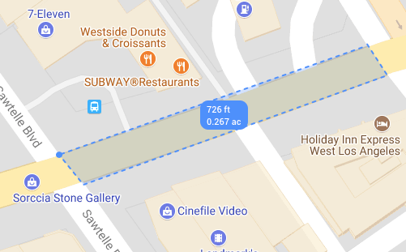
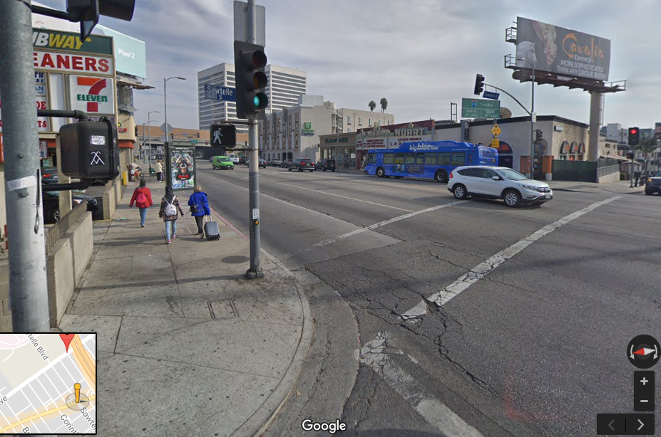
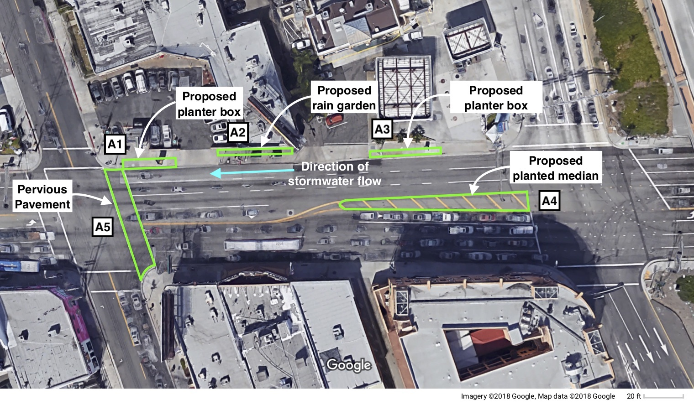
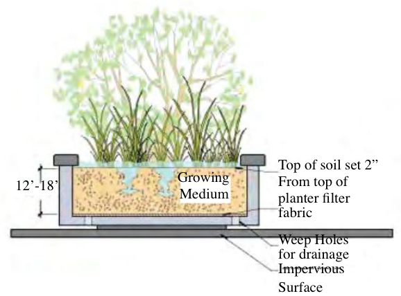
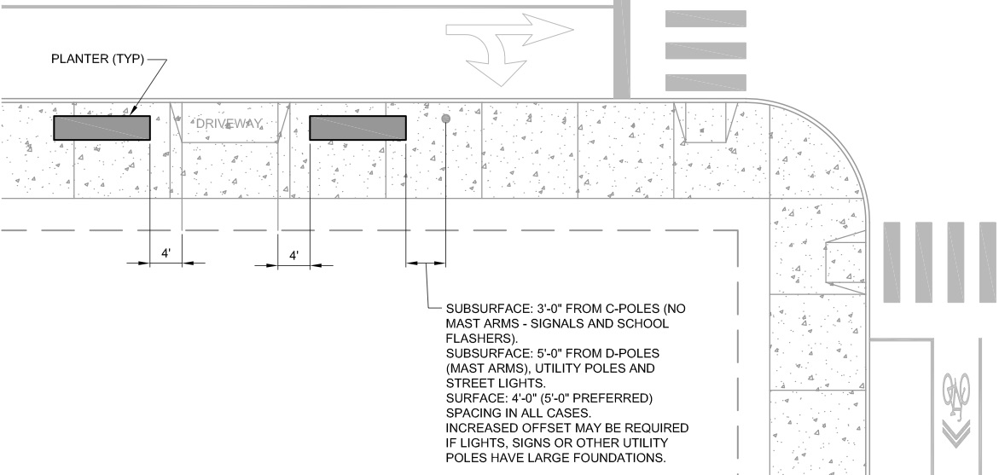
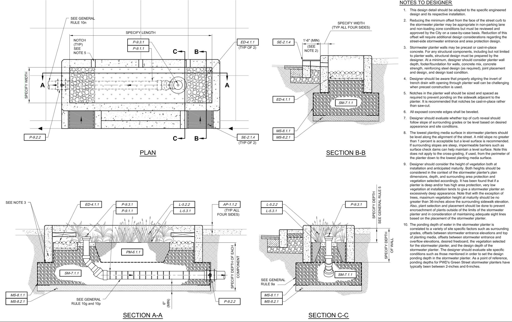
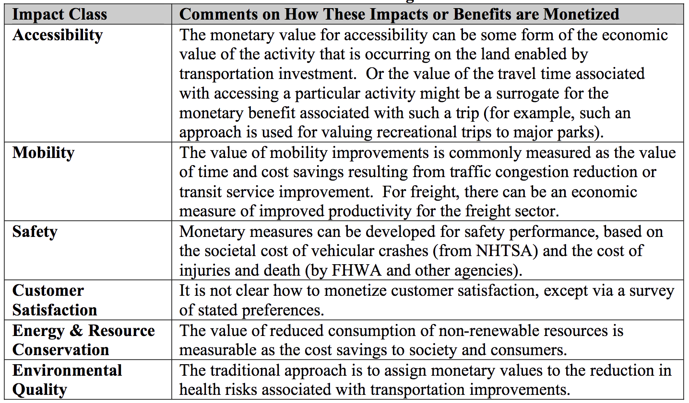

# Santa Monica Boulevard Green & Complete Street Retrofit

## Abstract

Santa Monica Boulevard, in Los Angeles, California serves as a major regional conduit and has potential to improve the lives of the large surrounding community through a green streetscape retrofit. This study assesses the costs and benefits of green infrastructure alternatives that may be implemented to achieve this goal. The proposed green infrastructure elements include rain gardens, permeable pavement, stormwater planters, and bike lanes. Our findings demonstrate that implementation of these mitigation techniques would result in a 57% runoff reduction and 45% contaminant removal while maintaining the street’s level of service.

---

## Introduction

Santa Monica Boulevard in Los Angeles, California serves as a major regional conduit by virtue of its connection to Hollywood, San Fernando Valley, West Los Angeles and Santa Monica. The study area encompasses roughly 0.267 acres of public right of way with a perimeter of around 726 feet and is surrounded by commercial property including a hotel, supermarkets, restaurants, gas stations, and shops (see Figure 1 below). A bus stop is also located at the intersection of Sawtelle Boulevard and Santa Monica Boulevard.

The site receives stormwater potentially contaminated with pollutants deposited from traffic activities. Moreover, the study area is lacking in green infrastructures that may help treat these contaminants on site. Storm water runoff flows down the streets and into catch basins that are connected to storm drain lines that flow directly into channels, rivers, lakes and the ocean. As the storm water is not treated prior to being discharged into the receiving water bodies, all pollutants, including trash, grease, oil, and sediments, are carried into the ocean causing pollution in the waterways and along the shores (Lukes, 2008). Contaminated stormwater runoff is the number one source of ocean pollution in Southern California, and the city’s street infrastructure plays a major role in flushing these pollutants out to sea.

## Design

Streets comprise a significant percentage of publicly owned land in most communities and offer a unique opportunity to incorporate elements that protect the environment and improve community health and prosperity. Complete streets are roadways planned and designed for safe, convenient access and mobility of roadway users of all ages and abilities. They also foster walkable downtowns and generate economic activity. Complete-street designs usually include sidewalks, bike lanes, paved shoulders, pedestrian control signals, bus pull-outs, curb cuts, raised crosswalks, ramps and other features.

Green streets refer to an interconnected network of natural features (vegetation, parks, wetlands, etc.) that provide beneficial ecosystem services for human populations walking in that street. Green streets achieve multiple benefits, such as, improved water quality and more liveable communities through the integration of stormwater treatment techniques which use natural processes and landscaping (Chau, 2009).

The existing wider sidewalks allow for the implementation of infiltration systems, without disturbing the pedestrian walkways. The necessity of having wider sidewalks comes from the fact that bioinfiltration systems such as bioswales, buffer zones or planter boxes, require a lot of space. The sidewalk re-design is restricted mainly by the standards set by the ADA (American with Disabilities Act) and the existing public right of way.

### Planter Boxes

The addition of stormwater planters will help mitigate the pollution contaminating the project site. Stormwater planters provide on-site treatment by capturing, treating, then infiltrating most of the runoff they receive. Planters also provide volume and flow control and water quality benefits (Wise, 2008). Additionally, planters improve existing urban streetscape by adding attractive green space.

The proposed planter box locations on the north sidewalk aligns with the existing stormwater infrastructure (conveyance pipes and storm drain inlets) for ease of connection, and safely accommodates pedestrians and vehicle access. The proposed planter boxes will collect and absorb runoff from the sidewalks, nearby parking lots, and streets. Runoff flows through the soil layer and into the gravel layer before being slowly discharged via a perforated pipe (see Figure 3 below for schematic and Appendix B for typical plans and details).

The planter box should contain a soil and compost mixture with an infiltration bed of clean, uniformly graded stone. The planter box depth is dictated by the selected plants, which may require a 6 to 18-inch rooting zone. Small trees and shrubs placed in the planters will consume less water, provide better filtration and cooling effects than grasses (Shashua-Bar, 2000) but require more space. The minimum planter width is typically 30 inches with no minimum length or required shape (Ackermann, 2008). The dimension of the proposed wooden rectangular planter boxes will have an 18 inch depth and a total area of 750 square feet (A1: 5\*50=250 ft2, A3: 5\*100=500 ft2). The total calculated planter box capacity is roughly 1,080 ft3. Taking into account the dimension of our planter boxes, the soil, the materials needed and the delivery, the cost will total around $850 (using the Budget Estimate Calculator for Planter Boxes).

### Rain Gardens

In urban streams, nutrient retention can be increased by adding vegetated landscapes designed to absorb water such as bioswales, green roofs, and rain gardens. This will help in reducing both the amount of urban stormwater runoff and its pollution load (Clausen 2007; Shuster et al. 2008). A test of both water retention and pollutant removal in rain gardens over a 1‐year period demonstrated that nearly 99% of water inputs were absorbed (Dietz and Clausen, 2005). Rain gardens also demonstrate nitrate retention of 67%, 82% ammonia retention, and 26% retention of total nitrogen (Dietz et. 2005). It is for these reasons that bioretention areas have been recommended as a best management practice (BMP) to reduce nonpoint source pollution from urban areas (US EPA, 2000; Prince George’s County, 1993).

Rain garden plant selection plays an important role in the pollution reduction. The soil layer captures stormwater while plants absorb and filter it (Hickey and Doran et. 2004). The majority of the plant palette selected for the retrofit is native to California, with some species selected for color variety. The plant list includes Yarrow, Rushes, Iris, Sticky Monkey Flower, Wild Rye, Lilac Verbena, Dogwood, California Rose, Flowering Gooseberry, Bowman California Fuchsia, and Red Maple.

The composition of the rain garden should include 2” of shredded hardwood mulch to keep the soil in place. Compost should be added above the topsoil (25%), which itself sits atop a layer of sand (25%). The bulk of the soil substrate (50%) should be a sandy loam with an infiltration rate of 5 inches and hour. Additional sand be added to the mix in order to increase the infiltration rate, however, limiting clay content is very important as it impedes water from infiltrating (Bannerman, 2003). The ponding depth should be maintained below 6 inches, and the filter bed depth below 36 inches.

Rain gardens require about as much maintenance as a standard landscaped bed and are relatively inexpensive to install. Using the average cost range of $10 to $12 per square foot of surface area (Rain Garden Design Manual), the total calculated cost for the two rain gardens (A2 and A4, Figure 2) comes out to around $13,500. The total calculated rain gain capture capacity is roughly 2,250 ft3 (\[A2+A4\]\*depth). A two foot rain garden depth was used to account for the soil volume and plant roots.

### Permeable Pavement

Installation of permeable pavement will help reduce runoff and increase groundwater recharge. Permeable pavers also trap suspended solids and pollutants, keeping them from entering the water stream. While extensive use of permeable pavers is limited by cost and traffic loads, implementation on a smaller scale is still feasible. The western crosswalk (A5, Figure 2) is ideal for retrofitting with permeable pavement and will provide additional infiltration if the rain garden and planter box capacity is reached. Permeable interlocking concrete pavers (PICP) filled with gravel demonstrate the best traffic load and aesthetics compared to pervious concrete and asphalt alternatives. With a crosswalk area of 1,200 square feet and installation cost of $6 per square foot, the cost totals a modest $7,200.

### Bikeways

Implementation of safe bikeways requires the addition of space, as the existing road lacks bicycle-lanes. The safest design option is the Class 1 bikeway (California Streets and Highways Code) which provides a completely separated right of way for the exclusive use of bicycles and pedestrians with crossflow by motorists minimized. Unfortunately, this design is not feasible with the limited space availability and the need to maintain the existing traffic level of service. While traffic lanes may not be removed, the benefits may outweigh the drawbacks of tightening the cars’ path by reducing lane width to accommodate bike lanes. A traffic assessment is necessary to determine the extent that traffic congestion may be affected. While fully separated right of ways is infeasible, green bikeway striping provides highly visible contrast on the street and increases motorists' awareness of cyclists.

## Discussion

The crux of implementing green and complete street measures is the benefit assessment. In the past, performance measures were limited to checking whether departmental goals are being achieved cost effectively (MacDonald, 2010). The impacts of specific street design features on the quality of life are not evaluated under these performance measurement systems. Thus, we need to compile new performance measures to assess these features. Research is now beginning to show some effects of green and complete street design that may be tested for in performance goals. The NCHRP suggested valuations approach can be seen in Appendix C.

Public safety is the main concern and responsibility of street design. Wider lanes are more likely to be associated with higher driver speeds than narrow lane widths (MacDonald, 2010). Higher driving speeds are associated with higher vehicle crashes and fatalities. These findings justify the addition of green features in place of the existing wider lanes. Roadside trees planted close to the roadway, or in this case medians, also have the effect of slowing down driver speeds (Van der Horst and Ridder, 2007).

Traffic is oftentimes thought of as an unintended consequence of retrofit projects, however, wider travel lanes only marginally increase traffic capacity (Van der Horst and Ridder, 2007). In Curitiba, Brazil, a complete street retrofit reduced the number of car lanes in favor of adding bus lanes and bike lanes with no traffic consequences. The residents of the city began using alternative commuting approaches and decreased their reliance on automobiles (Miranda, 2012). Similarly, the Mobility Plan for 2035 set by Mayor Garcetti considers creating green and complete streets throughout Los Angeles. Venice Boulevard, an existing green and complete street, demonstrates the success of retrofit projects in Los Angeles with decreased vehicular traffic, increased pedestrian traffic and cyclist safety despite the removal of a travel lane.

A second factor to consider is quality of life. Implementing these features will increase the quality of life of the nearby residents and will encourage more people to enjoy the street and frequent the surrounding businesses. The quality of life for the residents of the city is not simply limited to aesthetics, including rain gardens and planter boxes reduce runoff and contamination. In big storm events, when sewers mains reach capacity, the overflows are diverted to the nearby creeks which eventually discharge into the ocean. The Bicknell Avenue Green Street Urban Project in Santa Monica demonstrates how comprehensive structural Best Management Practices (BMPs) can harvest urban runoff, keeping the single largest source of water pollution out of the Santa Monica Bay. The project report shows that the BMPs improved water quality by drastically reducing the concentration of pollutants. Similarly, the Burnsville stormwater retrofit study analyzed two similar watersheds, one a control and the other a watershed with rain garden implementation. They found a 90% runoff reduction when comparing the control to the rain garden watershed.

## Conclusion

Santa Monica Boulevard holds the potential to better the lives of its surrounding community through a feasible retrofit project. The reasonable cost of implementing the above mentioned green infrastructure is fully justified by the tremendous benefits received. Installing a rain garden adjacent to the gas station will reduce the oil contamination by capturing most of the runoff and allowing it to infiltrate. Using compost in the rain gardens will allow further removal of oil contamination, as the addition of compost in an oil field was found to remove up to 45% of crude oil (Mao et al. 2009). The addition of both the planter boxes and rain gardens account for a potential capture capacity of 3,327 ft3. The total runoff flow rate for the site (see Appendix A) was found to be 5,800 ft3, therefore, the total runoff volume after implantation is approximately 2,500 ft3. This results in a 57% runoff reduction for the overall site.

## References

Atkins, Eleanor. Green Streets as Habitat for Biodiversity”, www.sciencedirect.com.

Chau, Haan‐Fawn. “Green Infrastructure for Los Angeles: Addressing Urban Runoff and Water Supply Through Low Impact Development“. City of Los Angeles (2009).

Choi, Yea Lim, "Public Stormwater Management with Green Streets. " University of Tennessee (2016). www.trace.tennessee.edu.

Dietz, M.E. & Clausen, J.C. Water Air Soil Pollut (2005) 167: 123. <https://doi.org>

Dill, Jennifer et al., “Demonstrating the Benefits of Green Streets for Active Aging: Final Report to EPA”, www.friendsoftrees.org.

Church, Sarah P. "Exploring Green Streets and rain gardens as instances of small scale nature and environmental learning tools." Landscape and Urban Planning 134 (2015): 229-240.

Environmental Protection Agency (EPA), “Building Blocks for Sustainable Communities” www.epa.gov.

Ewing, Reid, et al. "Cooler." (2005).

Glaros, Dannielle et. al., “Green and Complete Green Streets”, www.mwcog.org.

Lukes, Robb. “Managing Wet Weather with Green Infrastructure”. Municipal Handbook Green Streets, 2008.

MacDonald, Elizabeth, Rebecca Sanders, and Alia Anderson. "Performance measures for complete, green streets: a proposal for urban arterials in California." (2010).

McCann, Barbara, and Suzanne Rynne. "Complete the streets." Planning 71.5 (2005): 18-23.

Miranda, Hellem. Benchmarking Sustainable Urban Mobility: The Case of Curitiba, Brazil. Elsevier, 10 Apr. 2012, www.sciencedirect.com/science/article/pii/S0967070X12000558.

Sousa, Lindsey R., and Jennifer Rosales. "Contextually complete streets." Green Streets and Highways 2010: An Interactive Conference on the State of the Art and How to Achieve Sustainable Outcomes. 2010.

Shashua-Bar, Limor, and Michael E. Hoffman. "Vegetation as a climatic component in the design of an urban street: An empirical model for predicting the cooling effect of urban green areas with trees." Energy and buildings 31.3 (2000): 221-235.

Shu, Shi, et al. "Changes of street use and on-road air quality before and after complete street retrofit: An exploratory case study in Santa Monica, California." Transportation Research Part D: Transport and Environment 32 (2014): 387-396.

Wise, Steve. "Green infrastructure rising." Planning 74.8 (2008): 14-19.

---

## Appendix A

Runoff Calculations

Table 1: The Rational Method (Q = ciA)

Variable

Existing

Proposed

Runoff Coefficient (c)

0.85

0.806\*

Rainfall Intensity (i)

1.1 in/hr

1.1 in/hr

Area (A)

0.76 ac

0.76 ac

Flow (Q)

0.71 cfs

0.67 cfs

\*The proposed runoff coefficient value was calculated from a weighted runoff coefficient, assuming there is no capturing inside the rain garden and planter boxes.

cpropsed = ( cimp \* Aimp\+ cper\* Aper ) / Atot

According to the LADWP Hydrological Manual, Table 5.1.1

- Peak storm duration = 2.27 hours
- Rainfall intensity = 1.1 inches an hour

The peak depth of rainfall is then found to be 2.27 x 1.10 =  2.5 inches

Peak volume: Q\*t = 0.71cfs \* 2.27 hr \*3600s/hr = 5,800 ft3

Computation Sheet for Determining Runoff Coefficients

### Existing Site Conditions

Impervious Site Area1

\=

33105.6

(B)

Impervious Site Area Runoff Coefficient 2, 4

\=

0.850

(C)

Pervious Site Area3

\=

0

(D)

Pervious Site Area Runoff Coefficient4

\=

0.075

(E)

Existing Site Area Runoff Coefficient

\=

0.850

(F)

### Proposed Site Conditions (after construction)

Impervious Site Area1

\=

31261.2

(G)

Impervious Site Area Runoff Coefficient 2, 4

\=

0.85

(H)

Pervious Site Area3

\=

1844.4

(I)

Pervious Site Area Runoff Coefficient4

\=

0.075

(J)

Proposed Site Area Runoff Coefficient

\=

0.806

(K)

- - -

## Appendix B

Standard Planter Box Plans

Standard Planter Box Details

## Appendix C

Assessment of Monetization Potential of Categories

