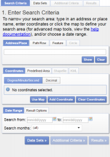
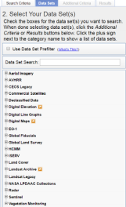
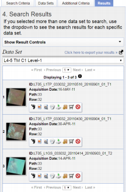
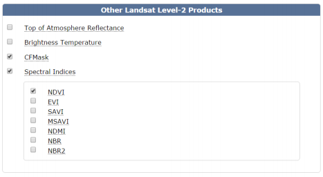
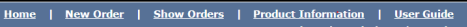
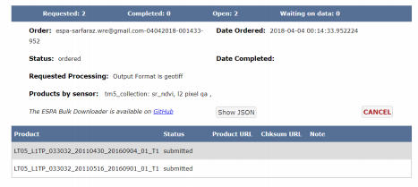
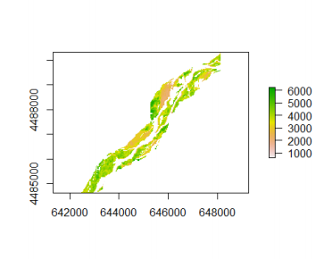
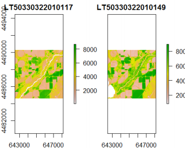
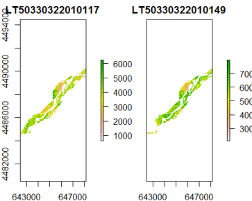

## Data Download

Various websites host remote sensing data. The main difference between these resources are the type of  data. Some websites provide you with raw imagery and others have done considerable amount of  reprocessing to provide you with products. Likewise, these websites provide you with various methods to  search for data. For instance, <https://glovis.usgs.gov> provide you with raw Landsat imagery, while <https://espa.cr.usgs.gov> provide processed Landsat data. There is also <https://earthexplorer.usgs.gov/> which is the most comprehensive remote sensing data depository that provides both Landsat and MODIS  satellite imagery in various formats. We will use some of these websites to download and explore that  data in this lab.

Selecting scenes:

a. Go to <https://earthexplorer.usgs.gov/>
b. On the left panel, you would see 4 different tabs. You would use each to filter and narrow  down your selection criteria (Figure 1).

Figure 1 Earth Explorer Data Search

c. Click on “Path/Row” tab in the middle of the page. For path enter 33, and for row enter 32. Click “Show”.
d. On the bottom of the current tab, select a date range: April 1st 2011 to May 30th\-2011.
e. On the top, click on the “Data Sets” tab. Click the + sign on next to “Landsat Archive >  Collection 1 Level-1 > L4-5 TM C1 Level-1”. Check the box next to L4-5 TM C1 Level-1. Hit the OK if warning appears.
f. Processed to the “Results” tab to see your search results. You should see a result page  such as below:

g. Copy past the “Entity ID” of the first two search entries in to an empty text file. Save the  text file and call it “33032.txt” (path-row name; this is arbitrary).

Note: each Entity ID should be in one line. Just copy/paste the text in front of Entity ID  and not the “Entity ID” itself.

## Download the data

This is a great resource for processed that. Many products are available for you to download. You  can also use this website as a great resources for your projects and data needs.

a. Go to <https://espa.cr.usgs.gov>
b. Set up a new account. Note: this is not a normal USGS account. Regardless of having a  previous account with USGS, you need to setup a new account with ESPA
c. On the top ribbon, click on the “New Order” tab.
d. Click “Choose File” and select the “33032.txt” (You are asking the search engine at this  website to find the processed version of the scenes that you have selected).
e. Scroll down, under Other Landsat Level-2 Products choose “CFMask” for cloud masking and “Spectral Indices>NDVI” for vegetation greenness index.

Note: Other indices are also available for download after the order complete. However, the order size and processing time increases as the # of products increases.

Figure 2. Product selection Panel.

f. Leave the rest of options with their default settings.

Notes:

1. You can order simple stats if you are interested. However, they are averaged over the entire scene and might not be very informative.
2. It is recommended to leave a  unique note under “Order Description” in case several scenes are being processed (e.g.  Colorado-2011).

g. Proceed to submit the order by clicking on the “Submit” button.

2\. You will receive a first email notifying you that the order is being processed. You will receive a  second email notifying you that you order is ready for download.

3\. Proceed to download the User Guide. The link can be found on the top ribbon under “User  Guide” tab. This PDF contains the information about each product and their meanings and  characteristics.

Figure 3. Top ribbon links.

4\. You can also check the status of your order by clicking on the “Show Order” tab. 5. When order is ready, go to “Show Order” page and proceed to download the tar files. Into the Sampledata folder.

Figure 4.Download Page.

Note 1: The tar files can be view by free compressors such as WINRAR or 7Zip. However, this is  required in order to processes the files in this tutorial.

Note 2: There are other methods to search for the data on the EarthExplorer website. You can select data  by drawing polygons or specifying exact location of your area of interest (AOI) using the Lat/Lon tab.

Part 2.2 Introduction to R and Raster Visualization

## R setup, data extraction, and visualization

### Install R, and R-studio

1\. Start R. Note: You can install R-studio in order to make R even more user friendly.

You can download R-studio at: <https://www.rstudio.com/products/rstudio/download/> Find the proper version at the bottom of the page, download, and install it!

### Install packages

Processing raw Landsat imagery is fast and straightforward with R. R is a statistical analysis software with growing capabilities. The R's success is partially related to growing  number of tools and packages that are available to users. We will be working with many of  them. You will have the chance to learn how to download, install, and work with this  packages.

2\. Open a R-script window by clicking on File>New File> R-script.

3\. The new window is where you would insert you R Script.

4\. As a starter, we would like to install a few packages in order to work with Landsat  Images.

• Use install.packge("NAME OF THE PACKGE") to install any package. However, since bfastSpatial package is still underdevelopment, you would need to install it directly  from "github". Install devtools first. Then, use install\_github to install bfastSpatial. The rest is very typical:

install.packages('devtools')

install\_github('loicdtx/bfastSpatial')

• You might actually get some errors. This is because this package is still under  development and many of its "dependencies" are not installed on your computer.

Note: Somewhere down the "installation" processes you get some errors; please read the  errors messages carefully. If you read the last few lines of the error message, it should say  that "some thing" is missing. Use your knowledge of package installation to resolve  these issues. You might need to install as much as 4 additional packages, but R does not give  you all 4 names at once; you should resolve the first error and attempt to install bfastspatial again. Then you would get another error. Install the second package and  repeat the processes. X(

Install the the following two packages as well:

install.packages("rgdal")

install.packages("raster")

• Now, load the installed packages. R does not try to load all the libraries at once in  order to save memory and time. Thus, if you need to work with a package, you would  need to load it using the "library()" or "require()" functions.

require("devtools")

require("bfastSpatial")

require("rgdal")

require("raster")

require("tools")

Note: R is case sensitive; Uppercase and lowercase words and commands an functions are  different from one another.

Set Working Directories

Like any programming task, you would benefit from setting working directories before  getting busy with solving the problems. You will define the input and the output  directories.

5\. You are give some data to work with. Define the input and output directory for both the  data and the shapefile:

Warning: Please check the below directories and change them to match data directories on  your computer.

Note: You can either manually type in the path here, OR, use a trick (search in Google) to  get the data path directory with a simple copy/paste.

indir <- "PATH TO THE DATA"

outdir <- "PATH TO THE OUTPUT"

# PC example: indir <- "C:/my/data/directory"

# Mac or Linux example: indir <- "/my/data/directory"

dir.create(outdir, showWarning=FALSE)

crop\_file<- "PATH TO THE SHAPEFILE CO5.shp"

## Reading the data

Read your data into the R memory. Since we have more than one file in this exercise, we  can first create a list of the files in the folder. Notice that you are creating and object, mylist, to refer to this list. The name of this object is almost arbitrary. But you would want  to use names that are representative of the actual information "attached" to them.

Here we are working with gride files. The following syntax will find them for you. 6\. Locate the tar files to be processed.

mylist <- list.files(indir, full.names=TRUE, pattern="\*.gz")

## Questions/Homework

1\. How many files do you see in the input folder? Print your output path here.

2\. How would you create a list of an imaginary set of text files with a .txt extension? Show  your syntax.

Getting help from R

R offers help regarding details of each package and function. The best way to prompt R for  help is to type a ?followed by the function name. Lets try it for our next function; the plot.

?plot

## Data manipulation and extraction

7\. Read the shapefile to crop the data into the desired extent. We call it Crop\_obj (Crop  Object) and it is the extent for the CO5 (Colorado 5) station.

crop\_name <- file\_path\_sans\_ext(basename(crop\_file))

crop\_obj <- readOGR(dsn=crop\_file, crop\_name, verbose=FALSE)

Warning A very important point about R. Remember that each data layer you work with has a coordinate systems. Refer to this link to read more about geographic coordinate systems. What you would like to do is to make sure that all layers in your data set have the  same coordinate system. Use projection function to check and see.

Here in this exercise, we have done this for you. But always make sure that both your rasters and shapefiles have the same coordinate system. Also, since you will be working on  a specific area, you will be working with a set of imagery hat have the same coordinate  system, so no worries there.

3\. Check the projection of your shapefie object. Print the projection here.

4\. Looking at the above two lines of code, what does the first line do? Explain each argument.

8\. Generate (or extract, depending on whether the layer is already in the archive or not)  NDVI for the first archived file. Notice that we are using the above shapefile to crop the  Landsat image. We will only work with the area inside the crop object.

Also notice that a mask mask had to be selected; in that case 'fmask', which is one of the  layers of the Landsat archive file delivered by USGS/ESPA. For details about that mask and  know which values to keep (keep=), you can visit this page, or for general information on  the layers provided in the archive, see the product guide.

Masking and cropping are optional but highly recommended if you intend to perform  subsequent time-series analysis with the layers produced.

The extension of the output is by default .grd. This is the native format of the raster package. This format has many advantages over more common GeoTiff or ENVI formats.

processLandsat(x=mylist\[1\], vi='ndvi', outdir=outdir, srdir=outdir, delete=TR UE,

mask='fmask', keep=0, e=extent(crop\_obj), overwrite=TRUE)

Look through the help page for the processLandsat function and answer the following  question.

5\. What do srdir and delete arguments do?

9\. The results of the above function has produced a nice sections of NDVI imagery for our  study site. Lets plot that:

list <- list.files(outdir, pattern=glob2rx('\*.grd'), full.names=TRUE) plot(r <- mask(raster(list\[1\]), crop\_obj))

6\. Process the second file in your input directory and save the output in the "out" folder. 7\. Why do you need to use raster function here? What does the mask function do?

## Visualization of Multiple Landsat Scenes

Now we would like to attempt to visualize both layers and processed to perform a time series analysis.

## Questions/Homework

1\. Make a list of both of you output files. Copy you code below (hint: You would want to use .grd files for display).

2\. Print the filenames and their location. This is just to check how many files do we have in  the system. Your code below.

3\. How many files do you see listed in your out directory? Can you tell their dates by  looking at the filename?

## Creating a multi-temporal raster object

1\. Create a new sub-directory to store the raster stack

outdir2 <- paste0(outdir, "/", "stack\_new")

dir.create(outdir2, showWarnings=FALSE)

4\. What does the paste0 function do? Look up the help!

2\. Generate a file name for the output stack

stackName <- file.path(outdir2, 'CO5\_Stack.grd')

3\. Stack the layers. Once the vegetation index layers have been produced for several dates,  they can be stacked, in order to create a multilayer raster object, with time dimension  written in the file as well. The function to perform this operation on Landsat data is the timeStack. By simply providing a list of file names or a directory containing the files, the  function will create a multilayer object and directly parse through the file names to extract  temporal information from them and write that information to the object created.

s <- timeStack(x=list, filename=stackName, datatype='INT2S', overwrite=TRUE) 4\. Visualize both layers.

plot(s)

5\. Processed to mask out the unwanted regions using the crop\_obj. plot(mask(s, crop\_obj))

5\. Explain the Landsat's filename (if it is new to you, Google it!). How is it helpful to you?

6\. Looking at the bottom-left of the above two images, why are they different? 7\. Why is the image on the right "greener" than the one in the left (Read about NDVI)?

## About the example above

• For this function to work, it is absolutely necessary that the input layers have the same  extent. Two Landsat scenes belonging to the same path/row, but acquired at different  times often have slightly different extents. We therefore recommend to always use an  extent object in processLandsat, even when working with full scenes.

• Time information is automatically extracted from the layer names (using getSceneInfo) and written to the z dimension of the stack.

• We chose to write the output to the .grd format, which allows the time information to  be stored as well as the original layer names.

• The x= argument can also simply be the directory containing the layers; in which case  we recommend using pattern= as well in order to ensure that only the desired files  are included.

NOTE:

Data you need for the lab exercise is available at:

<https://drive.google.com/file/d/1wLLab9KmYsw4LJoEQeNpaR8FIjPQmCrc/view?usp=sharing>
