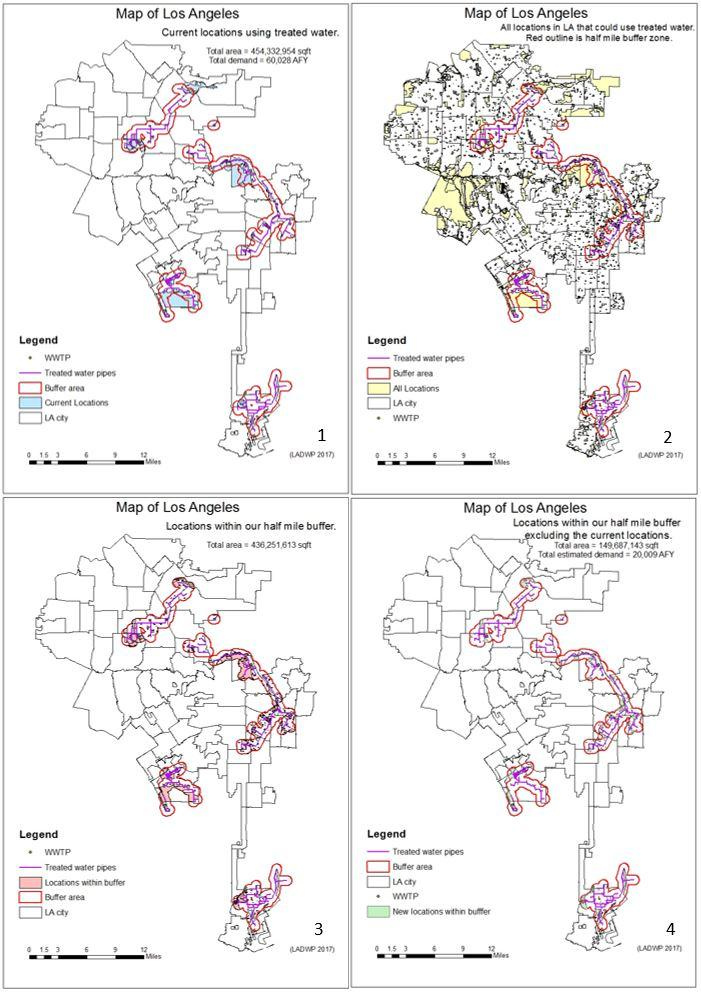
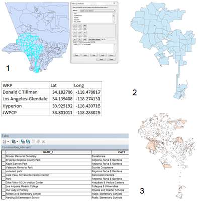

### Abstract

In the City of Los Angeles, there is an increasing need for local and reliable water supply. The recent water scarcity and drought affecting the city has prompted the 2050 Sustainable LA goal of achieving total water independence by the year 2050. One promising method for reaching this goal is through increased use of recycled water. This water is provided by wastewater treatment plants and is treated to a variety of standards. In this project, we explored the possibility of expanding on the existing recycled water infrastructure to service nearby parks, golf courses, memorial sites, and other non-potable uses. The spatial analysis was conducted using a software called ArcGIS. This software was used to determine the amount recycled water that could be added to Los Angeles pipe system.

## Introduction

Recycled water has been used for time immemorial and has played a significant role in the water systems of the United States. Throughout history, untreated effluent was allowed to enter waterways to be diluted and used downstream. In 1972, the Clean Water Act mandated elimination of the direct discharge of untreated waste from municipal and industrial sources. The goal was to ensure safe water for fishing and recreation. Today, nearly half a century later, most wastewater reclamation plants have secondary treatment capabilities, which allows for use under non-potable applications. These applications may include agriculture, groundwater water recharge, landscaping, cooling water, and golf courses. (See Table 1 below for a comprehensive list of recycled water uses.) Furthermore, increasing use of recycled water has the potential to reduce environmental impact, and increase resistance to climate change and natural disasters.

For these reasons, recycled water looks to be a promising part of any sustainable water management plan.

Table 1: Recycled Water Uses

Category

Uses

Urban

Irrigation of [public parks](https://www.google.com/url?q=https://en.wikipedia.org/wiki/Public_parks&sa=D&ust=1606078890734000&usg=AOvVaw3pMcaXLipvQsk-vgK1VSu-), sporting facilities, private gardens, [roadsides](https://www.google.com/url?q=https://en.wikipedia.org/wiki/Shoulder_(road)&sa=D&ust=1606078890735000&usg=AOvVaw0wAM7bBrhzejJ83ollRVPd); Street cleaning; Fire protection systems; Vehicle washing; Toilet flushing; Air conditioners; Dust control.

Agricultural

Food crops not commercially processed; Food crops commercially processed; Pasture for milking animals; Fodder; Fibre; Seed crops; Ornamental flowers; Orchards; Hydroponic culture; [Aquaculture](https://www.google.com/url?q=https://en.wikipedia.org/wiki/Aquaculture&sa=D&ust=1606078890736000&usg=AOvVaw1OxkpEXjOOv-q7wdWisc_P); [Greenhouses](https://www.google.com/url?q=https://en.wikipedia.org/wiki/Greenhouses&sa=D&ust=1606078890736000&usg=AOvVaw0AcJr386FPY_TB8EcwcHlQ); [Viticulture](https://www.google.com/url?q=https://en.wikipedia.org/wiki/Viticulture&sa=D&ust=1606078890736000&usg=AOvVaw3qUke0XMh-Lv1GgulJTol5).

Industrial

Processing water; [Cooling water](https://www.google.com/url?q=https://en.wikipedia.org/wiki/Cooling_water&sa=D&ust=1606078890738000&usg=AOvVaw2kGgOpU7f0qVZ83DBZLtAa); Recirculating [cooling towers](https://www.google.com/url?q=https://en.wikipedia.org/wiki/Cooling_towers&sa=D&ust=1606078890738000&usg=AOvVaw1RCYVi0zN9y671w5lRZp9E); [Washdown](https://www.google.com/url?q=https://en.wikipedia.org/wiki/Washdown&sa=D&ust=1606078890738000&usg=AOvVaw1dqxc4WZeOKmicELzdaL1K) water; Washing aggregate; Making [concrete](https://www.google.com/url?q=https://en.wikipedia.org/wiki/Concrete&sa=D&ust=1606078890738000&usg=AOvVaw353SCi_94jHYPo5fUni7HD); [Soil compaction](https://www.google.com/url?q=https://en.wikipedia.org/wiki/Soil_compaction&sa=D&ust=1606078890739000&usg=AOvVaw31RCNKcRZ3gmKl_A5GLkuv); [Dust control](https://www.google.com/url?q=https://en.wikipedia.org/wiki/Dust_control&sa=D&ust=1606078890739000&usg=AOvVaw1YNC5srxhCxgPHBrdsraGM).

Recreational

[Golf course](https://www.google.com/url?q=https://en.wikipedia.org/wiki/Golf_course&sa=D&ust=1606078890739000&usg=AOvVaw1XVOpyBOyRiXNccf_TekiE) irrigation; [Recreational](https://www.google.com/url?q=https://en.wikipedia.org/wiki/Recreational&sa=D&ust=1606078890740000&usg=AOvVaw1PLrjfI16Mk9KgoWU_vEE6) impoundments with/without public access (e.g. fishing, boating, bathing); Aesthetic impoundments without public access; [Snowmaking](https://www.google.com/url?q=https://en.wikipedia.org/wiki/Snowmaking&sa=D&ust=1606078890740000&usg=AOvVaw3AJQcnDyrI72X0ZK-EB57Q).

Environmental

[Aquifer recharge](https://www.google.com/url?q=https://en.wikipedia.org/wiki/Aquifer_recharge&sa=D&ust=1606078890741000&usg=AOvVaw0QB3hZ4ibos85v3raMeFp8); [Wetlands](https://www.google.com/url?q=https://en.wikipedia.org/wiki/Wetlands&sa=D&ust=1606078890742000&usg=AOvVaw28RXkWcOkIW9sEihak-153); [Marshes](https://www.google.com/url?q=https://en.wikipedia.org/wiki/Marshes&sa=D&ust=1606078890742000&usg=AOvVaw2Khifn1jqR4LJqvud9O3zC); Stream augmentation; [Wildlife habitat](https://www.google.com/url?q=https://en.wikipedia.org/wiki/Wildlife_habitat&sa=D&ust=1606078890742000&usg=AOvVaw3dPNwXfRK-N3mVvGNFaJd7); [Silviculture](https://www.google.com/url?q=https://en.wikipedia.org/wiki/Silviculture&sa=D&ust=1606078890743000&usg=AOvVaw1TuHCkOLIn_0DQm-Fq3Sdd).

Potable

Aquifer recharge for [drinking water](https://www.google.com/url?q=https://en.wikipedia.org/wiki/Drinking_water&sa=D&ust=1606078890743000&usg=AOvVaw2W3fZEAZwcVsuk-Jh8EI6K) use; Augmentation of surface drinking water supplies; Treatment until drinking water quality.

 In this project, we explore an option for increasing Los Angeles’ local water supply sources and help reduce its dependence on imported water. Through GIS (Geographic Information System) we can better our understanding of the situation and assess how and where this recycled water may be used. While the California water crisis has made recycled water use gradually become a necessary part of the state’s sustainable water management plan, there is public push-back regarding its origin. Therefore, a major barrier to wastewater reuse is psychological, not technical (Postel 1997). A number of proposed potable wastewater reuse projects have been abandoned due to lack of local community acceptance - including some in nearby San Diego. Despite its public view, recycled water is now offered as a new commodity to select consumers in distinct locations around the city. The delivery of recycled water requires significant infrastructure development and is another challenge faced in expanding the existing system (Australian Academy of Technological Sciences and Engineering, 2004).

The City of Los Angeles’ three out of the four water reclamation plants currently providing recycled water include the Los Angeles Glendale Water Reclamation Plant, Donald C. Tillman Water Reclamation Plant, and the Terminal Island Water Reclamation Plant. Los Angeles’ Hyperion Water Reclamation Plant only treats wastewater to a secondary level and discharges it into the ocean. The total average flows to the four water reclamation plants in 2015 was 305 million gallons per day (see Table 2 below).

Table 2: Water Reclamation Plants Flows in 2015

Plant

Flows (MGD)

Capacity (MGD)

Hyperion Water Reclamation Plant

240

450

Donald C. Tillman Water Reclamation Plant

32

80

Los Angeles Glendale Water Reclamation Plant

19

20

Terminal Island Water Reclamation Plant

14

30

The Los Angeles Glendale Water Reclamation Plant and the Donald C. Tillman Water Reclamation Plant treat water to tertiary levels and discharge the effluent into the Los Angeles River. Recycled water from both of these water reclamation plants is also currently used for non-potable reuse such as landscape irrigation, golf course irrigation, in-plant uses, power plant cooling, and other industrial uses. The Terminal Island Water Reclamation Plant  produces advanced treated recycled water. Advanced treated recycled water is produced by removing salt and other constituents and is used for industrial applications, seawater intrusion barriers, and groundwater recharge. The Terminal Island Water Reclamation Plant currently treats approximately 12 MGD of its total flow at the Advanced Water Purification Facility (up from the initial 5 MGD). The remainder of the effluent, primarily brine and residuals, is discharged to the Los Angeles Outer Harbor via the existing outfall (Mika et al. 2018).

The Los Angeles Water Supply Action Plan of 2010, published by LADWP, had set a goal of increasing the reclaimed water use to 50,000 AFY (61.7 million m3 per year). Since then, Los Angeles has set several goals to increase the use of recycled water, with the 2015 Urban Water Management Plan target is to use at least 72,200 AFY of recycled water by 2035. The plan will result in an addition of 9,650 AFY for non-potable reuse opportunities, 30,000 AFY for groundwater replenishment opportunities, and 9,650 AFY for long-term opportunities to maximize recycled water reuse (Mika et al. 2018). Though the potential maximum recycled water goal is approximately 161,000 AFY, there is currently a mismatch between local supply and demand for recycled water (Mika et al. 2018). The City is exploring options for increasing the volumes available for recycling including augmenting sewer flows with runoff, or reconfiguring sewer alignments to channel wastewater flows to water reclamation plants. While more costly, building new satellite water reclamation plants to create additional recycled water supply is a plausible alternative. In 2014, Mayor Garcetti had set a goal of converting 85% of public golf courses to recycled water by 2017. While some progress has been made towards this goal, there is room for improvement.

The Los Angeles Department of Water and Power plans to increase recycled water production at all four of its water reclamation plants by enhancing spreading grounds and expanding distribution pipelines in order to achieve the goals set in the Urban Water Management Plan. Plans for expanding the Donald C. Tillman Water Reclamation Plant use through the Groundwater Recharge Project is expected to add up to 30,000 AFY of recycled water demand. Future plans for the Hyperion Water Reclamation Plant include upgrading the facility to tertiary plus nitrification-denitrification treatment processes. The eventual goal being advanced treatment for indirect potable reuse or direct potable reuse. Two to five MGD of the upgraded advanced treated recycled water are slated to be used in the terminals and cooling towers at the Los Angeles World Airports facilities. Unfortunately, the Hyperion Water Reclamation Plant is located down-hill from most of its demand, which may complicate the plan to increase volumes of recycled water delivered.

Treating municipal wastewater to a tertiary level, achieved with nitrification and denitrification, places both an energy and cost constraint on the water reclamation system  (Mika et al. 2018). This is due to the amount of resources required to comply with drinking water quality standards. In most cases, tertiary treated wastewater is first injected into aquifers for storage and retention prior to being pumped out again. This adds to the energy burden associated with reclaiming water (Ashoori et al. 2015). The governing regulatory agencies allow ground-water recharge with reclaimed water and have found it to be a safe and effective way of recycling water (Ashoori et al. 2015). The regulatory agencies do, however, require a retention time of the reclaimed water in the storage aquifers for a minimum of six months before being pumped out (Johnson 2009). Despite the heavy regulation, these agencies have found recycled water to be a vital part of Los Angeles’ future water system.

At this point in time, it is more economically feasible to explore non-potable water reuse options. While non-potable water reuse is under less strict regulation by the California Department of Public Health, State Water Resources Control Board, Los Angeles Regional Water Quality Control Board, and the Los Angeles County Department of Public Health, there are still obstacles to overcome (LADWP 2010). The main challenges facing non-potable water reuse include lack of available funding, need for public education, documentation of the economics of water reuse, and support by politicians (Miller 2005). There is also a concern that reduced water consumption rate may have an impact on available recycled water. Research suggests that with the implementation of a water conservation program in Los Angeles, recycled water supplies may be reduced by as much as 20% (Mika et al. 2018). This is because decreased demands often lead to reduced sewer flows. While wastewater offers a more reliable flow than stormwater, total flows through water reclamation plants are still prone to long term fluctuations. These may result from increased indoor conservation, increased use of distributed on-site treatment facilities, and the introduction of gray-water systems. However, not all of this reduction will be indoor uses, and decreases in outdoor uses would not affect wastewater flows.

Decreased influent flows may be compensated for through low flow diversion facilities (LFDs), which are used in diverting dry weather flows from channels to water reclamation plants. Potential new sites identified for low flow diversion facilities within the city may total 5.5 MGD that could be integrated into the existing sewer system. The annual average combined flows available for capture in the city’s watersheds is roughly 150,000 acre feet. This includes 10,000 acre feet from the DC Watershed, 40,000 acre feet from the BC watershed, and 100,000 acre feet in the LAR watershed. By changing guidelines on runoff flow diversions to allow flows from dry weather runoff could greatly increase potential influent volumes to water reclamation plants. Hyperion Water Reclamation Plant, with its large unused capacity, is a prime candidate for accepting the additional low flow diversions. It would be necessary to test the potential impacts that the runoff diversion flows might have on influent quality to ensure that the plant’s effluent water quality requirements are still being met.

## Data and Methods

The research in this paper focuses on the study area of the city of Los Angeles, with the purpose of finding locations for potential expansion of the existing recycled water system. In order to expand the current recycled water system, data of location and use of existing wastewater treatment plants and existing recycled water pipelines are needed for analysis. Shapefiles of the city boundary and land use were obtained from Data.gov and Los Angeles County GIS Data Portal. Locations of existing recycled water pipelines were obtained from the report of Los Angeles Department of Water and Power: Recycled Water Annual Report. Using ArcGIS, maps were developed to:

-   Determine the location of existing wastewater treatment plants and their recycled water pipelines in the ArcGIS shapefile;
-   Investigate the potential area for recycled water reuse within a certain distance of existing facility;
-   Estimate of the total area for recycled water reuse and recycled water demand.

A map showing various land use helps to identify where the recycled water could possibly be used (e.g. irrigation, urban, landscape). Using the various maps created, potential locations for using recycled water were identified. Those locations were identified by being within a half mile of the recycled water pipes. These results can yield an action plan for the city that may help reach Sustainable LA’s goal of water independance by 2050.

First, the shapefile of the city’s boundary and public locations’ land use was added to ArcGIS. Using the snipping tool, images of the purple lines from the Recycled Water Annual Report PDF were added to ArcGIS. Using ArcGIS's georeferencing feature, the images were scaled and overlaid with the shapefile of the city boundary. Once the images were scaled correctly, a shapefile of the purple pipes was created. To do this, a shapefile of the sewer system was inserted because an existing shapefile needs to be available in order to edit and create lines. From the sewer file a new shapefile was extracted with one line. This line was edited and new lines were created on top of the purple lines from the PDF images. The new shapefile was called “Treated water pipes''. Once all the current recycled water pipes were outlined in the “Treated water pipes” shapefile a buffer was created using the “Buffer” tool from the proximity toolbox in Analysis Tools. The buffer created was of half a mile (fig. 1), creating another shapefile called “Buffer area”. From this buffer zone, using the “Intersect” tool from the overlay toolbox in the Analysis tools, the locations within the buffer zone were extracted (fig. 2). This created another shapefile, called “Locations within buffer.” A shapefile called “Current Locations'' was created by hand selecting the locations named in the Recycled Water Annual Report PDF then using the “Select” tool from the Extract toolbox in the Analysis tools. The locations for expansion were chosen by removing the current locations from the locations within the buffer. Using the “Erase” tool from the overlay toolbox in the Analysis tools a new shapefile called “New locations within buffer” was created. For Input features, “location within buffer” was used, for erase features, “current locations'' was used.

## Results and Discussion

Locations of current recycled water reuse were found and made into a shapefile in ArcGIS. With a total area of 10,430 acres, the total demand is 60,028 acre feet per year (fig.1). The locations for expansion were found using a buffer distance of half a mile. Potential sites for recycled water reuse were found within half-mile distance of existing recycled water pipes (fig.2). The buffer distance of half a mile was chosen because it is currently the greatest distance between the treated water pipe lines and current locations. The land use types of potential sites include cemeteries, parks, golf courses, gardens, sports complexes, church, schools, and universities. The total area of sites with such land uses within half mile buffer zone is 10,015 acres (fig.3). Subtracting the area of existing recycled water reuse sites, we got a total area of 3,436 acres for the potential new sites (fig.4). If we estimate water demand according to the total area of sites, another 20,009 acre feet per year of recycled water will be needed for those sites within the half-mile buffer zone. Further research could be conducted to analyze different distances of the buffer zone and to find out the best cost-effective plan.

This amount will add 20,009 acre feet to the already 50,000 acre feet that Los Angeles Department of Water and Power wants to increase the recycled water rate by. This will beat Urban Water Management Plan’s of 72,200 acre feet per year by 2035. These results are promising, as the buffer was limited to half-mile around the recycled water pipeline. If the buffer were increased to a mile around the recycled water pipeline the results would have been much larger. It is important to note that while supply increases, costs also increase drastically and may render the plan infeasible. Adding 20,009 acre feet per year on top of Los Angeles Department of Water and Power’s plan may in itself increase the cost of operation by tens of millions of dollars and consequently make this project infeasible.

While out of scope for this project, it would be useful to further explore areas where new recycled pipelines could have been added to the existing system. Several promising locations were identified, however, many were out of the city limits. If these new pipelines could be installed, the potential increase in recycled water supply would be substantial. Two of the areas identified are Inglewood Park, a very large cemetery, and Edward Vincent Jr Park, a recreational park. The two parks are only several miles away from the Hyperion Wastewater Treatment Plant, and would have added approximately 2,000 acre feet to the system. This expansion would definitely have helped Los Angeles reach its goal of reducing the need to import water. The only challenge with using this approach, is it does not take elevation into account and this may introduce expenses from pumping. The two Inglewood projects, for example, are located several hundred feet uphill from the Hyperion Wastewater Treatment Plant and would require the construction of a new pumping station. In this case, the additional infrastructure necessary  may be cost prohibitive. Dividing costs by introducing more consumers may be a viable option for making expensive projects more feasible.

Further research could have been conducted to find locations where recycled water may be used in groundwater recharge. The study could be approached by looking at the soils map for Los Angeles to find areas that have porous enough soils to allow discharge into the groundwater through spreading basins. Currently, the Donald C. Tillman Water Reclamation Plant diverts portions of its effluent to spreading basins. The challenge with adding spreading basins to Los Angeles is that land is hard to come by. Another challenge in adding spreading basins is poor soil quality. Los Angeles is infamous for having very poor soils, such as heavy clays. There are only a few areas that have good soils, with one being the valley region which has alluvial soils that allow for a high infiltration rate. Most of the areas in the valley suitable for spreading basins are occupied with high density urbanization. The open areas are currently being used for either parks, natural open space or existing spreading basins. Another problem is that if there is some open land that can be used, reclaimed water might have to be pumped from Hyperion Wastewater Treatment Plant to fulfill the demand because the Tillman Water Reclamation Plant is using most of its water for recycled water. Hyperion Wastewater Treatment Plant is located at sea level, the lowest point in the city. This recycled water will have to be pumped over a thousand feet in vertical elevation over the Santa Monica mountains which separate the two areas. Pumping is very expensive and should be kept to a minimum if possible. Thus, this project could be impractical because of the lack of good soil near the largest wastewater treatment plant, lack of usable water at the Tillman Wastewater Treatment, and the pumping required to reach an area that has good soil.

Overall, this project was a good starting point to look into how more recycled pipelines could be added to Los Angeles' already robust reclaimed water system. Research on alternatives to using buffer zones for determining recycled water locations should be conducted.

## Conclusions

Recycled water is a largely untapped resource in the City of Los Angeles. This resource has just begun to gain popularity in Los Angeles due to the wastewater reclamation plants adding tertiary treatment. This has allowed the wastewater to become clean enough to be used as recycled water, though there has been some backlash because the public does not want to come in contact with water that was wastewater only a short time ago. This is largely why reclaimed water is used for non-potable uses such as agriculture, groundwater water recharge, landscaping, cooling water, and golf courses. Golf courses have mostly switched to recycled water in the Los Angeles area because of the increased cost of imported water. Groundwater recharge is another great use for reuse water because it is used eventually as potable drinking water. This process takes many years to reach the drinking wells which is why the public is not pushing against the idea. This also makes the water cleaner because of the added filtration from the soils. With all these non-potable uses we decided to investigate if it was possible to increase the amount of reclaimed water used in the city of Los Angeles.

In the research conducted for this project, it was found that the Los Angeles Department of Water and Power only uses 60,028 acre feet per year of recycled water. In our project, we identified possibilities for adding 20,009 acre feet per year to the system by looking at areas that are not currently being used by the City of Los Angeles recycled water network and are within a half of a mile from the pipeline. While this may seem like an insignificant amount that will be added, everything helps in increasing the amount of water that will be reused. This will help reduce the dependence of imported water and increase the amount of reclaimed water used by over 33 percent. There is a lot more that can be done such as increasing the area around the pipeline or building entire new pipelines to areas that have high non-potable water requirements. This is just preliminary research that can be used to help create a larger pipe network that can provide more recycled water in the future. This project is a good demonstration of how GIS can be used to assess possibilities for increasing the amount of Los Angeles’ reclaimed water.

## References

Asano, Takashi. “Planning and Implementation of Water Reuse Projects.” (1991): 0273-1223

## Ashoori, Negin, et al. “Sustainability Review of Water-Supply Options in the Los Angeles Region.” American Society of Civil Engineers (2015).

## Halaburka, Brian J., et al. "Economic and ecological costs and benefits of streamflow augmentation using recycled water in a California coastal stream." Environmental science & technology 47.19 (2013): 10735-10743.

## Hurlimann, Anna, et al. "Establishing components of community satisfaction with recycled water use through a structural equation model." Journal of Environmental Management 88.4 (2008): 1221-1232.

## Lazarova, Valentina, and Akiça Bahri, eds. Water reuse for irrigation: agriculture, landscapes, and turf grass. CRC Press, 2004.

## Levine, Audrey D., and Takashi Asano. "Peer reviewed: recovering sustainable water from wastewater." (2004): 201A-208A.

Los Angeles Department of Water and Power. “Recycled Water Annual Report” (2017).

## Mika, Katie, et al. "LA Sustainable Water Project: Los Angeles City-Wide Overview." (2018).

Miller, G. Wade. “Integrated Concepts in Water Reuse: Managing Global Water Needs.” WateReuse Association (2005).

## Appendices

-   The shapefile of Los Angeles city boundary was obtained from the raw data of Los Angeles county by using the ‘select by attribute’ command (fig.1).
-   The location (longitude and latitude) of wastewater treatment plants are obtained from google map. The data was recorded in a csv file and further input into the ArcMap as a shapefile (fig.2 and table on the left).
-   The shapefile of land use data was obtained from online resource (fig.3).

